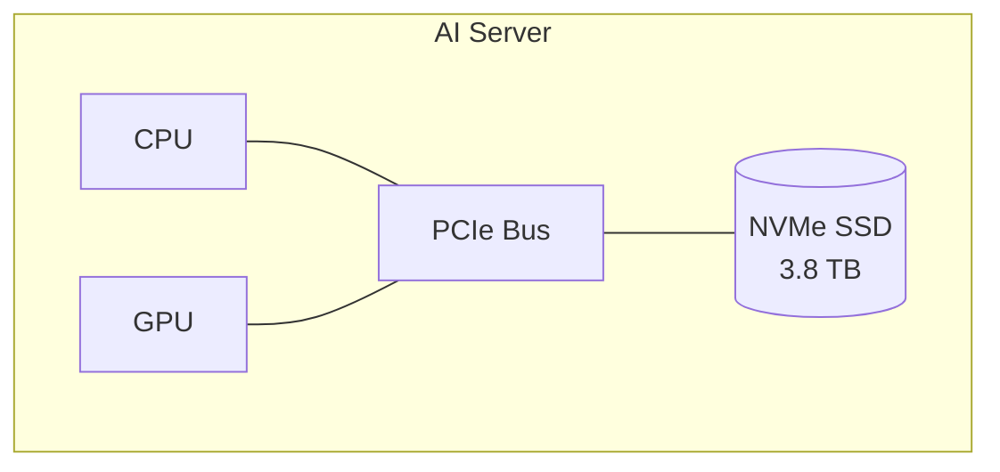
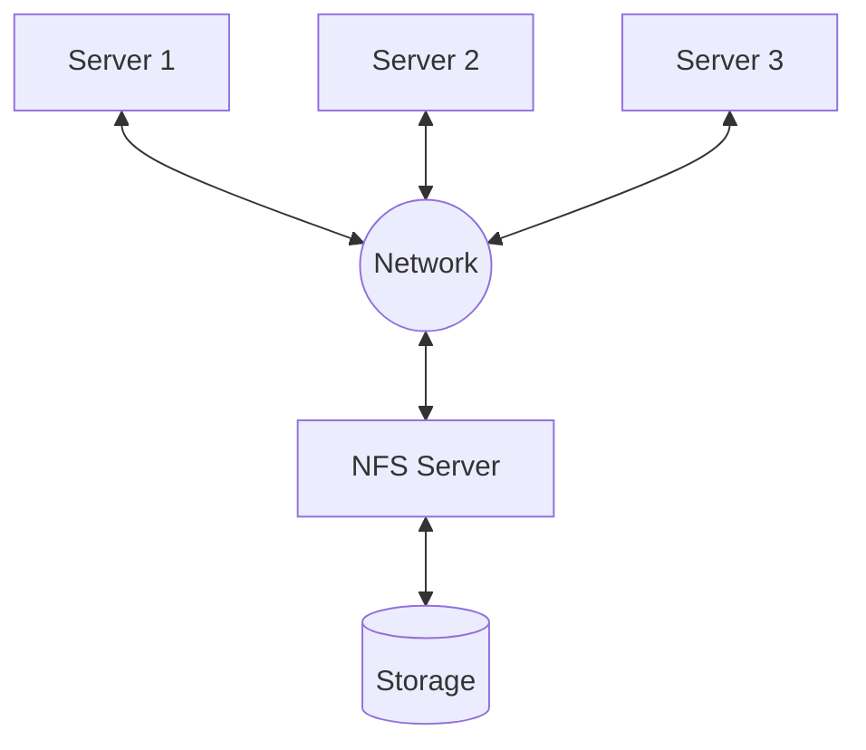
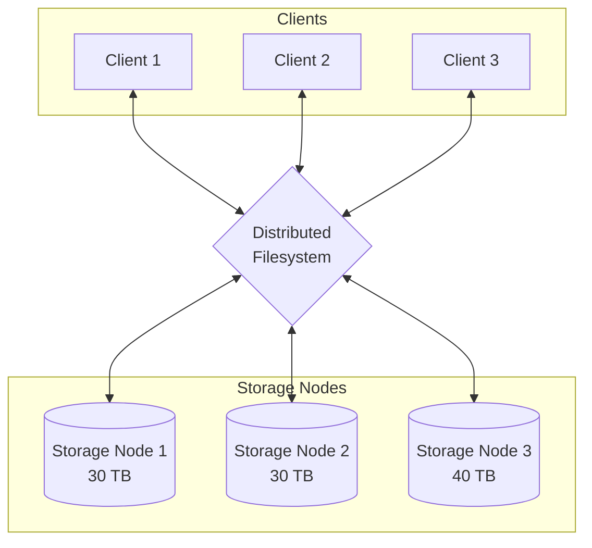
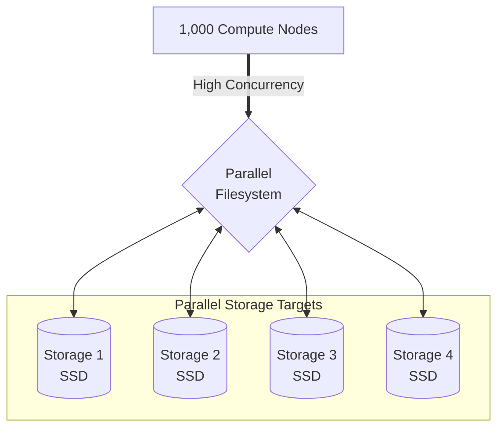

# NVMe vs NFS vs Distributed vs Parallel File Systems: What’s the Difference?

If you work with cloud infrastructure, Kubernetes, AI workloads, or High-Performance Computing (HPC), you will eventually run into terms like **NVMe, NFS, Distributed File System, and Parallel File System**. At first glance, they might sound like four completely different types of storage, but they aren't.

The confusing part is that these technologies describe **different aspects of how storage is provided and accessed**. A simple way to understand them is to ask yourself three questions:

1. **Is the storage local to my server or located somewhere on the network?**
2. **Is the data stored on one machine or distributed across multiple machines?**
3. **Can many machines access the storage concurrently at very high speeds?**

Once you start thinking about storage through this lens, the differences become much easier to grasp.

---

## The Short Version

Before we dive deeper, here's a mental model to keep in mind:

| Technology | Think of it as | Main Idea |
| :--- | :--- | :--- |
| **NVMe SSD** | A very fast local disk | Storage directly attached to one server. |
| **NFS** | A shared network drive | Multiple servers accessing files from a single shared server. |
| **Distributed File System** | Storage spread across multiple servers | Data is distributed across a cluster of storage nodes. |
| **Parallel File System** | A distributed filesystem built for massive concurrent I/O | Many clients reading and writing data in parallel. |

{: .tip}
> **Key Takeaway**
> A Parallel File System is generally just a specialized form of a Distributed File System that is heavily optimized for high-concurrency and high-throughput workloads.

Let's break down why this is the case.

---

## 1. Start with NVMe SSD

Let's begin with the simplest concept. An **NVMe SSD** is local storage attached directly to a server. 

For example, imagine a standard AI server equipped with GPUs. The NVMe SSD is physically attached directly to the server's motherboard via PCIe.



To the operating system, this disk might appear as `/dev/nvme0n1`. You can format it and mount it (e.g., `mount /dev/nvme0n1 /data`), and the application can then use `/data` as blazing-fast local storage.

### Why is NVMe so fast?
The secret to its speed is that the data doesn't have to travel across a network to reach a storage server. The path is incredibly short: **Application → Operating System → PCIe → NVMe SSD**.

This direct connection provides NVMe with extremely low latency and high I/O performance. Because of this, NVMe is commonly used for databases, AI training scratch space, caching, temporary datasets, and local Kubernetes storage.

---

## 2. The Limitation of NVMe

NVMe is fantastic, but it comes with a major limitation when you scale up. Suppose you have four GPU servers, and each one is equipped with its own blazing-fast NVMe drive. 

You now have four independent storage devices. Server 1 cannot simply access Server 2's NVMe drive. This setup is perfectly fine if each server is running completely independent tasks. But what if all four servers need to access the exact same dataset?

```text
dataset/
├── training-data-01
├── training-data-02
├── training-data-03
└── training-data-04
```

You would need to constantly copy data between servers or implement a complex synchronization mechanism. This is where network filesystems come in to solve the problem.

---

## 3. NFS — Shared Storage Over the Network

**NFS** stands for **Network File System**. Instead of keeping the storage locked inside every individual server, you introduce a dedicated storage server that exposes a filesystem over the network.



In this architecture, clients simply mount the filesystem over the network (e.g., `mount nfs-server:/data /mnt/data`). Now, all three servers can access the exact same `/mnt/data/` directory and see the same files:

```text
/mnt/data/
├── model.bin
├── dataset.csv
├── config.json
└── results/
```

### A Real-World Example
Imagine a company has 20 application servers, and every server needs access to shared directories like `/uploads`, `/shared-assets`, and `/reports`. Instead of copying those files onto every single server, the company exposes a shared NFS filesystem. All servers access the same single source of truth.

> [!NOTE]
> **The biggest advantage of NFS is its simplicity.**
> From the application's perspective, reading from and writing to an NFS mount looks and behaves exactly like interacting with a normal, local filesystem.

---

## 4. When Does NFS Become a Bottleneck?

NFS works exceptionally well for general-purpose workloads, but it can struggle at massive scale.

Imagine a large AI training cluster with 100 GPU servers, where every single node needs to constantly read massive amounts of training data simultaneously. In an NFS architecture, you have 100 clients heavily hitting a single shared storage system. Depending on the workload, the storage server itself or the network path leading to it can quickly become a bottleneck.

This bottleneck is particularly painful for workloads where **hundreds or thousands of compute nodes require very high aggregate throughput at the very same time**. 

This is exactly where distributed and parallel filesystems enter the picture.

---

## 5. Distributed File Systems

To solve the single-server bottleneck of NFS, we can distribute the storage itself. Instead of relying on a single, massive storage server holding 100 TB of data, a Distributed File System spreads the data across multiple smaller storage nodes.



In this setup, different files are distributed across different nodes:
* `file-01` → Storage Node 1
* `file-02` → Storage Node 2
* `file-03` → Storage Node 3

The magic of a Distributed File System is that it completely abstracts away this complexity. The application doesn't need to know where each file physically lives; it simply accesses `/dataset/file-01`, and the filesystem handles the routing.

Popular examples of Distributed File Systems include **CephFS**, **HDFS**, and **GlusterFS**. While their internal architectures differ, the core idea remains the same.

> [!IMPORTANT]
> **The Core Concept**
> Storage is no longer dependent on a single machine. You can horizontally scale by adding more storage nodes to increase capacity, performance, and resiliency.

---

## 6. What is a Parallel File System?

Now we reach the most powerful tier. A **Parallel File System** is designed specifically around the idea that many compute nodes must be able to access storage **concurrently and efficiently**.

Imagine a massive High-Performance Computing (HPC) cluster with 1,000 compute nodes.



In a Distributed File System, the goal is often simply to share files and increase resilience. In a Parallel File System, the workload is actively striped and spread across multiple storage targets.

The goal isn't just, *"I want to share files."* 
The goal is, *"I have thousands of machines performing heavy I/O at the exact same time, and I need the storage system to keep up without locking."*

---

## 7. A Practical AI Example

The easiest way to conceptualize this is through a large-scale AI training workload.

Imagine you're training a massive foundation model. You have **64 GPU servers** and a training dataset that is **50 TB** in size. During the training run, all 64 servers must continuously read chunks of this dataset. How do you design the storage?

### Approach 1: Local NVMe
You could copy the entire 50 TB dataset onto a massive local NVMe drive inside every single server. 
* **Pros:** This will yield absolutely incredible, unbottlenecked performance.
* **Cons:** You now have a nightmare data-management problem. You have to maintain 64 independent copies of a 50 TB dataset. If the dataset changes, you must synchronize 3.2 Petabytes of data across the cluster. Local NVMe offers **excellent performance** but **poor shared-data convenience.**

### Approach 2: NFS
You could place the 50 TB dataset on a shared NFS server.
* **Pros:** There is only one central dataset to manage.
* **Cons:** You now have 64 extremely hungry GPU servers constantly hitting a single storage server. The NFS server will likely become a severe chokepoint, starving the expensive GPUs of data and slowing down the entire training run.

### Approach 3: Distributed File System
You distribute the 50 TB dataset across multiple storage nodes using a system like CephFS.
* **Pros:** You gain scale-out storage. You are no longer reliant on a single NFS server, and total capacity and throughput are increased.
* **Cons:** While better than NFS, general-purpose distributed filesystems might still struggle with the aggressive locking and metadata overhead required by 64 GPUs concurrently reading thousands of tiny files.

### Approach 4: Parallel File System
You deploy a system like Lustre or WEKA, designed explicitly for this workload.
* **Pros:** The dataset is distributed, and the architecture is finely tuned for high-throughput, concurrent access. Different GPU clients can read different chunks of the dataset simultaneously from different storage targets without queuing or metadata bottlenecks. The GPUs stay fed, and training proceeds at maximum speed.

---

## 8. Is a Parallel File System a Distributed File System?

This is a common question, and the terminology can often be confusing. **Generally, yes.**

A parallel filesystem is commonly considered a highly specialized type of distributed filesystem. The difference lies in what they choose to emphasize.

* **Distributed Filesystem:** *"My data and storage are safely distributed across multiple machines."*
* **Parallel Filesystem:** *"My storage is distributed, and the underlying architecture is aggressively tuned to allow thousands of compute nodes to perform I/O concurrently at massive throughput."*

It's best to think of it as a specialized sub-category optimized for parallel workloads rather than a completely different species of technology.

---

## 9. The Restaurant Analogy

If the technical definitions are still blurry, this restaurant analogy usually helps clarify things.

Imagine you are running a restaurant.

### NVMe
You are one chef with your own personal refrigerator right next to your station.
* Very fast access, but only you can use it.

### NFS
You have a kitchen with 20 chefs, and they all share one very large refrigerator in the back.
* Everyone can access the same ingredients, which is convenient, but there might be a traffic jam if everyone needs something at once.

### Distributed File System
Your restaurant is expanding, so you buy three large refrigerators and place them in different areas.
* Ingredients are distributed between them, and the kitchen manager keeps track of where everything is.

### Parallel File System
You are now running a stadium-sized industrial kitchen with 1,000 chefs cooking simultaneously.
* You don't just need multiple refrigerators. You need a highly engineered storage and retrieval system designed specifically so that hundreds of chefs can fetch ingredients at the exact same time without waiting in a single queue.

---

## 10. Where Does Each One Fit?

A useful way to think about their typical use cases is by matching the storage requirement to the technology:

| Need | Technology | Typical Use Case | Examples |
| :--- | :--- | :--- | :--- |
| **Local + Low Latency** | **NVMe** | AI server training cache, fast databases, local scratch space. | Standard PCIe NVMe SSDs |
| **Simple Shared Data** | **NFS** | Application servers sharing logs, uploads, or configuration files. | AWS EFS, standard Linux NFS |
| **Scalable Distributed Storage** | **Distributed FS** | Large capacity storage spanning multiple nodes for general use. | CephFS, HDFS, GlusterFS |
| **Massive Parallel I/O** | **Parallel FS** | HPC clusters, massive AI/ML training runs requiring high throughput. | Lustre, IBM Spectrum Scale, WEKA |

---

## 11. Throughput vs. Latency

When designing AI infrastructure, understanding the distinction between throughput and latency is critical.

* **Latency:** How quickly can I complete one individual I/O operation?
* **Throughput:** How much total data can I move per second?

An **NVMe** drive excels at latency. It offers extremely low latency and incredibly high local performance for a single machine.

A **Parallel File System** focuses heavily on aggregate throughput. When you have many clients generating lots of simultaneous I/O, the goal is to sustain massive total data movement.

The question isn't always, *"Which individual storage device is the fastest?"* 
In AI and HPC, the much more important question is, **"How do I feed data to hundreds or thousands of compute nodes simultaneously without the storage network becoming the bottleneck?"**

---

## Final Takeaway

Don't think of NVMe, NFS, Distributed FS, and Parallel FS as four competing products. They are tools designed to solve fundamentally different problems.

* **NVMe answers:** *"How do I get extremely fast local storage?"*
* **NFS answers:** *"How do multiple machines share the same traditional filesystem?"*
* **Distributed FS answers:** *"How do I scale out storage and data across multiple machines?"*
* **Parallel FS answers:** *"How do I let a massive cluster of compute nodes access huge amounts of data concurrently and efficiently?"*

> [!TIP]
> Whenever you hear a requirement involving: 
> **AI Cluster + Hundreds of GPUs + Huge Dataset + High-Throughput Concurrent I/O**
> 
> Your brain should immediately jump to: 
> **Parallel File System (e.g., Lustre, Spectrum Scale, or WEKA).**
