**CPU vs GPU vs DPU vs TPU vs LPU vs NPU — what do they actually do, how are they different, and when should you use each one?**

Modern computing is no longer built around a single processor doing everything.

A traditional server might have relied almost entirely on a CPU. Today, a modern AI server can contain CPUs for general-purpose computing, GPUs for massively parallel computation, DPUs for networking and infrastructure offload, and specialized accelerators for machine learning and inference.

Then things become even more confusing.

You encounter terms such as:

* CPU
* GPU
* DPU
* TPU
* NPU
* LPU
* ASIC
* AI accelerator
* SmartNIC
* Neural accelerator

They sound similar, but they solve very different problems.

The easiest way to understand them is not to memorize their names.

Instead, ask one question:

> **What kind of work is this processor designed to do exceptionally well?**

Once you understand that, the differences become much easier to remember.

---

## The Short Version

| Processor | Think of it as... | What does it actually do? |
| :--- | :--- | :--- |
| **CPU** | **The Manager** | Handles general tasks, runs the operating system, and coordinates everything. Highly flexible, but not the fastest at heavy math. |
| **GPU** | **The Factory Floor** | Packed with thousands of smaller workers (cores) that process massive amounts of data at the same time. Perfect for training AI and rendering graphics. |
| **DPU** | **The Traffic Cop** | Offloads networking, storage, and security tasks so the CPU doesn't get bogged down managing data flow. |
| **TPU** | **The AI Math Whiz** | Google's custom chip designed purely for the specific heavy math (tensor operations) that neural networks rely on. |
| **LPU** | **The Speed Reader** | Built specifically to run Language Models (like ChatGPT) as fast as possible. Optimized for generating words with zero lag. |
| **NPU** | **The Efficiency Expert** | A lightweight AI chip built directly into phones and laptops to handle AI tasks (like face ID or blur backgrounds) without killing the battery. |

{: .important}
> **Key Takeaway**
> 
These processors aren't competing to replace each other. A modern AI data center uses <strong>all of them together</strong>!<br><br> The <strong>CPU</strong> manages the application, the <strong>GPU/TPU</strong> trains the AI models, the <strong>LPU</strong> generates the text responses, and the <strong>DPU</strong> moves the data around securely.


<p align="center">
  
</p>

For example:

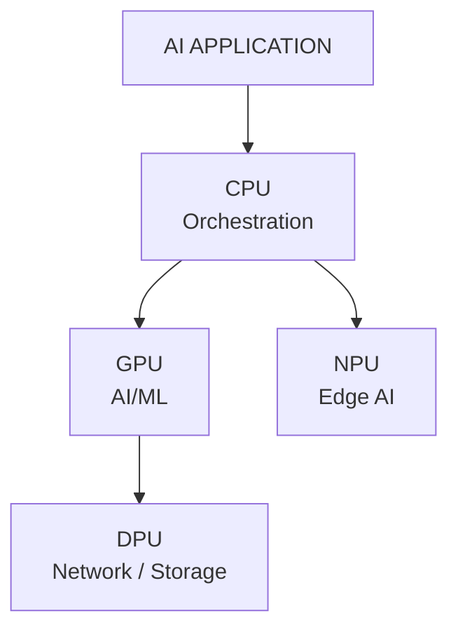

And in Google Cloud, a TPU may replace the GPU for workloads designed around Google's TPU ecosystem.

---

# 1. Why Do We Need Different Processors?

To understand the evolution of processors, consider a simple CPU.

A CPU is extremely flexible.

You can ask it to:

* run Linux
* execute Python
* handle an HTTP request
* run a database
* compress a file
* perform calculations
* manage Kubernetes
* execute Terraform
* run a web browser
* control other accelerators

The CPU can do almost everything.

But flexibility has a cost.

Suppose you need to perform the same mathematical operation on millions of pieces of data.

For example:

```text
1 × 2
2 × 3
3 × 4
4 × 5
...
1,000,000 × 1,000,000
```

A CPU can do this, but it isn't necessarily the most efficient architecture for the job.

Instead of asking one highly flexible worker to perform every task, we can build specialized hardware containing many processing elements designed to perform similar operations simultaneously.

That is where GPUs and other accelerators become useful.

The evolution roughly looks like this:

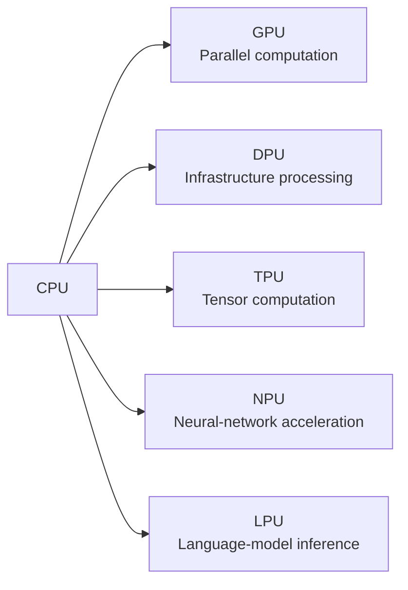

This is the fundamental idea behind **heterogeneous computing**.

---

# 2. CPU — The General-Purpose Brain

## What is a CPU?

CPU stands for **Central Processing Unit**.

It is the general-purpose processor responsible for executing the operating system, applications, system services and orchestration logic.

Examples include:

* Intel Xeon
* Intel Core
* AMD EPYC
* AMD Ryzen
* Arm-based CPUs
* Apple Silicon

The defining characteristic of a CPU is **flexibility**.

A CPU is designed to efficiently handle a huge variety of workloads rather than one narrow workload.

---

## How Does a CPU Work?

A simplified CPU looks like:

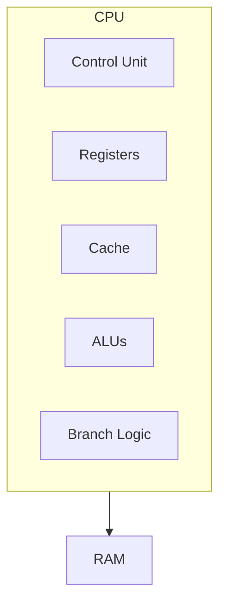

Modern CPUs contain multiple cores.

Each core can execute instructions independently.

For example:

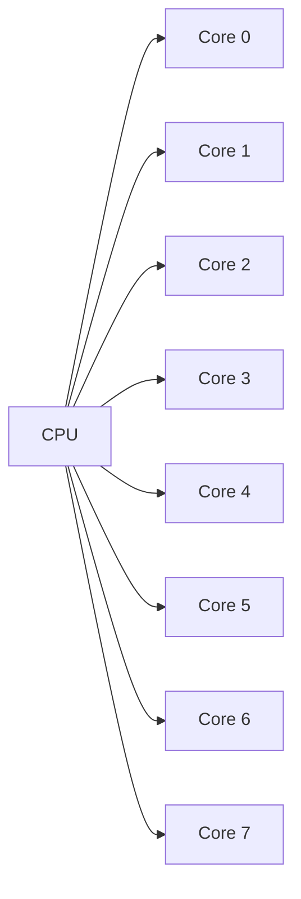

Modern CPUs also contain sophisticated:

* caches
* branch predictors
* out-of-order execution
* instruction pipelines
* SIMD/vector units
* memory controllers

These features make CPUs extremely good at complicated, branching and latency-sensitive workloads.

---

## What Are CPUs Good At?

CPUs excel at:

* operating systems
* application logic
* databases
* web servers
* API services
* Kubernetes control-plane workloads
* system management
* virtualization
* orchestration
* sequential and irregular workloads

For example:

```python
if user_is_authenticated:
    process_request()
else:
    return_error()
```

This kind of logic contains branching and control flow.

CPUs are very good at it.

---

## CPU Mental Model

Think of a CPU as:

> **A highly skilled worker who can perform almost any job.**

The worker is extremely versatile.

But if you have millions of identical jobs, hiring thousands of specialized workers may be more efficient.

That is where the GPU comes in.

---

# 3. GPU — The Parallel Processing Powerhouse

## What is a GPU?

GPU stands for **Graphics Processing Unit**.

GPUs were originally designed primarily for graphics workloads.

Graphics rendering contains enormous amounts of parallel computation.

For example, rendering a 4K image involves millions of pixels.

Many operations can be performed independently:

```text
Pixel 1 → calculate
Pixel 2 → calculate
Pixel 3 → calculate
Pixel 4 → calculate
Pixel 5 → calculate
...
Pixel millions → calculate
```

This makes GPUs excellent at parallel workloads.

And machine learning happens to contain enormous amounts of parallel mathematical computation.

That is why GPUs became fundamental to modern AI.

---

# 4. Why GPUs Are So Good for AI

Neural networks perform huge numbers of mathematical operations.

A simplified neural-network operation might look like:

```text
Y = X × W + B
```

Where:

* X = input
* W = weights
* B = bias
* Y = output

Matrix multiplication contains many independent operations.

Instead of:

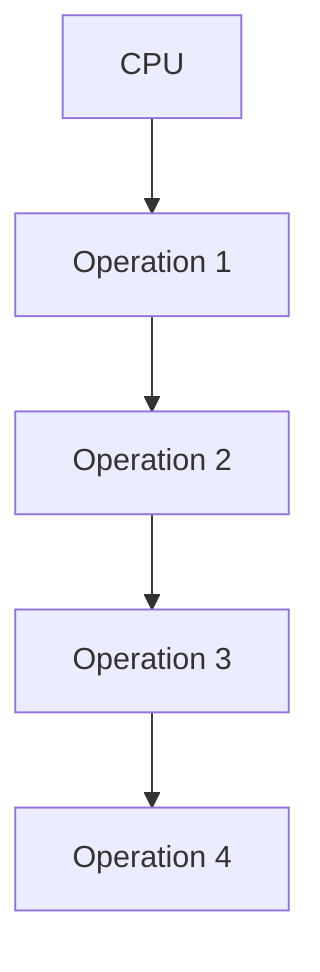

A GPU can execute many operations concurrently:

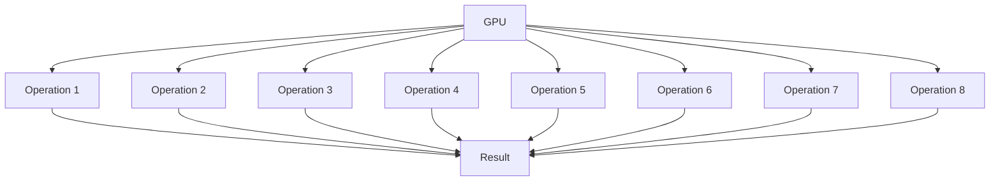

This is why GPUs are so effective for:

* deep learning
* large language models
* computer vision
* scientific computing
* simulations
* graphics
* high-performance computing

NVIDIA GPUs, for example, are widely used for AI training and inference, while AMD's Instinct family targets AI and HPC workloads.

---

# 5. CPU vs GPU

The most important distinction is:

> **CPU = optimized for flexibility and low-latency general-purpose execution.**

> **GPU = optimized for throughput and massive parallelism.**

Imagine a restaurant.

### CPU

One highly experienced chef:

```text
Chef
 |
 +-- Cook
 +-- Clean
 +-- Prepare
 +-- Serve
 +-- Handle special requests
```

Very flexible.

### GPU

Hundreds of specialized kitchen workers:

```text
Worker Worker Worker Worker
Worker Worker Worker Worker
Worker Worker Worker Worker
Worker Worker Worker Worker
```

Extremely effective when everyone performs similar operations simultaneously.

---

# 6. DPU — The Data Center Infrastructure Processor

DPU stands for **Data Processing Unit**.

This is where things become particularly interesting for cloud and infrastructure engineers.

A DPU is designed to accelerate and offload infrastructure workloads such as:

* networking
* storage
* security
* encryption
* packet processing
* virtualization infrastructure
* data movement

NVIDIA's BlueField platform, for example, combines compute with hardware acceleration for networking, storage and security.

---

# 7. Why Do We Need DPUs?

Imagine a server running a major application.

The CPU might be doing:

```text
Application
Database
Kubernetes
Networking
Storage
Encryption
Virtualization
Security
```

A significant amount of CPU capacity can be consumed by infrastructure operations.

Instead of using application CPUs for all of these jobs, we can offload infrastructure processing.

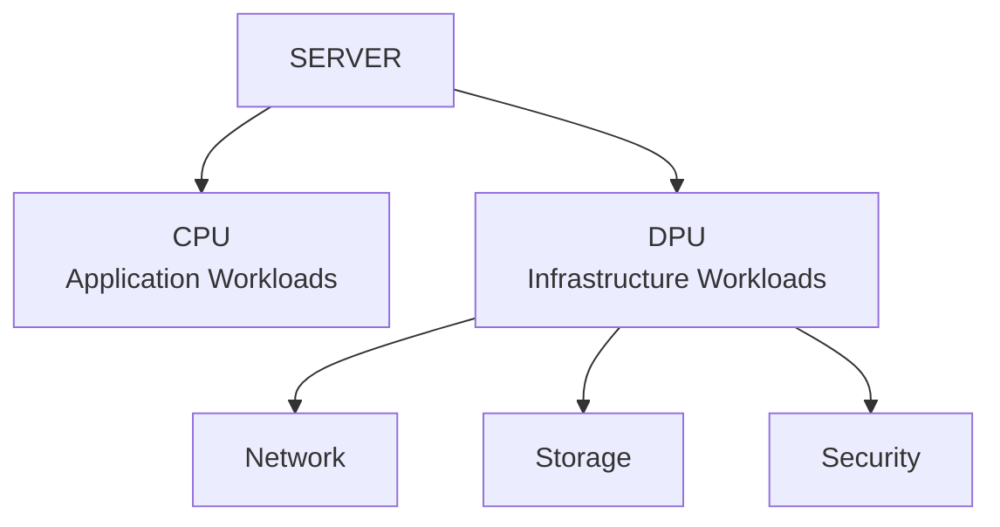

The CPU is freed to focus on the application.

---

# 8. What Does a DPU Actually Do?

A DPU can accelerate things such as:

### Networking

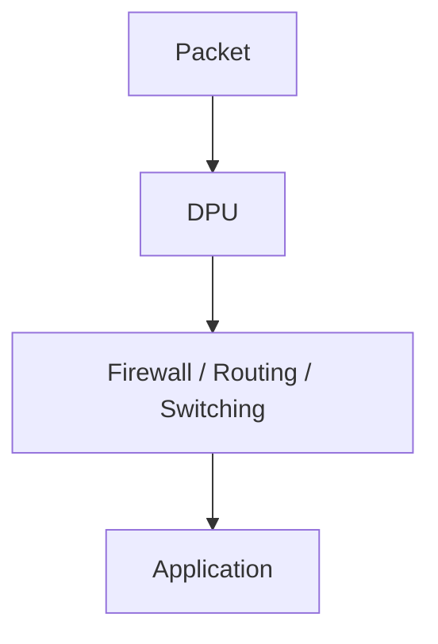

### Storage

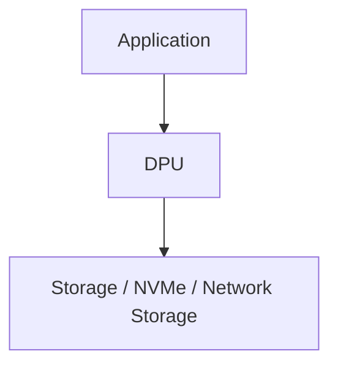

### Security

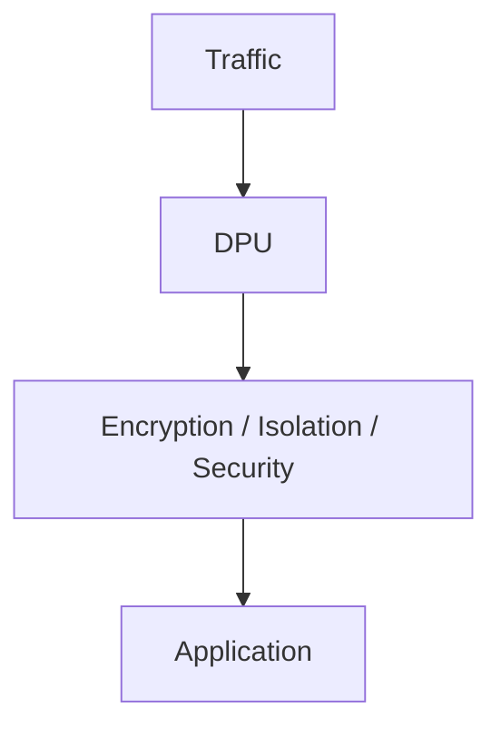

This is especially useful in:

* cloud data centers
* hyperscale infrastructure
* Kubernetes infrastructure
* storage systems
* multi-tenant environments
* AI data centers

---

# 9. DPU vs SmartNIC

You will often hear the term **SmartNIC** alongside DPU.

They overlap.

A SmartNIC is essentially a programmable network adapter capable of performing processing beyond basic packet transmission.

A DPU generally goes further by providing substantial compute capability and infrastructure offload.

A simplified evolution is:


The exact terminology varies across vendors and architectures, so it is better to focus on **capabilities** rather than treating the terms as perfectly interchangeable.

---

# 10. TPU — Google's Tensor Processing Unit

TPU stands for **Tensor Processing Unit**.

This is one area where the original comparison needs an important correction.

A TPU is not simply another generic name for an AI accelerator.

**TPU is Google's custom ASIC family designed specifically for machine-learning workloads.**

Google designed TPUs around the mathematical operations that dominate neural networks, particularly tensor and matrix computations.

---

# 11. Why Are Tensors Important?

Machine-learning models operate heavily on tensors.

A tensor can be thought of as a generalized multidimensional array.

For example:

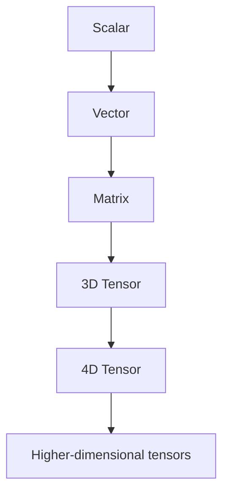

A neural network performs enormous numbers of tensor operations.

For example:

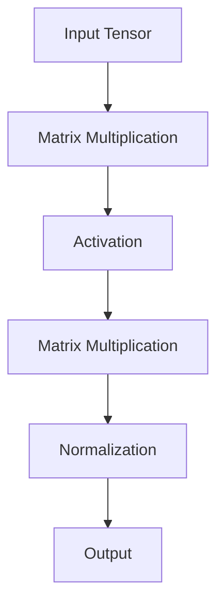

TPUs are specifically designed to accelerate these operations.

Google describes TPU hardware around specialized matrix-multiplication units and systolic-array architectures.

---

# 12. TPU Architecture Mental Model

A simplified view:

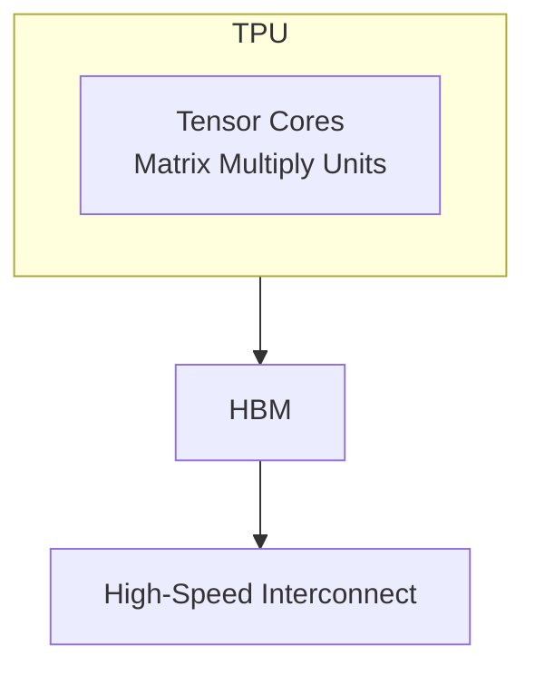

The architecture is designed around moving and processing large amounts of tensor data efficiently.

Google's current Cloud TPU platform supports large-scale training and inference and integrates with frameworks such as JAX and PyTorch.

---

# 13. TPU vs GPU

This is an important interview question.

### GPU

```text
General parallel accelerator
          ↓
Graphics
AI
HPC
Simulation
Scientific computing
```

### TPU

```text
Purpose-built ML accelerator
          ↓
Tensor operations
Matrix multiplication
Deep learning
Large-scale AI
```

The GPU is generally more flexible.

The TPU is more specialized.

This does not mean:

> TPU = better GPU

or

> GPU = better TPU

The correct answer is:

> **The best accelerator depends on the workload, software ecosystem, model architecture, availability, cost and scale.**

---

# 14. What About NVIDIA and AWS "TPU-Like" Hardware?

This is another important distinction.

NVIDIA has AI GPUs and other accelerators.

AWS has purpose-built AI accelerators such as **Trainium** and **Inferentia**.

These compete in the broader **AI accelerator** market, but they are not literally Google's TPUs.

So instead of saying:

> "NVIDIA and AWS make TPUs."

A technically accurate statement is:

> "Google develops TPUs, while NVIDIA, AWS and other vendors offer competing or complementary AI accelerator architectures."

That distinction matters when writing technical documentation or preparing for an infrastructure certification.

---

# 15. LPU — Language Processing Unit

LPU stands for **Language Processing Unit**.

Unlike CPU, GPU and DPU, LPU is not a universally standardized processor category across the entire industry.

The term is strongly associated with **Groq's LPU architecture**, which was designed specifically for fast AI inference and language-model workloads.

Groq describes its LPU around principles such as:

* software-first architecture
* deterministic execution
* on-chip memory
* programmable scheduling
* high-speed inference

---

# 16. Why Would We Need an LPU?

Modern LLM inference has a very different performance profile from model training.

Suppose a user asks:

```text
"What is Kubernetes?"
```

The system must generate tokens:

```text
What
 ↓
is
 ↓
Kubernetes
 ↓
?
```

The latency between tokens matters.

For conversational AI, users care about:

* time to first token
* tokens per second
* latency
* throughput
* cost per token
* energy efficiency

An architecture specifically optimized for inference can therefore make sense.

Groq describes its LPU as a processor architecture built around the requirements of LLM inference.

---

# 17. LPU vs GPU

Think about the difference like this:

### GPU

```text
Highly parallel
Flexible
Programmable
Excellent for:
- Training
- Inference
- HPC
- Graphics
```

### LPU

```text
Highly specialized
Inference-focused
Deterministic execution
Excellent for:
- LLM inference
- Token generation
- Low-latency AI serving
```

The important point is that an LPU doesn't replace GPUs everywhere.

It targets a particular part of the AI workload spectrum.

---

# 18. NPU — Neural Processing Unit

NPU stands for **Neural Processing Unit**.

An NPU is a specialized accelerator designed to efficiently execute neural-network workloads.

NPUs are particularly common in:

* smartphones
* laptops
* embedded systems
* IoT devices
* edge computing
* robotics
* automotive systems

Examples include neural/AI acceleration capabilities found in modern mobile and client processors.

---

# 19. Why Do Devices Need NPUs?

Imagine a smartphone performing:

* face recognition
* camera enhancement
* background removal
* speech recognition
* translation
* generative AI
* image classification

You could send everything to a cloud GPU.

But that creates:

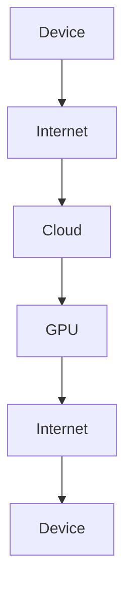

This creates:

* latency
* bandwidth consumption
* privacy concerns
* cloud costs

An NPU allows the device to perform AI locally.

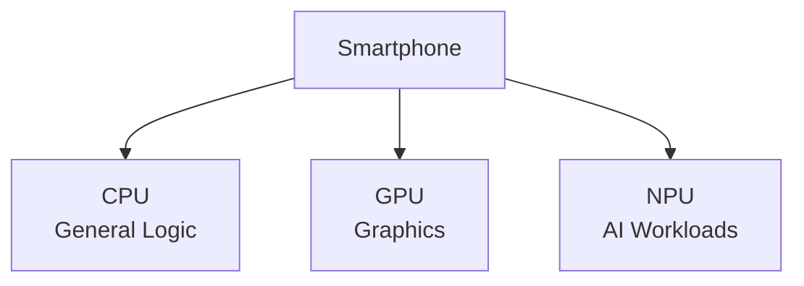

This is called **edge AI** or **on-device AI**.

---

# 20. NPU vs GPU

The distinction is primarily about optimization and deployment.

### GPU

Usually:

* more general-purpose parallel accelerator
* high throughput
* large-scale AI
* graphics
* HPC
* training and inference

### NPU

Usually:

* specialized neural-network acceleration
* power efficient
* integrated into client/mobile/edge SoCs
* inference-focused in many practical deployments

An NPU is therefore especially valuable when:

> **You need AI computation close to the user with low power consumption and low latency.**

---

# 21. NPU vs TPU

Both accelerate neural-network workloads, but they operate in different contexts.

### TPU

Typically:

```text
Cloud / Data Center
        ↓
Large-scale AI
        ↓
Training + Inference
```

### NPU

Typically:

```text
Device / Edge
      ↓
Low-power AI
      ↓
On-device inference
```

There is some overlap, but their design goals and deployment environments are different.

---

# 22. Putting Everything Together

Now we can build the complete mental model.

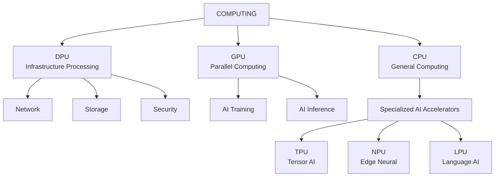

The key insight is:

> **These processors are specialized around different bottlenecks.**

---

# 23. A Simple "Who Does What?" Mental Model

If you remember only one thing, remember this:

```text
CPU → Thinks
GPU → Calculates in parallel
DPU → Moves and protects data
TPU → Calculates tensors
NPU → Calculates neural networks efficiently
LPU → Generates language efficiently
```

Or even simpler:

```text
CPU = General
GPU = Parallel
DPU = Infrastructure
TPU = Tensor
NPU = Neural
LPU = Language
```

---

# 24. Processor Comparison

| Processor | Primary Goal                 | Typical Location            | Best At                         |
| --------- | ---------------------------- | --------------------------- | ------------------------------- |
| CPU       | General computation          | Everywhere                  | OS, applications, control logic |
| GPU       | Massive parallel computation | Servers, PCs, workstations  | AI, graphics, HPC               |
| DPU       | Infrastructure offload       | Data centers                | Networking, storage, security   |
| TPU       | Tensor acceleration          | Google infrastructure/cloud | ML training and inference       |
| NPU       | Efficient neural processing  | Phones, PCs, edge devices   | On-device AI                    |
| LPU       | Fast language inference      | AI inference infrastructure | LLM serving                     |

---

# 25. Which Processor Should You Choose?

There is no universally "best" processor.

The correct choice depends on the workload.

## Scenario 1: Web Server

You need:

```text
HTTP
Business Logic
Database Queries
Authentication
API Processing
```

Choose:

**CPU**

---

## Scenario 2: AI Model Training

You need:

```text
Large matrices
Tensor operations
Massive parallelism
Large memory bandwidth
```

Choose:

**GPU or specialized AI accelerator such as TPU**, depending on your framework, platform and workload.

---

## Scenario 3: Kubernetes Infrastructure

You need:

```text
Networking
Storage
Security
Packet Processing
Virtualization
```

A:

**DPU**

can offload infrastructure services from the host CPU.

---

## Scenario 4: Smartphone Face Recognition

You need:

```text
Low latency
Low power
Local inference
Privacy
```

Choose:

**NPU / neural accelerator**

---

## Scenario 5: Large-Scale LLM Inference

You need:

```text
High tokens/sec
Low latency
High throughput
Efficient inference
```

Potential options include:

* GPUs
* dedicated AI accelerators
* inference-specialized architectures such as Groq LPUs

The right choice depends heavily on model architecture, serving stack, memory requirements and economics.

---

# 26. Why AI Changed Processor Architecture

The AI revolution changed the definition of a "computer."

Traditional computing looked like:

```text
CPU
 |
 +--- RAM
 |
 +--- Storage
 |
 +--- Network
```

Modern AI infrastructure looks more like:

```text
                         CPU
                          |
          +---------------+---------------+
          |               |               |
          v               v               v
        GPU              DPU          Accelerator
          |               |               |
          |               |               |
        HBM            Network         AI Memory
          |
          v
      AI Workload
```

The CPU remains important.

But it is no longer expected to perform every operation itself.

This is the foundation of **heterogeneous computing**.

---

# 27. Heterogeneous Computing

Heterogeneous computing means using different processors for different workloads.

For example:

```text
Application
     |
     v
   CPU
     |
     +-------> GPU
     |          |
     |          +--> AI computation
     |
     +-------> DPU
     |          |
     |          +--> Networking
     |          +--> Storage
     |          +--> Security
     |
     +-------> NPU
                |
                +--> Local AI
```

Instead of asking:

> "Which processor is fastest?"

Ask:

> **"Which processor is best suited to this workload?"**

That is a much better architectural question.

---

# 28. Why This Matters for AI Infrastructure

If you work in DevOps, SRE, MLOps or cloud infrastructure, understanding these processors becomes increasingly important.

Running a GPU workload is not simply:

```bash
docker run my-model
```

A production AI infrastructure stack can involve:

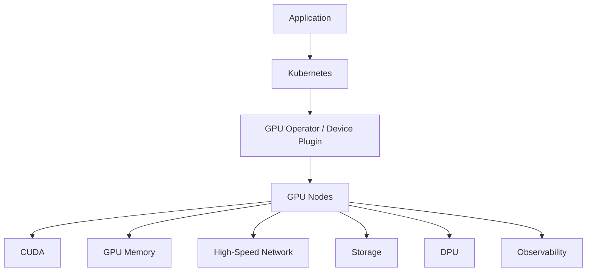

You need to understand:

* GPU scheduling
* GPU memory
* PCIe
* NVLink / high-speed interconnects
* NUMA
* RDMA
* container runtimes
* Kubernetes device plugins
* GPU operators
* inference serving
* model parallelism
* data parallelism
* storage throughput
* network bottlenecks

The accelerator is only one component of the system.

---

# 29. The Biggest Mistake: Looking Only at FLOPS

One common mistake is to compare accelerators purely by compute performance.

For example:

```text
Accelerator A = 100 TFLOPS
Accelerator B = 120 TFLOPS
```

It is tempting to conclude:

```text
B > A
```

But real-world AI performance depends on much more than raw compute.

You also need to consider:

### Memory capacity

Can the model fit?

```text
Model = 80 GB
GPU Memory = 40 GB

Problem.
```

### Memory bandwidth

How quickly can the accelerator access model weights?

### Interconnect

Can multiple accelerators communicate efficiently?

### Network

Can data reach the accelerator quickly enough?

### Software ecosystem

Does your framework support the hardware efficiently?

### Kernel optimization

Are optimized kernels available?

### Power efficiency

How much performance do you get per watt?

### Cost

How much does each generated token cost?

Therefore:

> **Peak FLOPS is not the same thing as application performance.**

---

# 30. AI Infrastructure Is a System, Not a Chip

This is especially important when designing production AI platforms.

A modern AI system can look like:

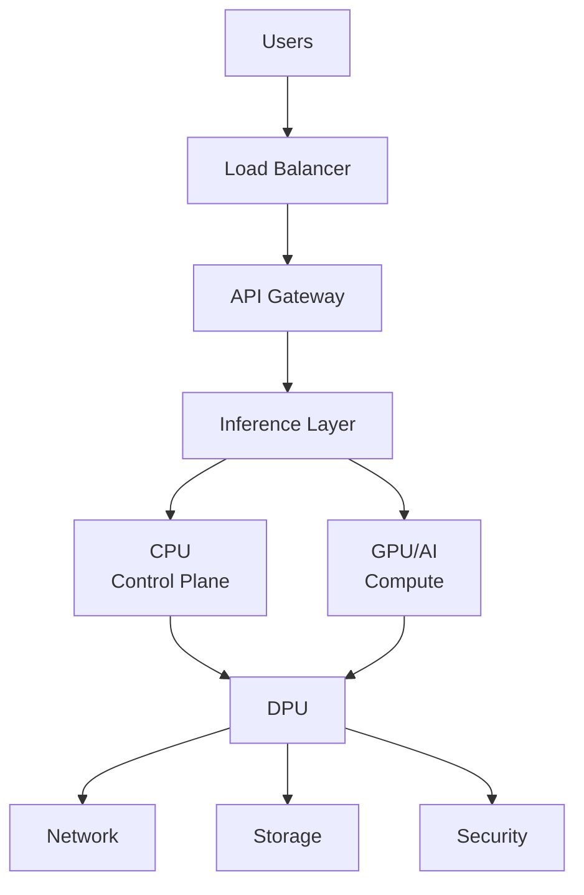

Performance can be limited by any layer.

For example:

```text
GPU = 95% utilization
```

sounds good.

But suppose:

```text
Storage = slow
Network = saturated
CPU = bottleneck
GPU memory = insufficient
```

Then simply buying a faster GPU may not solve the problem.

---

# 31. Processor Selection Cheat Sheet

Use this decision tree:

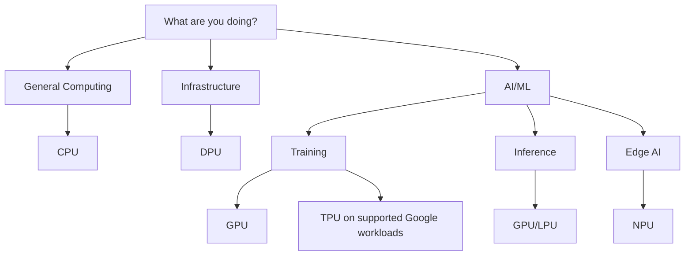

---

# 32. The Most Important Interview Question

If an interviewer asks:

> **"What is the difference between CPU and GPU?"**

Don't simply say:

> CPU is sequential and GPU is parallel.

That is an oversimplification.

A stronger answer is:

> "A CPU is a general-purpose processor optimized for low-latency execution, complex control flow and a broad range of workloads. A GPU is a throughput-oriented parallel processor containing many execution resources designed to perform large numbers of similar operations concurrently. That's why CPUs are typically used for application orchestration and control logic, while GPUs are particularly effective for graphics, scientific computing and machine-learning workloads."

---

# 33. What Is the Difference Between GPU and DPU?

A good interview answer:

> "A GPU accelerates compute-intensive parallel workloads such as graphics, AI and HPC. A DPU is focused on infrastructure processing, particularly networking, storage and security. The DPU can offload these operations from the host CPU so the CPU can focus on application workloads."

This distinction is particularly important in cloud and AI data-center architecture.

---

# 34. What Is the Difference Between TPU and GPU?

A good answer:

> "A GPU is a general-purpose parallel accelerator that can support graphics, AI, HPC and many other workloads. A TPU is Google's custom ASIC architecture specifically designed to accelerate machine-learning workloads, particularly tensor and matrix operations. The choice depends on the workload and software ecosystem rather than one being universally better."

Google's TPU documentation explicitly describes TPUs as custom-developed ASICs for ML workloads.

---

# 35. What Is the Difference Between NPU and GPU?

A good answer:

> "Both can accelerate AI workloads, but an NPU is typically designed specifically for neural-network operations with strong power efficiency, making it particularly useful for edge and client devices. GPUs are more general-purpose parallel accelerators and are widely used for large-scale AI training and inference."

---

# 36. What Is the Difference Between LPU and NPU?

This is where terminology matters.

An NPU is a broad industry term for a neural-network accelerator.

An LPU is more specialized terminology, strongly associated with architectures such as Groq's LPU for language-model inference.

So:

```text
NPU
 |
 +-- Neural-network acceleration
 |
 +-- Broad industry terminology


LPU
 |
 +-- Language-model workloads
 |
 +-- Specialized inference architecture
```

They should not be treated as universally standardized categories with identical definitions.

---

# 37. One Final Mental Model

Imagine a huge company.

### CPU — Manager

Handles:

```text
Decision making
Coordination
Control
General work
```

### GPU — Workforce

Handles:

```text
Thousands of similar tasks simultaneously
```

### DPU — Logistics Department

Handles:

```text
Moving goods
Networking
Storage
Security
Infrastructure
```

### TPU — Mathematics Department

Specialized in:

```text
Tensor and matrix calculations
```

### NPU — Local AI Specialist

Handles:

```text
Neural-network workloads efficiently
```

### LPU — Language Specialist

Handles:

```text
Language-model inference
Token generation
```

So the whole company looks like:

```mermaid
flowchart TD
    COMP[COMPANY] --> CPU[CPU<br/>MANAGEMENT]
    CPU --> GPU[GPU<br/>Workforce]
    CPU --> DPU[DPU<br/>Logistics]
    CPU --> AI[AI Specialists]
    DPU --> NET[Network]
    DPU --> STO[Storage]
    AI --> TPU[TPU]
    AI --> NPU[NPU]
    AI --> LPU[LPU]
```

---

# 38. The Bigger Picture

The future of computing is not:

```text
CPU vs GPU
```

It is:

```text
CPU + GPU + DPU + Specialized Accelerators
```

Modern data centers increasingly resemble a collection of specialized compute engines rather than a single type of processor doing everything.

The CPU provides general-purpose control.

The GPU provides massive parallel compute.

The DPU handles infrastructure and data movement.

The TPU provides specialized tensor acceleration in Google's ecosystem.

The NPU brings efficient neural processing closer to the edge.

And specialized inference architectures such as Groq's LPU target the unique requirements of language-model serving.

The real architectural challenge is therefore not simply choosing the fastest processor.

It is determining:

> **Which processor should perform which workload, where should that workload execute, how does data reach it, and how do all of these components work together efficiently?**

That is the foundation of modern heterogeneous computing and AI infrastructure.

---

# 39. Final Comparison

| Processor | Full Name                | Primary Optimization      | Typical Environment                  | Key Strength                |
| --------- | ------------------------ | ------------------------- | ------------------------------------ | --------------------------- |
| **CPU**   | Central Processing Unit  | General-purpose execution | PCs, servers, cloud                  | Flexibility                 |
| **GPU**   | Graphics Processing Unit | Massive parallelism       | AI servers, PCs, HPC                 | Throughput                  |
| **DPU**   | Data Processing Unit     | Infrastructure offload    | Data centers                         | Networking/storage/security |
| **TPU**   | Tensor Processing Unit   | Tensor operations         | Google Cloud / Google infrastructure | ML acceleration             |
| **NPU**   | Neural Processing Unit   | Neural-network operations | Phones, PCs, edge                    | Power-efficient AI          |
| **LPU**   | Language Processing Unit | Language-model inference  | AI inference infrastructure          | Fast language inference     |

---

# 40. The One-Line Summary

If you remember nothing else, remember this:

```text
CPU → General-purpose computing
GPU → Massively parallel computing
DPU → Data-center infrastructure
TPU → Tensor-focused AI acceleration
NPU → Efficient neural processing
LPU → Language-model inference
```

And the most important principle:

> **Modern computing is increasingly heterogeneous: use the right processor for the right workload rather than expecting one processor to do everything.**

---

## Frequently Asked Questions

### Is a GPU a CPU replacement?

No.

GPUs are specialized parallel processors. CPUs remain essential for operating systems, application logic, orchestration and workloads that require complex control flow.

### Is a TPU better than a GPU?

Not universally.

TPUs are purpose-built for machine-learning workloads, while GPUs offer broader programmability and a mature ecosystem across AI, graphics and HPC. The better choice depends on the workload and software stack.

### Is every AI chip an NPU?

No.

"NPU" is generally used for neural-network accelerators, but the industry has many specialized AI accelerator architectures with different designs and naming conventions.

### Is an LPU the same as an NPU?

No.

The terms describe different concepts. NPU is a broad category for neural-network acceleration, while LPU is strongly associated with specialized language-processing/inference architectures such as Groq's LPU.

### Is a DPU used for AI computation?

Usually its primary role is infrastructure acceleration rather than model computation.

However, DPUs can be extremely important to AI infrastructure because they can accelerate networking, storage and security operations around AI workloads.

### Can a server have CPU, GPU and DPU simultaneously?

Absolutely.

This is increasingly common in high-performance cloud and AI infrastructure:

```text
CPU → Application / Control
GPU → AI / HPC
DPU → Network / Storage / Security
```

### Why not use GPUs for everything?

Because GPUs are not optimized for every workload.

Using a GPU for general application logic or infrastructure operations can be inefficient. Specialized processors allow each workload to run on hardware designed for it.

---

## Conclusion

The processor landscape has evolved from a world dominated by general-purpose CPUs to a heterogeneous world containing specialized compute engines.

The CPU remains the foundation.

The GPU provides massive parallel processing.

The DPU moves infrastructure processing away from application CPUs.

The TPU specializes in tensor-based machine learning.

The NPU brings neural acceleration to power-sensitive devices.

And specialized architectures such as LPUs target high-performance language-model inference.

Understanding these differences is becoming increasingly important for software engineers, cloud engineers, DevOps engineers, MLOps engineers, SREs and AI infrastructure architects.

Because when you design a modern AI platform, the question is no longer simply:

> **"How many CPUs do I need?"**

The better question is:

> **"What workloads do I have, which processor is best suited to each workload, and how do I build the infrastructure that allows all of them to work together efficiently?"**

That is the real foundation of modern AI infrastructure.
