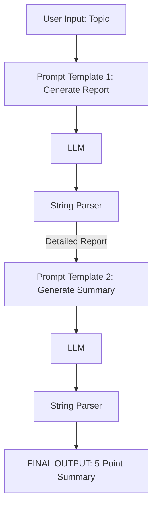
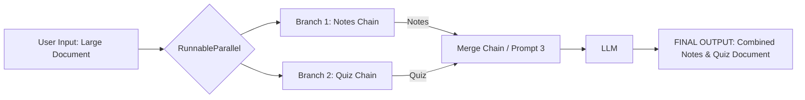
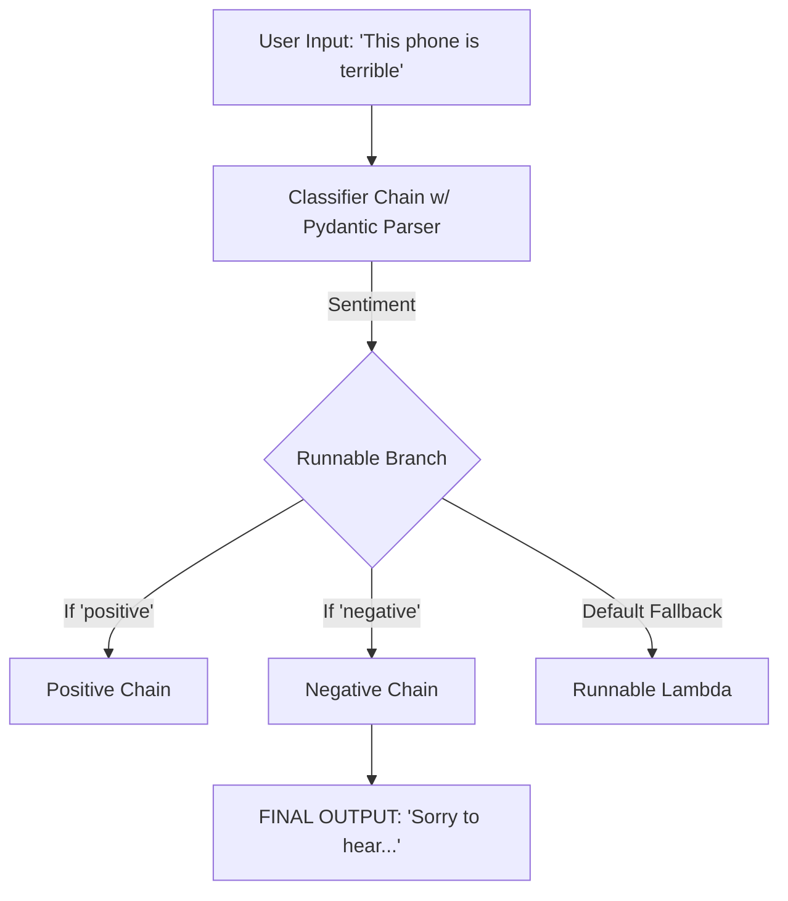

  

{: .note}
> 
> [1. Sequential Chains](#1-sequential-chains)
>
> [2. Parallel Chains](#2-parallel-chains)
>
> [3. Conditional Chains](#3-conditional-chains-branching)

### Phase 1: The Core Problem & The "Pipeline" Solution
When building Generative AI applications, you will quickly notice that any system is simply a sequence of smaller steps. Even the simplest application requires a minimum of three steps: taking user input to form a prompt, passing that prompt to the LLM, and parsing the LLM's response to display to the user.

{: .note}
>
> **The Problem:** If you manually execute these steps, you have to write heavy, repetitive boilerplate code. You must manually format the prompt, invoke the model, extract the content from the model's output payload, and pass it forward. If you are building a massive, complex enterprise application, this manual approach is completely unscalable.

{: .note}
>
> **The Solution:** Chains allow you to construct an automated pipeline. In a chain, the output of Step 1 automatically becomes the input for Step 2, and the output of Step 2 becomes the input for Step 3, and so on. Once the pipeline is built, you simply provide the initial input to trigger the chain, and the system handles the entire execution flow automatically until it delivers the final output.

To link these components together cleanly, LangChain utilizes **LangChain Expression Language (LCEL)**, a declarative syntax that relies heavily on the pipe operator (`|`). A standard chain is built with a simple, elegant line of code: `chain = prompt | model | parser`.

---

### Phase 2: The Three Chain Architectures
You can use Chains to build three distinct types of architectures, ranging from simple sequences to complex conditional routing. 

#### 1. Sequential Chains
A Sequential Chain executes steps in a direct series. It is highly useful when a task requires multiple passes through an LLM.

**The Application:** Imagine you want to generate a detailed report on a topic (like "Unemployment in India"), and then immediately summarize that newly generated report into five bullet points.

**The Execution:** You create two prompts. The pipeline starts with Prompt 1, feeds into the model, and parses the output into a detailed report. That output text is immediately piped directly into Prompt 2, fed back into the model, and parsed to yield the final 5-pointer summary. 

**Visual Architecture: Sequential Chain**

#### 2. Parallel Chains
Sometimes, tasks do not need to wait for each other. You can execute multiple chains simultaneously using a concept called `RunnableParallel`. 

**The Application:** You pass a massive text document (like a guide on Machine Learning) to the AI. You want to simultaneously generate a set of study notes *and* a multiple-choice quiz, and then merge them into one document.
**The Execution:** You set up two separate sub-chains: one dedicated to generating notes and another dedicated to generating a quiz. Using `RunnableParallel`, you pass the source text to both models at the exact same time. Once both parallel branches finish, their outputs are piped into a third "Merge Chain" that combines them into a single response.

**Visual Architecture: Parallel Chain**

#### 3. Conditional Chains (Branching)
Conditional Chains function like an `if/else` statement for your AI pipeline. Based on a specific condition, the system dynamically routes the input to different chains.

**The Application:** You are building an intelligent customer service bot. It reads user feedback, determines the sentiment, and routes it to generate an appropriate response (e.g., thanking them for positive feedback, or apologizing for negative feedback).
**The Execution:** This requires strict control over the LLM's output. If you ask an LLM for sentiment, it might say "The sentiment is positive," which will break your `if/else` logic. Therefore, you must use a **PydanticOutputParser** to force the LLM to output a strict, structured dictionary with only the exact words "positive" or "negative". 

Once the sentiment is strictly classified, you use `RunnableBranch`. `RunnableBranch` checks the condition: if the sentiment is "positive", it triggers the Positive Prompt Chain; if "negative", it triggers the Negative Prompt Chain. You also provide a fallback default chain using `RunnableLambda` (which converts a standard Python function into a pipeline component) just in case no conditions are met.

**Visual Architecture: Conditional Chain**

---

### Phase 3: Debugging and Visualization
When building these highly complex pipelines, it becomes difficult to keep track of where the data is flowing. LangChain provides a built-in debugging tool to visualize your entire architecture directly in the terminal. 

By calling the function `chain.get_graph().print_ascii()`, the system will print a visual representation of your exact pipeline, showing every prompt, model, parser, branch, and connection from start to finish.
