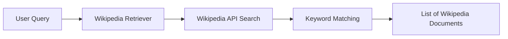
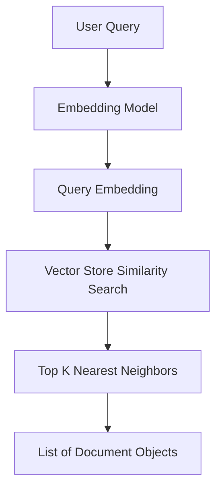
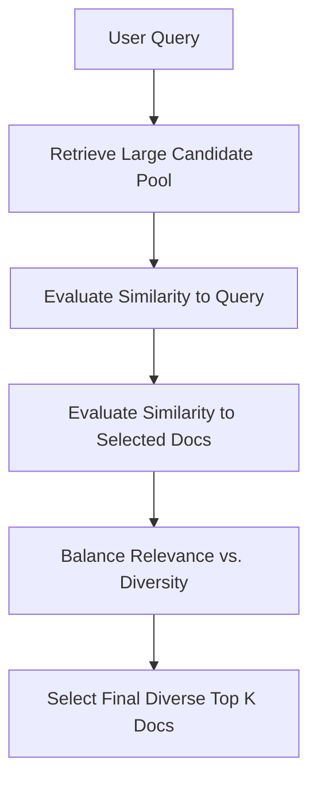
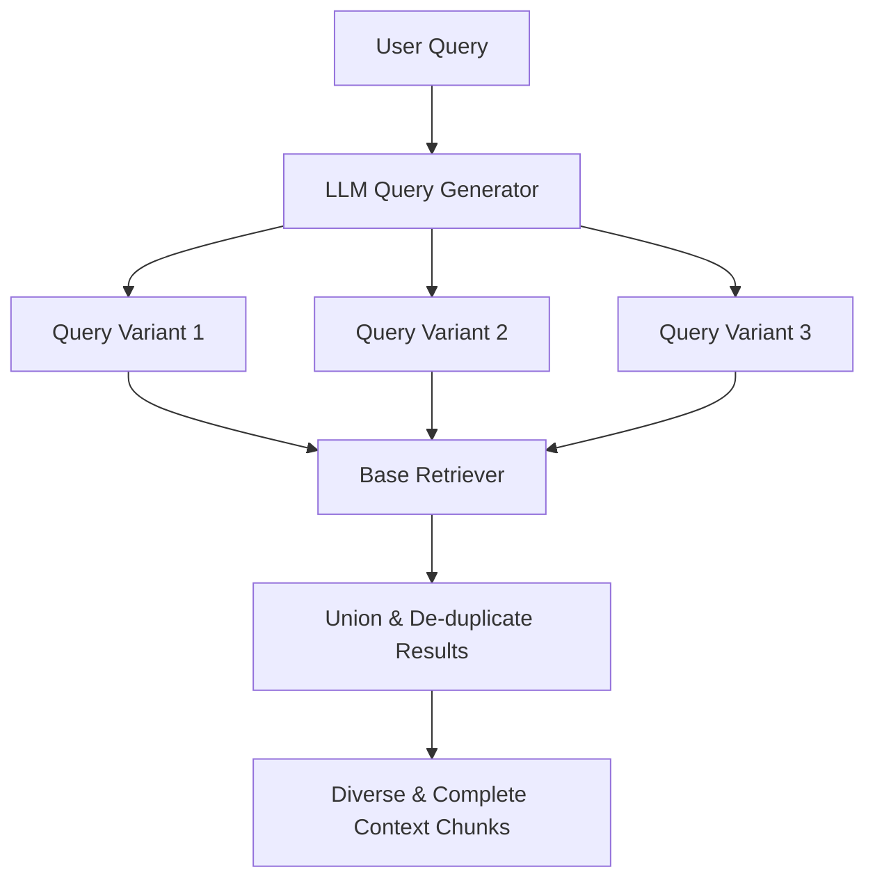
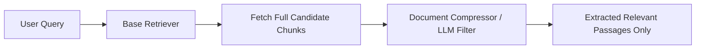

# Understanding Retrievers in LangChain: From Similarity Search to Advanced Retrieval Strategies

## Introduction

Retrieval-Augmented Generation (RAG) has become the gold standard for connecting Large Language Models (LLMs) to external, dynamic, or private datasets. However, simple RAG implementations often suffer from poor retrieval quality. They may return redundant chunks, irrelevant information, or fail to interpret ambiguous user queries correctly. 

At the heart of any high-performing RAG system is the **Retriever**. Selecting the right retrieval strategy is one of the most effective levers you have to improve response accuracy, reduce LLM context pollution, and optimize token costs. This guide explores the core concepts of retrievers in LangChain, details five essential retriever types, and outlines best practices for implementing them in production.

---

## Background

In LangChain, a **Retriever** is a component that fetches relevant documents from a data source in response to an unstructured query. 

{: .important }
> **Key Concept:**
> Unlike a Document Loader, which ingestion-loads *all* content from a source, a Retriever acts as a query-time search engine. It applies search logic to filter, rank, and return only the most relevant `Document` objects.

```
                  +-----------------------+
                  |  External Data Source |
                  +-----------+-----------+
                              |
                              | (Search query execution)
                              v
+------------+    +-----------+-----------+    +-----------------------+
| User Query | -> |       Retriever       | -> | List of Document Objs |
+------------+    +-----------------------+    +-----------------------+
```

Technically, retrievers are defined as a standard input/output interface:
* **Input**: An unstructured text query (string).
* **Output**: A list of LangChain `Document` objects.

Every `Document` object contains two main fields:
1. `page_content`: The raw text content.
2. `metadata`: A dictionary containing metadata (e.g., source path, page numbers, author).

### Retrievers as LCEL Runnables
In LangChain, all retrievers inherit from the `Runnable` class. This makes them first-class citizens of the LangChain Expression Language (LCEL). You can seamlessly chain them with prompt templates, LLMs, and output parsers, or integrate them into complex workflows:

```python
# A simple LCEL chain containing a retriever
chain = (
    {"context": retriever | format_docs, "question": RunnablePassthrough()}
    | prompt
    | model
    | parser
)
```

---

## Types of Retrievers

We can categorize LangChain retrievers along two main dimensions:

1. **Based on Data Source**: Where the retriever fetches the information (e.g., local files, cloud databases, external APIs like Wikipedia or ArXiv).
2. **Based on Search Strategy**: The algorithmic mechanism used to determine document relevance (e.g., similarity search, diversity-focused search, query expansion).

Let's examine five common retrievers, starting with simple data-source integrations and moving to advanced algorithmic retrieval strategies.

---

## 1. Wikipedia Retriever

The **Wikipedia Retriever** is a data-source retriever. Instead of querying a pre-indexed vector store, it connects directly to the Wikipedia API to retrieve articles relevant to a query.

### Concept
The Wikipedia Retriever uses keyword-based matching to locate articles. The text of the retrieved articles is parsed and returned as standard LangChain `Document` objects.

### Architecture


### Implementation
To use the Wikipedia Retriever, import it from `langchain_community.retrievers` and configure it with settings like the maximum number of documents to return or the language.

```python
from langchain_community.retrievers import WikipediaRetriever

# Initialize the retriever
retriever = WikipediaRetriever(
    lang="en", 
    load_max_docs=2
)

# Fetch relevant documents
docs = retriever.invoke("Indian Premier League")

# Inspect results
for doc in docs:
    print(f"Source: {doc.metadata['source']}")
    print(f"Snippet: {doc.page_content[:150]}...\n")
```

### Best Practices
* **Use Case**: Best for generic world knowledge or background fact-checking.
* **Pitfall**: It relies on keyword matching. If your query uses synonyms or is phrased ambiguously, it may fail to find relevant articles.

---

## 2. Vector Store Retriever

The **Vector Store Retriever** is the foundation of most semantic RAG applications. It wraps a vector store (such as FAISS, Chroma, or Pinecone) and uses embedding vectors to perform semantic similarity searches.

### Concept
During retrieval, the user's query is converted into a vector embedding using the same embedding model used to index the data. The retriever then queries the vector store to find the closest document vectors in the embedding space (typically using Cosine Similarity).

### Architecture


### Implementation
You can instantiate a retriever directly from any existing LangChain vector store using the `.as_retriever()` helper:

```python
from langchain_core.vectorstores import InMemoryVectorStore
from langchain_openai import OpenAIEmbeddings

# Initialize embeddings and vector store
embeddings = OpenAIEmbeddings()
vectorstore = InMemoryVectorStore(embeddings)

# Populate vector store (assuming documents are loaded and split)
# vectorstore.add_documents(chunks)

# Create the retriever
retriever = vectorstore.as_retriever(
    search_type="similarity",
    search_kwargs={"k": 3}
)

# Invoke retrieval
docs = retriever.invoke("What are the prerequisites for learning machine learning?")
```

### Best Practices
* **Direct Similarity Search vs. Retriever**: While you can call `vectorstore.similarity_search()` directly, wrapping it as a retriever allows it to conform to the `Runnable` interface, allowing it to be used in chains and upgraded with more advanced search strategies.

---

## 3. MMR (Maximum Marginal Relevance) Retriever

Standard semantic searches can suffer from redundancy. For example, if you ask "What are the adverse effects of climate change?", a simple similarity search might return three highly similar documents all discussing glacier melting. While relevant, this fills your LLM's limited context window with repetitive information.

The **MMR Retriever** solves this by optimizing for both **relevance** and **diversity**.

### Concept
MMR first retrieves a larger set of candidate documents, then iteratively selects the most relevant document while penalizing candidate documents that are highly similar to those already selected.

This behavior is governed by the parameter **lambda ($\lambda$)**:
* $\lambda = 1$: Behaves exactly like standard similarity search (relevance only).
* $\lambda = 0$: Maximizes diversity among selected documents.
* *Typical Value*: $0.5$ balances both characteristics.

### Architecture


### Implementation
To use MMR, change the `search_type` to `"mmr"` when converting your vector store:

```python
# Configure MMR retrieval
retriever = vectorstore.as_retriever(
    search_type="mmr",
    search_kwargs={
        "k": 3,               # Number of documents to return to the LLM
        "fetch_k": 10,        # Number of candidate documents to pass to MMR algorithm
        "lambda_mult": 0.5    # Diversity factor (0 = max diversity, 1 = max relevance)
    }
)

docs = retriever.invoke("What are the adverse effects of climate change?")
```

### Best Practices
* **Use Case**: Excellent for domains where knowledge sources are highly repetitive or redundant.
* **Pitfall**: Avoid setting $\lambda$ too low ($< 0.2$), as this can retrieve completely irrelevant documents just to force diversity.

---

## 4. Multi Query Retriever

User queries are often ambiguous, vague, or use vocabulary that differs from how the information is written in the database. For example, a user asking "How can I stay healthy?" might miss documents containing "balanced diet details" or "cardiovascular exercise benefits."

The **Multi Query Retriever** automates prompt tuning by using an LLM to generate multiple formulations of a query from different perspectives.

### Concept
The Multi Query Retriever passes the user query to an LLM, which generates multiple related query formulations. The retriever runs all generated queries against the base retriever, merges the retrieved documents, and de-duplicates the final set.

### Architecture


### Implementation
```python
from langchain.retrievers.multi_query import MultiQueryRetriever
from langchain_openai import ChatOpenAI

# Define the helper LLM for query generation
llm = ChatOpenAI(temperature=0)

# Create the Multi Query Retriever
retriever = MultiQueryRetriever.from_llm(
    retriever=vectorstore.as_retriever(),
    llm=llm
)

# Executes query generation and retrieves documents
docs = retriever.invoke("How can I stay healthy?")
```

### Best Practices
* **Use Case**: Highly recommended for user-facing applications where search queries are short, informal, or ambiguous.
* **Pitfall**: Generating multiple queries increases latency and API token costs because of the extra LLM call prior to retrieval.

---

## 5. Contextual Compression Retriever

When documents are retrieved, they are usually returned as entire chunks. Often, only a single sentence or paragraph within a large chunk contains the answer, while the rest of the text is irrelevant noise. This noise wastes context space and can distract the LLM during generation.

The **Contextual Compression Retriever** solves this by extracting and returning only the specific segments of documents that are relevant to the query.

### Concept
1. The base retriever fetches full candidate documents.
2. A document compressor (typically an LLM or cross-encoder model) parses each document in the context of the user query.
3. The compressor trims away irrelevant text, returning only the highly relevant snippets.

### Architecture


### Implementation
```python
from langchain.retrievers import ContextualCompressionRetriever
from langchain.retrievers.document_compressors import LLMChainExtractor
from langchain_openai import ChatOpenAI

# Initialize the compressor LLM
llm = ChatOpenAI(temperature=0)
compressor = LLMChainExtractor.from_llm(llm)

# Create the Contextual Compression Retriever
compression_retriever = ContextualCompressionRetriever(
    base_compressor=compressor,
    base_retriever=vectorstore.as_retriever()
)

# Retrieve compressed snippets
compressed_docs = compression_retriever.invoke("What is photosynthesis?")
```

### Best Practices
* **Use Case**: Crucial when using LLMs with small context windows or when document chunks are dense and cover multiple topics.
* **Pitfall**: High latency. Processing every retrieved document with an LLM before generation adds significant overhead. Consider using lighter embeddings-based filters (like `EmbeddingsFilter`) to compress without LLM calls.

---

## Strategy Comparison

To choose the right retrieval strategy for your application, compare their characteristics below:

| Retriever | Primary Goal | Latency | Cost | Best Suited For |
| :--- | :--- | :--- | :--- | :--- |
| **Vector Store (Similarity)** | Find semantically similar text | Low | Low | Generic semantic queries on clean datasets |
| **MMR** | Reduce redundancy & maximize diversity | Low | Low | Datasets with repetitive content (e.g., news wires) |
| **Multi Query** | Resolve vague or poorly phrased prompts | Medium | Medium | User-facing chat interfaces with informal queries |
| **Contextual Compression** | Extract only relevant parts of chunks | High | High | Long documents or highly precise answers |

---

## Advanced Retrievers to Explore

Beyond these five, LangChain offers more specialized retrievers:
* **Parent Document Retriever**: Stores small chunks for retrieval but returns the larger parent document (or a larger section) to provide the LLM with broader context.
* **Self Query Retriever**: Uses an LLM to query a vector store by parsing metadata filters out of the user's natural language query.
* **Ensemble Retriever**: Combines results from multiple retrievers (e.g., sparse BM25 keyword search + dense semantic vector search) and re-ranks them using Reciprocal Rank Fusion (RRF).

---

## Key Takeaways

* **Retrievers are search engines, not loaders**: A retriever takes a string query and returns filtered, ranked `Document` objects.
* **LCEL Integration**: Because retrievers are runnables, they plug directly into LangChain Expression Language chains.
* **Diversification vs. Relevance**: Use MMR to avoid filling your LLM context window with repetitive documents.
* **Address Vague Queries**: Use Multi Query retrieval to expand user search phrases into multiple relevant queries.
* **Minimize Context Noise**: Use Contextual Compression to isolate and extract only the relevant parts of a long text chunk.

---

## Conclusion

Building a production-ready RAG application requires more than just a naive vector similarity search. By choosing the right retriever and search strategy, you can drastically reduce hallucinations, decrease latency, and lower token consumption. 

Start by building a baseline similarity retriever. As you evaluate your application, transition to MMR to fix duplicate results, Multi Query to handle ambiguous queries, or Contextual Compression to refine the context passed to your LLM.
