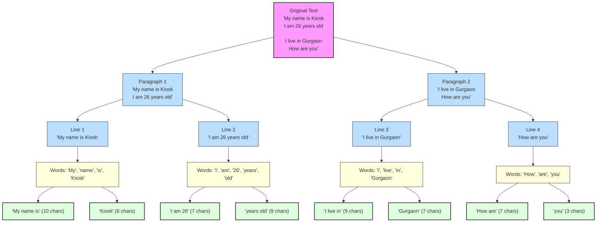

## Building RAG-based applications using LangChain. 

Let's discuss a very important second component called text splitters. We will study different techniques for splitting large texts into smaller chunks, which are necessary for LLM applications. We'll cover length-based, structure-based, and semantic-based splitting methods.

First, let's discuss what text splitting actually is.

Suppose you have a very large text file or PDF, maybe thousands of pages long, and you want to perform some kind of processing on it. Obviously, processing such a huge PDF all at once would be very difficult. So an obvious solution is to divide the entire PDF into smaller chunks. 

*For example, you could create chunks based on pages: page one becomes one chunk, page two becomes another chunk, and so on. Or you could use another strategy, such as creating chunks based on paragraphs.*

# Text Splitters in RAG: Chunking Data for LLMs

To build any Retrieval-Augmented Generation (RAG) application, the second step in the ingestion phase is to break down the loaded documents into smaller, semantically coherent chunks. This process is handled by **Text Splitters**.

In this guide, we will explore how Text Splitters work in LangChain, cover different types of text splitting, and understand how to optimize chunk sizes and overlap.

---

## The Roadmap: Mastering Text Splitting
To fully understand how to split external data for an LLM, we will cover:
* **What** is Text Splitting?
* **Why** is Text Splitting important?
* **The 4 Main Splitting Techniques** (Length-based, Text-structure, Document-structure, and Semantic)
* **Chunk Size & Chunk Overlap** (Optimizing context retrieval)

---

## The Big Picture: RAG & Chunking

Regardless of how complex a RAG application is, it is almost always built using four core components:

```
[ Raw Source ] ---> [ Document Loader ] ---> [ Text Splitter ] ---> [ Vector Database ] ---> [ Retriever ]
                                              (Our Focus)             (Storage)             (Search)
```

1. **Document Loaders**: Load data from different sources and convert them into standard objects.
2. **Text Splitters**: Break down large documents into smaller, semantically coherent chunks.
3. **Vector Databases**: Store chunk embeddings to enable fast fuzzy semantic searches.
4. **Retrievers**: Retrieve and rank the top context chunks matching the user query.

{: .tip}
> The good part is that even though these splitters work with different types of data, the basic idea behind all of them is exactly the same. So once you understand one splitter properly, you can easily work with most of the others.


## What is a Text Splitter?

{: .important }
> **Definition:**  
> Text splitting is the process of breaking large chunks of text like articles, PDFs, HTML pages, and books into smaller manageable pieces (chunks) that an LLM can handle effectively. The code that performs this operation is called a **text splitter**.

This is a very important fact in the world of LLMs: if you are building any LLM-powered application, **you should never try to deal with very large texts all at once**. Generally, in such situations, the quality of the LLM’s output is not very good. It is always recommended that you divide large texts into smaller chunks and then feed those chunks to the LLM. This significantly improves output quality.

---

## Why is Text Splitting Important?

There are three major reasons why text splitting is crucial when building LLM-powered applications:

### 1. Overcoming Context Length Limits (Model Limitations)
Every Language Model has a strict context length limit, meaning there is a boundary to how much text an LLM can receive as input in a single request.

Suppose an LLM has a context length of 50,000 tokens (for simplicity, let's assume tokens and words are the same). If you have a huge PDF containing thousands of pages and over 100,000 words, you cannot send the entire document in a single prompt because it exceeds the context limit. Text splitting solves this by breaking the document into smaller segments.

{: .note}
> Many embedding models and language models have maximum input size constraints. Splitting allows us to process documents that would otherwise exceed these limits.


### 2. Improving Downstream Task Performance
When building LLM-powered applications, you perform tasks such as embeddings, semantic search, and text summarization. Text splitting generally provides better results for all these tasks.

Let me explain.

Take embeddings for example. You have a piece of text and convert it into numbers or vectors so that machine learning models can work with it. You do this using an embedding model.

If you try to embed a very large text into vectors, you will notice that the embedding quality is often not very good. In other words, the vector does not effectively capture the semantic meaning of the entire text.

This happens because you are trying to represent the semantic meaning of a huge amount of text using only a few numbers, which is difficult.

Instead, if you divide the text into smaller chunks and generate separate embeddings for each chunk, it has been observed that these smaller chunks capture semantic meaning much better.
  
  {: .tip}
  > **Example:** Suppose you have a document about the IPL where different paragraphs cover CSK, Mumbai Indians, RCB, etc. If you generate a single embedding for the whole text, the quality will be diluted. Creating separate embeddings for each team's paragraph captures the semantic meaning much more effectively.

* **Semantic Search**:
As discussed before, suppose you have separate documents about `RCB`, `MI`, and `CSK`, and you have generated embeddings for all of them.

Now suppose you receive a query: “Which IPL team does Virat Kohli play for?”

You generate an embedding for the query and compare it with the document embeddings. The document with the highest similarity provides the answer. This process is called semantic search.

Again, it has been observed that semantic search works more accurately when you perform chunking first. If you search over smaller chunks rather than one large block of text, the search quality is significantly improved.


* **Summarization**

If you ask an LLM to summarize a very large document, LLMs are not always great at handling large texts. Sometimes they drift off-topic, and sometimes they hallucinate information that doesn't even exist in the document. Empirical evidence shows that text splitting often produces better summarization results.

So reason number two is that text splitting improves downstream tasks such as embeddings, semantic search, and summarization.

* **Computational Efficiency**

Obviously, processing smaller chunks is more efficient than processing one huge text. It reduces memory requirements and allows better parallelization of tasks.

After this discussion, I hope you understand why text splitting is so important when building LLM-based applications.   

Specifically, we will cover four different types of text splitting:

1. **Length-based splitting**
2. **Text-structure-based splitting**
3. **Document-structure-based splitting**
4. **Semantic-meaning-based splitting**

Now let's discuss our first text splitting technique, called length-based text splitting.

Length-based text splitting is the simplest and fastest way to split text. With this method, you decide beforehand what the size of each chunk will be (defined in characters or tokens).

Suppose you have a text and set the chunk size to 100 characters:
1. The splitter traverses the text from the beginning.
2. Once it reaches 100 characters, it cuts the text to create the first chunk.
3. It resumes traversing from that point, counts another 100 characters, creates the second chunk, and continues this pattern.

{: .tip}
> **Pros & Cons:**
> * **Pros:** Extremely simple and fast.
> * **Cons:** Ignores linguistic structure, grammar, and semantic meaning. It will cut abruptly after exactly 100 characters, even if it splits a word, sentence, or paragraph in half.

[ChunkViz](https://chunkviz.up.railway.app/)

#### Implementation in LangChain
In LangChain, this is implemented using `CharacterTextSplitter`:

```python
from langchain.text_splitter import CharacterTextSplitter

text = """Your text goes here....."""

splitter = CharacterTextSplitter(
    chunk_size=100,
    chunk_overlap=0,
    separator=''
)

result = splitter.split_text(text)

print(result)

```

#### Connecting Document Loaders with Text Splitters
Usually, instead of splitting raw text strings directly, you want to split standard `Document` objects that you loaded using a Document Loader (like `PyPDFLoader`):

```python
from langchain_community.document_loaders import PyPDFLoader
from langchain.text_splitter import CharacterTextSplitter

# 1. Load documents (returns list of Documents, one per page)
loader = PyPDFLoader("file.pdf")
documents = loader.load()

# 2. Initialize the splitter
splitter = CharacterTextSplitter(
    separator="\n",
    chunk_size=1000,
    chunk_overlap=150
)

# 3. Use split_documents instead of split_text
chunked_docs = splitter.split_documents(documents)
print(f"Generated {len(chunked_docs)} chunked documents.")
print("Metadata of first chunk:", chunked_docs[0].metadata)
```

{: .note}
> Using `split_documents` automatically preserves the original document's `metadata` dictionary (such as page number or source path) and attaches it to every single resulting chunk document.

---

### Understanding Chunk Overlap

The `chunk_overlap` parameter defines how many units (characters/tokens) of overlap exist between two consecutive chunks.

```
[--- Chunk 1 ---]
           [--- Chunk 2 ---]
           ^--- Overlap ---^
```

If your `chunk_size` is 100 and `chunk_overlap` is 20, the last 20 characters of Chunk 1 will also appear at the beginning of Chunk 2.

{: .important}
> **Why is Chunk Overlap Useful?**
> * **Context Preservation:** Abruptly splitting text at a size boundary can cut a sentence in half or sever the link between a pronoun and its subject. Overlap keeps context intact at the boundary.
> * **Better Retrieval:** It ensures that information lying exactly on a boundary isn't lost during similarity searches.
>
> **Trade-off:**
> * Too little overlap leads to context fragmentation.
> * Too much overlap creates redundant chunks, increasing vector store size and LLM generation costs.
>
> *Rule of Thumb:* A common recommendation is to set `chunk_overlap` to **10% to 20%** of your `chunk_size` (e.g., `chunk_size=1000`, `chunk_overlap=150`).

---

### 2. Text-Structure-Based Splitting (`RecursiveCharacterTextSplitter`)

This technique takes advantage of the fact that written text naturally follows a hierarchical structure:
1. **Paragraphs** (separated by `\n\n`)
2. **Sentences** (separated by `\n` or punctuation)
3. **Words** (separated by spaces `" "`)
4. **Characters** (separated by `""`)

The most popular implementation in LangChain is the **`RecursiveCharacterTextSplitter`**.

#### How the Recursive Algorithm Works
The splitter is initialized with a default hierarchy of separators: `["\n\n", "\n", " ", ""]`.
1. It attempts to split the text by the first separator (double newlines `\n\n` for paragraphs).
2. If the resulting chunks are smaller than the target `chunk_size`, it keeps them.
3. If any chunk is still larger than the target `chunk_size`, it recursively applies the next separator (single newlines `\n`) to that specific chunk.
4. It repeats this process down the separator list (spaces, then characters) until all pieces fit within the maximum size constraint.

This approach intelligently merges adjacent segments when they fit, ensuring that paragraphs, sentences, and words are kept together as much as possible.

{: .tip}
> **Example Walkthrough:**
> Consider this input text:
> ```text
> My name is Kiosk
> I am 26 years old
> 
> I live in Gurgaon
> How are you
> ```
> Let's set a small `chunk_size` of **10 characters**.
> - The splitter first splits on paragraph boundaries (`\n\n`).
> - Since the paragraph *"My name is Kiosk\nI am 26 years old"* is longer than 10 characters, it splits it using `\n`.
> - The sentence *"My name is Kiosk"* is still longer than 10 characters, so it splits on spaces `" "`.
> - It merges word blocks together as long as they don't exceed 10 characters.
> 
> The resulting chunks are:
> * `"My name is"` (10 chars)
> * `"Kiosk"` (6 chars)
> * `"I am 26"` (7 chars)
> * `"years old"` (9 chars)
> * `"I live in"` (9 chars)
> * `"Gurgaon"` (7 chars)
> * `"How are"` (7 chars)
> * `"you"` (3 chars)
> 
> Notice how the algorithm works hard to avoid splitting individual words. If we increased the `chunk_size` to 26, it would keep entire sentences intact. If we increased it to 50, it would keep entire paragraphs intact.


### Visual Splitting & Merging Tree



Here is the step-by-step breakdown showing the recursive splitting and final merging process:

```text
📂 Original Text
 ├── 📄 Paragraph 1: "My name is Kiosk\nI am 26 years old"
 │    ├── 📝 Line 1: "My name is Kiosk"
 │    │    ├── 🔤 Words: ["My", "name", "is", "Kiosk"]
 │    │    └── 🔗 Merge (≤ 10 chars):
 │    │         ├── "My name is" (10 chars)
 │    │         └── "Kiosk" (6 chars)
 │    └── 📝 Line 2: "I am 26 years old"
 │         ├── 🔤 Words: ["I", "am", "26", "years", "old"]
 │         └── 🔗 Merge (≤ 10 chars):
 │              ├── "I am 26" (7 chars)
 │              └── "years old" (9 chars)
 └── 📄 Paragraph 2: "I live in Gurgaon\nHow are you"
      ├── 📝 Line 3: "I live in Gurgaon"
      │    ├── 🔤 Words: ["I", "live", "in", "Gurgaon"]
      │    └── 🔗 Merge (≤ 10 chars):
      │         ├── "I live in" (9 chars)
      │         └── "Gurgaon" (7 chars)
      └── 📝 Line 4: "How are you"
           ├── 🔤 Words: ["How", "are", "you"]
           └── 🔗 Merge (≤ 10 chars):
                ├── "How are" (7 chars)
                └── "you" (3 chars)
```

#### Implementation in LangChain
`RecursiveCharacterTextSplitter` is the recommended default splitter for general text.

#### Example 1:-

```python
from langchain.text_splitter import RecursiveCharacterTextSplitter

text = """
Space exploration has led to incredible scientific discoveries. From landing on the Moon to exploring Mars, humanity continues to push the boundaries of what’s possible beyond our planet.

These missions have not only expanded our knowledge of the universe but have also contributed to advancements in technology here on Earth. Satellite communications, GPS, and even certain medical imaging techniques trace their roots back to innovations driven by space programs.
"""

# Initialize the splitter
splitter = RecursiveCharacterTextSplitter(
    chunk_size=500,
    chunk_overlap=0,
)

# Perform the split
chunks = splitter.split_text(text)

print(len(chunks))
print(chunks)
```


#### Example 2:-

```python
from langchain.text_splitter import RecursiveCharacterTextSplitter

text = """My name is Kiosk
I am 26 years old

I live in Gurgaon
How are you"""

# Initialize the recursive splitter
splitter = RecursiveCharacterTextSplitter(
    chunk_size=26,
    chunk_overlap=5
)

# Split the text
chunks = splitter.split_text(text)

for idx, chunk in enumerate(chunks):
    print(f"Chunk {idx+1}: {repr(chunk)}")
```

---

### 3. Document-Structure-Based Splitting

Standard text structure splitters are designed for general prose. However, structured documents like source code or markup require separator rules that match their programming or formatting language:

* **Python code** is organized around classes (`class`), functions (`def`), loops, and indentation rather than sentences.
* **Markdown** documents are structured around headings (`#`, `##`), list items, and section blocks.
* **HTML** documents are structured using tags (`<p>`, `<div>`, etc.).

Using general splitters on code can break classes or HTML structures, rendering the context useless or causing syntax errors.

To solve this, LangChain provides language-specific recursive splitters that use syntax-aware separators.

#### Implementation in LangChain
You can instantiate a structured splitter using the `from_language` constructor of `RecursiveCharacterTextSplitter`:

```python
from langchain.text_splitter import RecursiveCharacterTextSplitter, Language

# 1. Example code snippet to split
python_code = """
class DatabaseConnector:
    def __init__(self, host: str):
        self.host = host

    def connect(self):
        print(f"Connecting to {self.host}")
        return True

def run_query():
    print("Running some DB query")
"""

# 2. Create a Python-specific splitter
python_splitter = RecursiveCharacterTextSplitter.from_language(
    language=Language.PYTHON,
    chunk_size=100,
    chunk_overlap=0
)

# 3. Split the code
code_chunks = python_splitter.split_text(python_code)

for idx, chunk in enumerate(code_chunks):
    print(f"--- Chunk {idx+1} ---")
    print(chunk)
```

{: .tip}
> **Supported Languages:**  
> LangChain supports a wide variety of languages via the `Language` enum, including:
> - `Language.PYTHON`
> - `Language.JS`
> - `Language.TS`
> - `Language.HTML`
> - `Language.MARKDOWN`
> - `Language.CPP`
> - `Language.GO`
> - `Language.JAVA`
> - `Language.PHP`
> - and many others.

---

### 4. Semantic-Meaning-Based Splitting (`SemanticChunker`)

`Farmers were working hard in the fields, preparing the soil and planting seeds for the next season. The sun was bright, and the air smelled of earth and fresh grass. The Indian Premier League (IPL) is the biggest cricket league in the world. People all over the world watch the matches and cheer for their favourite teams.`

Length and structural splitting methods rely on formatting markers (like newlines or length metrics). However, these parameters do not understand what the text actually *means*.

Consider a single paragraph where the first half details *agricultural irrigation* and the second half transitions immediately into *IPL cricket statistics*. Structurally, it is one paragraph, so a structure-based splitter will keep it as a single chunk. Semantically, these are two entirely unrelated topics. They should be split into different chunks to avoid confusing the vector database and the LLM.

**Semantic Splitting** solves this by evaluating semantic transitions:

```text
[ Sentence 1: Agriculture ]  \
[ Sentence 2: Farming     ]   |-- High Cosine Similarity (Keep together)
[ Sentence 3: Irrigation  ]  /
       === Low Similarity Boundary (Topic shift detected!) ===
[ Sentence 4: Cricket     ]  \
[ Sentence 5: IPL Matches ]   |-- High Cosine Similarity (Keep together)
[ Sentence 6: Dhoni       ]  /
```

#### The Semantic Chunking Algorithm
1. **Sentence Segmentation:** Break the raw document into individual sentences.
2. **Generate Embeddings:** Convert each sentence into a vector representation using an embedding model.
3. **Similarity Calculation:** Compute the cosine similarity between each sentence and its neighbors.
4. **Identify Drops:** Detect points where the similarity drops below a calculated threshold.
5. **Split Chunks:** Insert chunk boundaries at these drop-off points.

#### Implementation in LangChain
LangChain provides the `SemanticChunker` (present in `langchain_experimental`). You can choose different thresholding techniques to determine when a topic shift has occurred:

* **Percentile** (default): Splits occur when the similarity drop exceeds a specified percentile.
* **Standard Deviation**: Splits occur when the similarity drop is greater than a standard deviation threshold.
* **Interquartile Range**: Uses interquartile range statistical filters.
* **Gradient**: Splitting based on local slope changes.

```python
# Note: Requires langchain-experimental and an embedding model package
from langchain_experimental.text_splitter import SemanticChunker
from langchain_google_genai import GoogleGenerativeAIEmbeddings

# Initialize the embedding model
embeddings = GoogleGenerativeAIEmbeddings(model="gemini-embedding-2")

# Initialize the semantic chunker
splitter = SemanticChunker(
    embeddings,
    breakpoint_threshold_type="standard_deviation",
    breakpoint_threshold_amount=2
)

# Split the text
text = "..."
documents = splitter.create_documents([text])
```

{: .warning}
> **Experimental Feature:**
> The `SemanticChunker` is currently in LangChain's experimental module. In practice, boundaries are not always highly accurate, and performance depends heavily on the quality of the underlying embedding model. However, as models improve, semantic chunking is poised to become one of the most vital strategies for RAG systems.
