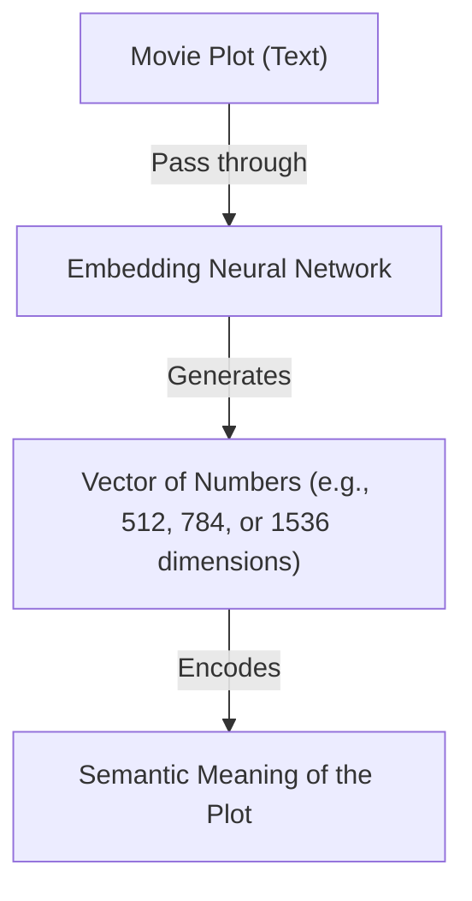
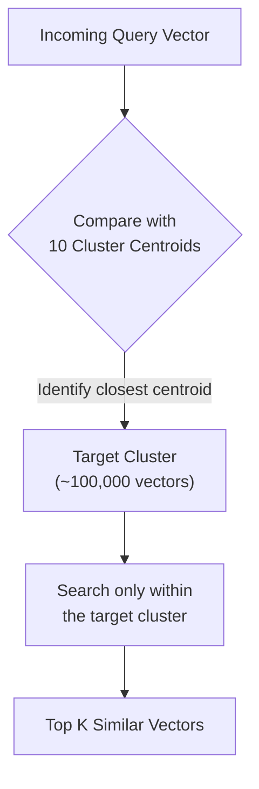

# Vector Stores in RAG-based Applications

So far, we have covered [document loaders](/docs/ai/RAG/Document-Loaders/) and [text splitters](/docs/ai/RAG/Text-Splitters/). Today we will learn about vector stores, which are a critical component of any Retrieval-Augmented Generation (RAG) system.

---

## 🗺️ The Roadmap
In this guide, we will explore:
* **The "Why":** A real-world movie catalog example illustrating why we need vector stores.
* **The "What":** What exactly is a vector store, its core features, and how it handles semantic similarity.
* **Vector Store vs. Vector Database:** Understanding the key differences and typical use cases.
* **Hands-on LangChain Integration:** Implementing a complete, functional code pipeline with **ChromaDB**.

---

## 🎬 Why We Need Vector Stores: A Real-World Example

To understand **why** we need vector stores, let’s consider a real-world scenario.

Suppose you want to build a website where, like `IMDb`, you want to list every movie in the world. Essentially, you want to create a movie catalog system that looks something like, A user can come here, search for any movie, and get all the information related to it.

Now if you think about how such a website would be built, the first step would be to have a database containing data about all movies, right? You would need a database that contains all movie-related information such as movie ID, movie name, director, actors, genre, release date, outcome (hit or flop), and much more.

Where would this information come from? There are many ways. You could fetch data from public APIs or use web scraping. Once you have this database, you can build a backend system, say using Python, that pulls data from the database and sends it to the frontend, which then displays it.

### The Basic Architecture
To build this, you need a basic stack:
1. **Database:** Stores movie details (ID, name, director, actors, genre, release date, outcome like hit/flop, etc.).
2. **Backend:** Powered by Python (or another backend language) to fetch data from the database.
3. **Frontend:** Displays the movie details to the user.

### Adding a Movie Recommendation System
Now suppose you have built this website, but gradually you want to improve it. The first improvement you think of is adding a movie recommendation system.

This means that if a user is on the page of a particular movie, say *Spider-Man*, then along with *Spider-Man*’s information, you also show other similar movies at the bottom of the page, such as *Iron Man* and *Captain America*.

A high-quality recommendation system increases user engagement: a user reading about *Spider-Man* clicks on *Iron Man*, then *Captain America*, spending more time on your site, which you can monetize through advertisements.

#### Attempt 1: Keyword Matching (The Simple Solution)
A very simple solution is keyword matching. You compare two movies ($M_1$ and $M_2$) based on various parameters:
* Director
* Actors
* Genre
* Release date

If these keywords match, the movies are considered similar. If they don’t match, the movies are considered dissimilar.

While this keyword-matching system works reasonably well initially, it has two major flaws:

1. **False Positives (High keyword match, completely different plots):**  
   Suppose a user watches *My Name Is Khan* and wants recommendations. The system recommends *Kabhi Alvida Naa Kehna* because:
   * Same director (Karan Johar)
   * Same lead actor (Shah Rukh Khan)
   * Similar release period
   * Both have the "Drama" genre tag
   
   Since multiple keywords match, the system thinks they are similar. In reality, their storylines and core themes are entirely different.

2. **False Negatives (No keyword match, highly similar plots):**  
   Consider *Taare Zameen Par* and *A Beautiful Mind*. Both movies feature a central character struggling with a mental/neurological challenge or condition while being exceptionally gifted in another aspect. The themes and emotional arcs are highly similar. However:
   * Different directors
   * Different actors
   * Different release dates
   
   Since they share no common keywords, the algorithm will never identify them as similar.

In short, keyword matching is too simplistic. To get high-quality recommendations, you need a better approach.

---

#### Attempt 2: Comparing Movie Plots (Semantic Matching)
Instead of matching keywords, you decide to **compare the plots** of the movies. If two movie stories are similar, the movies are similar.

To do this:
1. You fetch movie plots (each containing 2,000–3,000 words) and add them to your database.
2. You need a system to compare the semantic meaning of these plots and output a similarity score.

---

### Enter Text Embeddings

Comparing the semantic meaning of two large texts (2,000–3,000 words) is a highly challenging Natural Language Processing (NLP) task. However, deep learning has solved this via **embeddings**.

An **embedding** is a vector (list) of floating-point numbers that represents the semantic meaning of any text snippet.



During this process:
1. You feed the text into an embedding model (neural network).
2. The neural network processes and understands the semantic context of the text.
3. The network outputs a numerical vector representing that semantic meaning.
4. The vector may have 512, 784, or 1536+ dimensions. These numbers collectively encode the meaning of the text.

By converting movie plots into embedding vectors:
* Movie 1 $\rightarrow$ Embedding Vector 1
* Movie 2 $\rightarrow$ Embedding Vector 2
* Movie 3 $\rightarrow$ Embedding Vector 3
* Movie 4 $\rightarrow$ Embedding Vector 4

Because these plots are now represented as numbers, they can be plotted in a multi-dimensional coordinate space. 

When a user asks: **"Which movie is most similar to $M_4$ (e.g., *Stree*)?"**
The system calculates the angular distance (similarity) between $M_4$ and all other vectors:
* **$M_4$ vs. $M_3$:** Large angular distance (low similarity)
* **$M_4$ vs. $M_2$:** Large angular distance (low similarity)
* **$M_4$ vs. $M_1$ (e.g., *3 Idiots*):** Small angular distance (high similarity)

A smaller angular distance indicates a higher similarity. The system concludes that $M_1$ is the most similar movie to $M_4$.

### Summary of the Semantic Pipeline:
1. **Obtain movie plots.**
2. **Generate embedding vectors** for every plot.
3. **Calculate similarities** between vectors (typically using Cosine Similarity).
4. **Rank movies:** High similarity = similar, low similarity = dissimilar.

{: .note}
> This semantic recommendation system works beautifully in theory. However, in practice, building this system at scale introduces several critical challenges.

---

### 🛑 The Three Core Challenges

When building this semantic system, you face three primary engineering bottlenecks:

| Challenge | Description | Why Traditional DBs Fail |
| :--- | :--- | :--- |
| **1. Generating Embeddings** | You have millions of movies and need to generate, manage, and batch-process embeddings for all of them. | - |
| **2. High-Dimensional Storage** | Storing millions of high-dimensional vectors (e.g., 1536 float values per vector). | Traditional relational databases (MySQL, PostgreSQL, Oracle) are designed for tabular data, not high-dimensional vector types. |
| **3. Scalable Semantic Search** | Finding the top 5 most similar vectors from 1,000,000 documents requires calculating distances 1,000,000 times (a $O(N)$ operation). | Performing raw distance calculations for millions of rows on every query is computationally expensive and causes massive latency. |

{: .note}
> **The Solution:** This is where **Vector Stores** come in. They are designed specifically to solve these storage and retrieval challenges.

---

## What is a Vector Store?

{: .important}
> **Definition:**  
> A **Vector Store** is a specialized storage and retrieval system designed specifically to hold data represented as numerical vectors (embeddings) and perform fast similarity searches on them.

---

## The 4 Key Features of a Vector Store

A robust vector store provides four main capabilities:

### 1. Storage
At its core, a vector store holds vector embeddings alongside their associated **metadata**.
* **Storage Options:** Can run **in-memory** (ideal for rapid testing) or **on-disk** (persistent storage for production).
* **Metadata Support:** Stores helper data (like Movie ID, Title, Genre, URLs) alongside the vector. This allows filtering results based on non-vector criteria.

### 2. Similarity Search
Allows querying the store with a new vector to retrieve the most similar vectors. This forms the foundation of recommendation engines, semantic search, and RAG systems.

### 3. Indexing (Speed Optimization)
If you have 1 million vectors, comparing a query against all 1 million is too slow. Vector stores use **indexing** (e.g., Approximate Nearest Neighbors - ANN) to speed up search.

**An Example of Indexing via Clustering:**
Suppose you group 1,000,000 vectors into 10 clusters (100,000 vectors per cluster), each with a calculated **centroid**:



Instead of 1,000,000 comparisons, you perform:
$$\text{10 (Centroid comparisons)} + \text{100,000 (Cluster member comparisons)} \approx 100,010 \text{ operations}$$
This reduces search computations by approximately **90%**.

### 4. CRUD Operations
Like any standard database, a vector store supports full Create, Read, Update, and Delete operations:
* **Create:** Insert new vectors.
* **Read:** Retrieve specific vectors or search similar ones.
* **Update:** Modify existing vectors or their metadata.
* **Delete:** Remove vectors.

---

{: .note}
> **Common Use Cases:**
> * Recommendation Systems
> * Semantic Search Engines
> * Retrieval-Augmented Generation (RAG)
> * Multimedia & Image Search

Whenever your application involves storing and retrieving vectors, vector stores are typically a much better choice than traditional relational databases.

---

## Vector Store vs. Vector Database

Although these terms are often used interchangeably, there is a distinct difference in scale and features:

| Feature | Vector Store (e.g., FAISS) | Vector Database (e.g., Pinecone, Qdrant) |
| :--- | :--- | :--- |
| **Core Functions** | Stores vectors, retrieves vectors, similarity search. | Stores vectors, retrieves vectors, similarity search. |
| **ACID Compliance** | Rarely supported. | Full transaction support. |
| **Scalability** | Usually runs in-memory or single node. | Distributed, auto-scaling architecture. |
| **Enterprise Features**| Minimal (mostly single process). | Backup/Restore, Access Control (IAM), Concurrency control. |

{: .note}
> $$\text{Vector Store} + \text{Enterprise Database Features} = \text{Vector Database}$$

{: .important}
> **Rule of Thumb:**  
> **Every vector database is a vector store, but not every vector store is a vector database.**

* **Examples of Vector Stores:** FAISS (Facebook AI Similarity Search)
* **Examples of Vector Databases:** Milvus, Qdrant, Weaviate, Pinecone, Chroma

---

## LangChain Integration: A Unified Interface

LangChain provides built-in support for many popular vector stores (FAISS, Pinecone, Chroma, Qdrant, Weaviate). By wrapping them under a single unified interface, LangChain makes it extremely easy to switch from one vector store to another with minimal code changes.

Regardless of the underlying vector store, the key API methods remain identical:
* `from_documents(...)` / `from_texts(...)`
* `add_documents(...)` / `add_texts(...)`
* `similarity_search(...)`
* `similarity_search_with_score(...)`

---

## Deep Dive: ChromaDB

We will use **ChromaDB**, a lightweight, open-source vector database suitable for local development and small-to-medium production workloads. ChromaDB sits somewhere between a raw vector store and a full-fledged vector database.

### ChromaDB Hierarchy
ChromaDB organizes data in a structured hierarchy:

```
[ Tenant ]
    └── [ Database ]
            └── [ Collection ]  <--- Equivalent to a Table in SQL
                    └── [ Documents ]
                            ├── Embeddings (Vectors)
                            └── Metadata
```

A **Collection** in Chroma is roughly equivalent to a table in a relational database.

---

## Hands-on Implementation: ChromaDB with LangChain

Let's write a complete Python script that covers all the CRUD and search operations.

### 1. Install Dependencies
```bash
pip install langchain-chroma langchain-openai langchain-core
```

### 2. Full Code Walkthrough
```python
import os
from langchain_chroma import Chroma
from langchain_openai import OpenAIEmbeddings
from langchain_core.documents import Document

# 1. Setup API Keys
# Ensure you have OPENAI_API_KEY set in your environment variables.
# os.environ["OPENAI_API_KEY"] = "your-api-key"

# Initialize our embedding model
embeddings = OpenAIEmbeddings(model="text-embedding-3-small")

# 2. Creating Document Objects
# We will load data representing five IPL players.
documents = [
    Document(
        page_content="Virat Kohli is a world-class batsman playing for RCB. He is known for his aggressive style, incredible chase record, and has led the Indian team.",
        metadata={"id": "1", "team": "RCB", "role": "batsman"}
    ),
    Document(
        page_content="Rohit Sharma is a prolific batsman who plays for Mumbai Indians. He has led MI to multiple IPL titles and is famous for hitman pull shots.",
        metadata={"id": "2", "team": "MI", "role": "batsman"}
    ),
    Document(
        page_content="MS Dhoni is a legendary wicketkeeper-batsman and former CSK captain, famous for his finishing ability and calm demeanor under pressure.",
        metadata={"id": "3", "team": "CSK", "role": "wicketkeeper-batsman"}
    ),
    Document(
        page_content="Jasprit Bumrah is an elite fast bowler who plays for Mumbai Indians, known for his unique action, lethal yorkers, and death bowling skills.",
        metadata={"id": "4", "team": "MI", "role": "bowler"}
    ),
    Document(
        page_content="Ravindra Jadeja is a premier all-rounder playing for CSK, contributing with his left-hand batting, slow left-arm orthodox bowling, and brilliant fielding.",
        metadata={"id": "5", "team": "CSK", "role": "all-rounder"}
    )
]

# 3. Creating a Chroma Vector Store & Adding Documents
print("Initializing Chroma DB in-memory...")
# We use from_documents to generate embeddings and load them into Chroma
vector_store = Chroma.from_documents(
    documents=documents,
    embedding=embeddings,
    collection_name="ipl_players"
)

# 4. Viewing Stored Data (Querying the Database)
# We can inspect the collection to view metadata and page content
db_data = vector_store.get()
print("\n--- Inspecting Stored Documents ---")
for doc_id, content, metadata in zip(db_data['ids'], db_data['documents'], db_data['metadatas']):
    print(f"ID: {metadata['id']} | Name: {content.split('is')[0].strip()} | Team: {metadata['team']}")

# 5. Performing Similarity Search
# Let's perform a query: "Among these, who is a bowler?"
query = "Among these, who is a bowler?"
print(f"\nSearching for: '{query}'...")
search_results = vector_store.similarity_search(query, k=2)

print("\n--- Similarity Search Results ---")
for doc in search_results:
    print(f"Content: {doc.page_content}")
    print(f"Metadata: {doc.metadata}\n")

# 6. Similarity Search with Scores
print("Performing similarity search with scores...")
search_results_with_scores = vector_store.similarity_search_with_score(query, k=2)

print("\n--- Similarity Search with Scores (Distance) ---")
for doc, score in search_results_with_scores:
    # Note: Chroma returns L2 distance score, so lower values represent higher similarity.
    print(f"Score (Distance): {score:.4f}")
    print(f"Content: {doc.page_content}\n")

# 7. Metadata Filtering
# We can filter search queries to look only at certain metadata values (e.g., team: CSK)
print("Filtering results to team: CSK...")
csk_results = vector_store.similarity_search(
    query="Show me an all-rounder",
    k=2,
    filter={"team": "CSK"}
)

print("\n--- Metadata Filtered Search Results ---")
for doc in csk_results:
    print(f"Content: {doc.page_content}")
    print(f"Metadata: {doc.metadata}\n")

# 8. Updating Documents
# Let's update Virat Kohli's (id: 1) content. First, find its Chroma database ID.
chroma_id_to_update = None
for chroma_id, metadata in zip(db_data['ids'], db_data['metadatas']):
    if metadata['id'] == "1":
        chroma_id_to_update = chroma_id
        break

if chroma_id_to_update:
    updated_doc = Document(
        page_content="Virat Kohli is a world-class batsman playing for RCB. He holds the record for the most runs in IPL history.",
        metadata={"id": "1", "team": "RCB", "role": "batsman", "runs": "legendary"}
    )
    vector_store.update_document(document_id=chroma_id_to_update, document=updated_doc)
    print(f"Successfully updated document (ID: {chroma_id_to_update})")

# 9. Deleting Documents
# Let's delete Ravindra Jadeja (id: 5)
chroma_id_to_delete = None
for chroma_id, metadata in zip(db_data['ids'], db_data['metadatas']):
    if metadata['id'] == "5":
        chroma_id_to_delete = chroma_id
        break

if chroma_id_to_delete:
    vector_store.delete([chroma_id_to_delete])
    print(f"Successfully deleted Ravindra Jadeja (ID: {chroma_id_to_delete}) from the store.")
```

---

## 📝 Homework
Re-implement the code above using another vector store, such as:
* **FAISS** (`from langchain_community.vectorstores import FAISS`)
* **Pinecone** (`from langchain_pinecone import PineconeVectorStore`)

Observe how the LangChain interface remains almost identical, demonstrating the power of its unified abstraction layers!
