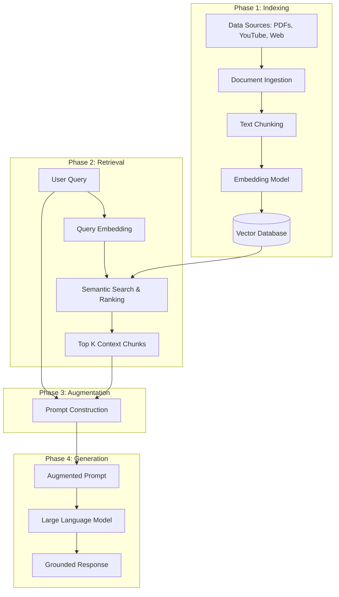

<p align="center">
  
</p>


# Retrieval-Augmented Generation (RAG): What, Why & How

In this guide, we will dive deep into one of the most important and widely used paradigms in Generative AI today: **Retrieval-Augmented Generation (RAG)**. 

Since the wave of Generative AI started, developers have built a multitude of applications. However, the most common, practical, and useful pattern among them is RAG.

---

## The Roadmap: Why, What, and How
To master RAG, we will follow a structured approach covering three core questions:
* **Why** do we need RAG? (Understanding the limitations of Large Language Models)
* **What** is RAG? (Defining the architecture and its core concept)
* **How** does RAG work? (Breaking down the technical steps and flow)

---

## Why RAG? Understanding LLM Limitations

Technically speaking, LLM's are giant transformer based Neural Network architecture. where lot's of parameters (weights & bias) are present. The concept of training the LLM is Pre-training. We train LLM's on huge amount of data. Like, literally the data present on internet. The result of this pre-training is, the LLM now contain the world-wide knowledge.

What if i ask you where does LLM's store the world-wide knowledge? I guess you already know the answer, yes correct, it's parameters i.e. number of weights & bias. That's why this knowledge is called parametric knowledge. That's why we listen the more amount of parameters the model have, just as much powerful the model become. e.g. The model with 13 billion parameters will be more powerful than the 7 billion parameters & model with 70 billion parameters will be more powerful than the 13 billion parameters & so on.

### Parametric Knowledge vs. External Knowledge
LLMs are massive transformer-based neural network architectures trained (pre-trained) on astronomical scales of public internet data. During this pre-training stage, the model stores all its learned information inside its **parameters** (weights and biases). This is known as **Parametric Knowledge**.

Generally, the more parameters a model has, the larger its capacity for parametric knowledge:

$$\text{7B Parameters} \rightarrow \text{13B Parameters} \rightarrow \text{70B Parameters} \rightarrow \text{175B+ Parameters}$$

When a user prompts an LLM, the model processes the query and generates a response by looking up patterns in its parametric knowledge.


$$\text{User Prompt} \rightarrow \text{LLM / Parametric Knowledge} \rightarrow \text{Response}$$

Now the question comes, as model contains a huge amount of data how can we access it as a user ? So, the answer is via Prompting.

You can send a query to the LLM, which we called prompt in technical language. As soon as the prompt go to LLM, it will start understanding it & then it go to it's parametric knowledge & try to print correct answer word by word. This is how a typical LLM work.

Now in most of the situations, this flow works where you send the prompt & access the parametric knowledge of LLM & generate the response. 
But there are certain situations where this flow can't help you. There are certain situation when this perticular flow doesn't help you. So, now let's discuss those scenerios where with the help of prompting you can't do generate the best response from LLM's parametric knowledge.


### The Three Failure Modes of LLM Prompting
While this flow works well for general knowledge queries, relying solely on parametric knowledge fails in three critical real-world scenarios:

#### 1. Private/Proprietary Data
If you ask a general-purpose LLM about private data—such as internal company documents, subscriber details, or video transcripts from a private learning portal—the model cannot answer. 

* **Reason**: During its pre-training stage, the model never had access to this private data.

#### 2. Recent or Real-Time Information
Every LLM has a **knowledge cut-off date** (e.g., January 2025). The model is completely unaware of any events, news, or developments that occurred after its last pre-training run. But chatgpt can do because it has access to internet. but if you use any opensource model from huggingface of somewhere, most likely it won't answer you.

* **Reason**: Without active web search capabilities, offline or open-source models cannot answer questions about current affairs or real-time updates.

#### 3. Hallucinations
Because LLMs are probabilistic systems predicting the next most likely token, they can confidently invent factually incorrect information.

* **Reason**: Instead of stating "I don't know," a model may generate highly plausible but entirely fabricated stories (e.g., claiming Albert Einstein played professional football for Germany in his youth). This is known as **Hallucination**.

---

## The First Attempt at a Solution: Fine-Tuning

To resolve these limitations, developers initially turned to **Fine-Tuning**.

$$\text{Pre-trained LLM} \rightarrow \text{Small Domain-Specific Dataset} \rightarrow \text{Fine-Tuned Model}$$


### What is Fine-Tuning?
Fine-tuning involves taking a pre-trained LLM and training it further on a smaller, task- or domain-specific dataset (such as medical records or financial reports). 

{: .note }
> **The Engineering Student Analogy:**  
> Think of a pre-trained LLM as an engineering graduate who has completed their degree. They have broad general knowledge (physics, chemistry, math, basic coding). However, when they join a company, they undergo 2–3 months of specialized training to learn the company's specific stack.
>
> * **Student** = LLM
> * **Engineering Degree** = Pre-training
> * **Company Onboarding** = Fine-Tuning


### Fine-Tuning Methods

1. **Supervised Fine-Tuning (SFT)**: The model is trained on labeled prompt-response pairs (typically between 1,000 and 1,000,000 examples) to align its behavior with desired outputs.

2. **Continued Pre-training**: An unsupervised technique where the model continues to predict the next token on a raw, unlabeled text corpus specific to a domain (e.g., feeding raw medical textbooks or video transcripts).

3. **RLHF (Reinforcement Learning from Human Feedback)**: Aligning model output with human preferences.

4. **PEFT (Parameter-Efficient Fine-Tuning)**: Techniques like **LoRA** and **QLoRA** that freeze the base weights and train only a small fraction of adapter parameters, dramatically lowering compute costs.

### How Fine-Tuning Addresses the Three Problems
* **Private Data**: You can train the LLM on your private documents, embedding them into its parametric knowledge base.

* **Recent Data**: You can run periodic fine-tuning runs to update the model with new data.

* **Hallucinations**: You can train the model on tricky prompts and explicitly teach it to answer "I don't know" when appropriate, reducing the hallucination rate.

### The Drawbacks of Fine-Tuning
Despite these benefits, fine-tuning introduces severe operational bottlenecks:

* **High Computational Cost**: Retraining weights, even with PEFT, requires expensive GPU resources.

* **Technical Complexity**: Setting up training pipelines, hyperparameter tuning, and evaluating models demands highly specialized AI engineering talent.

* **Dynamic Data Problem**: If your data changes frequently (e.g., updating a product catalog daily or adding new courses), you must constantly retrain the model. If you delete a product, removing that information from the model's parametric weights is extremely difficult.

---

## The Breakthrough: In-Context Learning (ICL)

As models grew larger, researchers discovered an **emergent property** in LLMs: **In-Context Learning (ICL)**.

### What is In-Context Learning?
In-Context Learning is the ability of an LLM to learn how to solve a task purely by observing examples provided directly within the prompt, without updating any of its parameters or weights.

For example, in a **Few-Shot Prompt**:
```text
Classify the sentiment of the following texts.

Text: "I love this phone! It's so smooth."
Sentiment: Positive

Text: "This app crashes a lot."
Sentiment: Negative

Text: "I hate the battery life."
Sentiment:
```
By analyzing the structure in the prompt, the model outputs `Negative` without any weight adjustments.

{: .important }
> **Emergent Properties in LLMs**  
> An emergent property is a capability that suddenly appears when a system scales in size and complexity, despite not being explicitly programmed. ICL was absent in smaller models like GPT-1 and GPT-2, but spontaneously emerged in GPT-3 (175B parameters), which led to the landmark research paper: *"Language Models are Few-Shot Learners"*.


### Transitioning to RAG: Context Injection
If an LLM can learn from examples inside the prompt, what if we provide the **entire background context** needed to answer a specific query directly inside the prompt?

Let's return to the lecture example. If a student asks a specific question about *Gradient Descent* in a 2-hour Linear Regression lecture:
Instead of sending the entire 2-hour transcript (which exceeds context limits), we:
1. Identify the specific segment discussing *Gradient Descent* (e.g., minutes 5 to 25).
2. Inject that specific 20-minute transcript into the prompt.
3. Ask the LLM to answer the question using only the provided transcript.

This concept of retrieving relevant information and injecting it into the prompt is called **Retrieval-Augmented Generation (RAG)**.

---

## What is RAG?
RAG is a way to make a language model smarter by giving it extra information at the time yous ask your question.  The model will then base its answer on that information, instead of relying on its parametric knowledge.

**Retrieval-Augmented Generation (RAG)** is a paradigm that enhances an LLM's performance by retrieving relevant facts from an external, authoritative knowledge base and passing them as context to the LLM alongside the user's query.

$$\begin{array}{ccccc}
& & \text{External Knowledge (Database)} & & \\
& & \downarrow \text{Retrieve} & & \\
\text{User Query} & \rightarrow & \text{Prompt Generator} & \rightarrow & \text{Augmented Prompt} \rightarrow \text{LLM} \rightarrow \text{Response}
\end{array}$$

### Sample RAG Prompt
```text
You are a helpful assistant. Answer the question using ONLY the provided context below.
If the context does not contain the answer, reply with "I do not know." Do not make up answers.

Context:
---------------------
[Retrieved Transcript Segment: Minutes 5-25 discussing Gradient Descent]
---------------------

Question: How does the optimization step work in Gradient Descent?
Answer:
```
This forces the model to base its response on the provided context rather than relying on its probabilistic parametric knowledge, virtually eliminating hallucinations.

---

## How RAG Works: Step-by-Step

Technically, RAG is a marriage of two fields:
1. **Information Retrieval (IR)**: A classic computer science field focused on finding relevant documents.
2. **Text Generation**: The modern capability of LLMs to generate coherent text.

The RAG workflow is split into four sequential phases: 

   a. **Indexing**

   b. **Retrieval**

   c. **Augmentation**

   d. **Generation**



### Phase 1: Indexing (Building the Knowledge Base)
Indexing is the process of preparing your knowledge base so that it can be efficiently searched at query time.
(Indexing is an offline preparation phase where your documents are converted into a searchable index.)

1. **Document Ingestion**: Loading documents (PDFs, Markdown files, YouTube transcripts, Google Drive files, Github repos, scraped webpages, Internal wiki etc) using **Document Loaders**.

    {: .tip}
    >
    **Tools:-** `PyPDFLoader`, `YoutubeLoader`, `WebBaseLoader`, `GitLoader` etc

2. **Text Chunking**: Splitting large documents into smaller, semantically coherent segments Chunking is required because:
   * LLMs have strict input context limit (4k-32k tokens approx). Smaller chunks are more focused, increasing semantic search accuracy.

   {: .tip}
   >
   **Tools:-** `RecursiveCharacterTextSplitter`, `MarkdownHeaderTextSplitter`, `SemanticChunker` etc

3. **Embedding Generation**: Converting each chunk into a dense vector (Embedding) that capture it's meaning.

   **Why Embeddings ?**
   * This allow fast fuzzy semantic search.
   * Embeddings of similar meanings are close in the vector space.
   * Embeddings of different meanings are far apart in the vector space.

   {: .tip}
   >
   **Tools:-** `OpenAIEmbeddings`, `HuggingFaceEmbeddings`, `text-embedding-3-small`, `SentenceTransformersEmbeddings`, `InstructorEmbeddings` etc

4. **Vector Storage**: Storing the embedding vectors alongside their corresponding raw text and metadata (like source URLs or timestamps) in a **Vector Store**
   
   {: .tip }
   >
   **Tools:-** Local-only: `FAISS`, `Chroma` ... Cloud-based: `Pinecone`, `Weaviate`, `Milvus`, `Qdrant` etc

### Phase 2: Retrieval (Finding Relevant Context)
When a user submits a query, RAG retrieves relevant information from the vector store in real-time.

1. **Query Embedding**: The user's query is converted into a vector using the **same embedding model** used during indexing.

2. **Semantic Search**: The system calculates the distance (e.g., Cosine Similarity) between the query vector and all stored chunk vectors in the database.

3. **Ranking & Filtering**: The closest matching vectors are retrieved, ranked by similarity score, and the top-performing text chunks (e.g., Top 3 or Top 5) are returned.

### Phase 3: Augmentation (Injecting Context)
The retrieved text chunks and the user's original query are formatted into a single prompt template (as shown in the [Sample RAG Prompt](#sample-rag-prompt) section).

### Phase 4: Generation (Producing the Grounded Output)
The augmented prompt is passed to the LLM. The LLM reads the context, processes the query, and uses its text-generation capability to produce a factual, grounded answer.

---

## Comparing RAG and Fine-Tuning

{: .important}
>
| Metric / Feature | Fine-Tuning | RAG |
| :--- | :--- | :--- |
| **Model Customization** | Modifies internal weights (parametric knowledge) | Modifies prompt context (in-context knowledge) |
| **Cost** | High (expensive GPU compute for training) | Low (no model training, only vector DB storage) |
| **Data Update Frequency** | Slow (requires a retraining pipeline) | Instant (just add/remove vectors in database) |
| **Hallucination Control** | Moderate (hard to completely eliminate) | High (grounded via context instructions) |
| **Technical Expertise** | High (requires machine learning engineers) | Moderate (software/application engineers) |
| **Transparency & Auditability** | Low (black box model weights) | High (retrieved text chunks can be cited as sources) |

---

## Summary of RAG Benefits
1. **Solves Private Data Access**: Easily queries custom enterprise documents without sharing them for public base model training.
2. **Solves Knowledge Cut-off**: Constantly fetches live information or updated databases.
3. **Drastically Reduces Hallucinations**: Grounding answers in retrieved facts prevents the model from fabricating answers.
4. **Cost-Effective & Simple**: Avoids expensive model training, providing a lightweight, maintainable alternative to fine-tuning.
