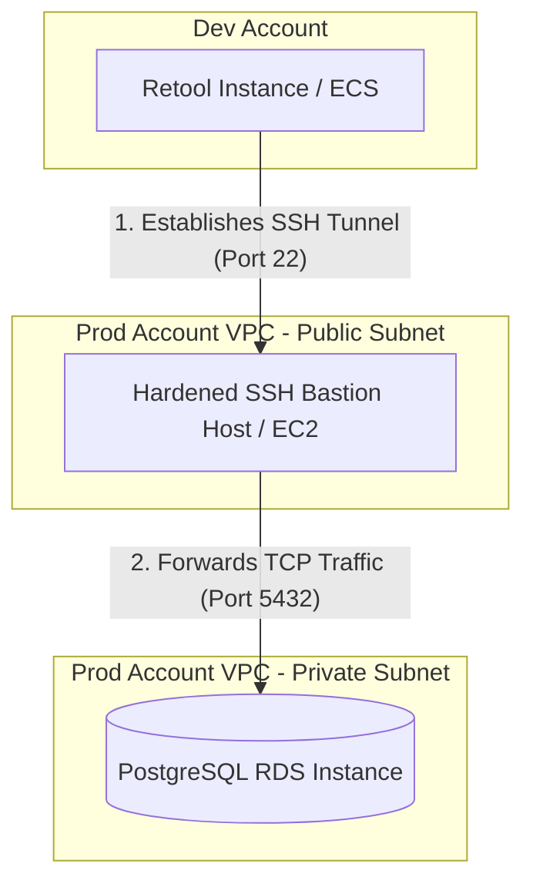
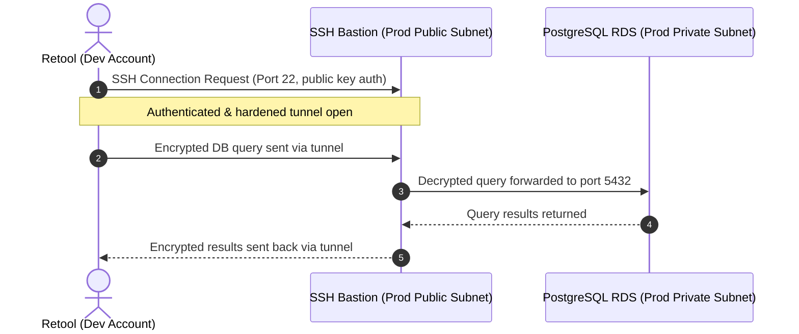

# Connecting Retool to a Private PostgreSQL RDS Across AWS Accounts Without VPC Peering

## Introduction

Many organizations isolate their internal administration panels, such as Retool, in a separate AWS account from their core production databases. While this segregation aligns with security best practices, it introduces a common networking challenge:

> How do we allow Retool (running in a Dev/Management account) to query a private PostgreSQL RDS instance (running in a Production account) without exposing the database to the public internet, configuring complex VPC Peering, or setting up a Transit Gateway?

This article outlines how to implement a secure, hardened **SSH Bastion architecture** to safely tunnel PostgreSQL queries across AWS accounts.

---

## Problem Statement

Our multi-account AWS environment consists of:

| Component | AWS Account | Subnet / Placement | Network Access |
| :--- | :--- | :--- | :--- |
| **Retool Instance** | Dev / Management Account | ECS / Fargate Subnets | Outbound access only |
| **PostgreSQL RDS** | Production Account | Private Subnets | Inaccessible from the internet |
| **Bastion Host** | Production Account | Public Subnet | Public SSH port (whitelists Retool only) |

Requirements:

* PostgreSQL RDS must remain private
* No VPC Peering
* No Transit Gateway
* No Public RDS Endpoint
* Retool must be able to query the database
* Retool should use a dedicated read-only database user

---

## Architecture Overview

Instead of opening up network routes at the VPC level, we establish an SSH tunnel from Retool to a hardened EC2 Bastion host in the production account's public subnet. The Bastion host then forwards the decrypted database traffic to the private RDS instance.



### Connection Flow
The sequence below illustrates how the connection is authenticated, established, and utilized:



---

## Why Avoid VPC Peering?

While VPC Peering is a standard solution, it introduces operational and governance overhead:
* **CIDR Overlaps**: If the Dev and Prod VPCs share overlapping IP ranges, VPC Peering cannot be established without complex NAT configurations.
* **Routing Overhead**: It requires modifying routing tables in both accounts and updating DNS configurations.
* **Security Boundaries**: VPC Peering provides bi-directional network reachability, which may violate security requirements for prod-to-dev isolation.

For a single application-to-database connection, an SSH bastion tunnel is simpler, faster to implement, and keeps the production VPC network boundaries intact.

---

## Step-by-Step Implementation

Follow these steps to deploy and secure the tunnel.

### Step 1: Deploy the Bastion Host

Launch an EC2 instance in the Production account VPC's public subnet.

| Setting | Recommended Value | Rationale |
| :--- | :--- | :--- |
| **Instance Type** | `t3.micro` or `t4g.nano` | Minimal CPU and memory are required for forwarding traffic. |
| **OS** | Ubuntu 22.04 LTS or Amazon Linux 2023 | Modern, standard Linux distributions with regular security updates. |
| **Subnet** | Public Subnet | Must be reachable by Retool's outbound static IPs. |
| **Elastic IP** | Enabled | Ensures the bastion retains a static IP address across restarts. |

---

### Step 2: Configure Security Groups

We enforce strict network segmentation using AWS Security Groups.

#### 1. Bastion Security Group (`sg-bastion`)
Only allow inbound SSH traffic from Retool's static outbound IP addresses. 

{: .warning }
> **Security Warning:**
> Never configure the source IP to `0.0.0.0/0` (anywhere). Always whitelist Retool's specific public egress IPs.

| Protocol | Port | Source | Description |
| :--- | :--- | :--- | :--- |
| **TCP** | `22` | Retool Outbound Egress IPs | Allows Retool to initiate the SSH tunnel. |

#### 2. PostgreSQL RDS Security Group (`sg-rds`)
The database must only accept traffic originating from the Bastion host.

| Protocol | Port | Source | Description |
| :--- | :--- | :--- | :--- |
| **TCP** | `5432` | `sg-bastion` (Security Group ID) | Restricts database access to the Bastion host. |

---

### Step 3: Create and Configure the Dedicated SSH User

SSH into the Bastion host using your administrative user (e.g., `ubuntu` or `ec2-user`), then create a dedicated user for Retool.

```bash
# Create a user named 'retool' without a password (forcing SSH key-based auth)
sudo adduser retool --disabled-password --gecos ""

# Switch to root to create and configure the SSH directory
sudo su -

# Create the SSH configuration folder
mkdir -p /home/retool/.ssh
touch /home/retool/.ssh/authorized_keys
```

---

### Step 4: Generate SSH Keys & Deploy Public Key (If you want to use Retool's own key then skip this step)

On your local workstation (or Retool's key manager), generate a 4096-bit RSA key pair:

```bash
ssh-keygen -t rsa -b 4096 -f retool-prod-rds -C "retool-ssh-tunnel"
```

This creates two files:
* `retool-prod-rds`: The private key (provide this to Retool).
* `retool-prod-rds.pub`: The public key (add this to the Bastion).

Copy the contents of `retool-prod-rds.pub` and paste them into `/home/retool/.ssh/authorized_keys` on the Bastion host.

#### Secure File Permissions
Restrict file and directory permissions so the SSH daemon accepts the keys:

```bash
# Secure the SSH directory and authorized_keys file
chmod 700 /home/retool/.ssh
chmod 600 /home/retool/.ssh/authorized_keys

# Change ownership of the files to the retool user
chown -R retool:retool /home/retool/.ssh
```

---

### Step 5: Harden SSH Configuration (optional)

Edit the SSH daemon configuration file on the Bastion host (`/etc/ssh/sshd_config`) to disable password authentication and restrict the `retool` user's capabilities.

Add or modify the following lines:

```text
# Disable password authentication and root login
PasswordAuthentication no
PermitRootLogin no
PubkeyAuthentication yes

# Enable TCP forwarding (required for SSH tunneling)
AllowTcpForwarding yes

# Limit SSH access to the administrative user and the retool user
AllowUsers ubuntu retool
```

#### Restricting Port Forwarding (Least Privilege)
To ensure the `retool` SSH user cannot access other resources in the VPC, restrict its forwarding permissions to the database endpoint only. Add this block to the bottom of `/etc/ssh/sshd_config`:

```text
Match User retool
    # Restrict forwarding exclusively to the RDS endpoint on port 5432
    PermitOpen prod-db.example.rds.amazonaws.com:5432
    # Disable interactive terminal sessions for this user
    X11Forwarding no
    AllowAgentForwarding no
```

Restart the SSH daemon to apply the changes:

```bash
sudo systemctl restart sshd
```

---

### Step 6: Create a Read-Only PostgreSQL User

To enforce the principle of least privilege, Retool must connect using a dedicated read-only database user. 

Connect to your PostgreSQL database and run the following queries:

```sql
-- Create the dedicated Retool user
CREATE USER retool_prod WITH PASSWORD 'SecurePasswordPlaceholder';

-- Grant connection permissions
GRANT CONNECT ON DATABASE mydb TO retool_prod;

-- Grant usage on the public schema
GRANT USAGE ON SCHEMA public TO retool_prod;

-- Grant read access to all existing tables in the schema
GRANT SELECT ON ALL TABLES IN SCHEMA public TO retool_prod;

-- Automatically grant read access to any tables created in the future
ALTER DEFAULT PRIVILEGES IN SCHEMA public
GRANT SELECT ON TABLES TO retool_prod;
```

---

### Step 7: Configure Retool

1. Open your Retool dashboard and navigate to **Resources** > **Create New** > **PostgreSQL**.
2. Fill in the **Database Settings**:

| Setting | Value | Rationale |
| :--- | :--- | :--- |
| **Host** | `prod-db.example.rds.amazonaws.com` | The private DNS endpoint of your RDS instance. |
| **Port** | `5432` | Standard PostgreSQL port. |
| **Database** | `mydb` | The name of your database. |
| **Username** | `retool_prod` | The read-only PostgreSQL user created in Step 6. |
| **Password** | `SecurePasswordPlaceholder` | The password for the read-only user. |

3. Enable the **Connect via SSH Tunnel** option and configure the settings:

| Setting | Value | Rationale |
| :--- | :--- | :--- |
| **SSH Host** | `198.51.100.50` (Bastion Elastic IP) | The public IP of the Bastion host. |
| **SSH Port** | `22` | The SSH port on the Bastion host. |
| **SSH User** | `retool` | The restricted SSH user created in Step 3. |
| **Private Key** | Content of `retool-prod-rds` | The private key generated in Step 4. |

4. Click **Test Connection**. Once successful, click **Create Resource**.

---

## Security Best Practices

* **User Isolation**: Maintain a strict separation between the SSH user (`retool` on the Bastion) and the database user (`retool_prod` on PostgreSQL).
* **Least Privilege SQL**: Never connect Retool using database superuser credentials (like `postgres` or `rds_superuser`). The database user should only have `SELECT` privileges unless writing is explicitly required.
* **Strict Whitelisting**: Keep the Bastion Security Group locked down to Retool's egress IPs. Regularly audit the whitelist.
* **Disable Shell Access**: By restricting the `retool` SSH user in `sshd_config`, you prevent the user from spawning an interactive shell, securing the host if the private key is ever compromised.

---

## Alternatives Considered

To choose the right architecture for your team, compare the common cross-account database connection methods below:

| Feature | Hardened SSH Bastion | AWS PrivateLink | VPC Peering |
| :--- | :--- | :--- | :--- |
| **Complexity** | Low | High | Medium |
| **Security Model** | Hardened host in public subnet | Fully private, unidirectional | Fully private, bi-directional |
| **CIDR Planning** | Not required | Not required | Required (No overlapping IPs allowed) |
| **Network Path** | Public Internet (Encrypted) | AWS Private Network | AWS Private Network |
| **Cost** | Low (Single micro EC2 instance) | Medium (VPC Endpoints hourly rate) | Low (Data transfer charges) |

---

## Key Takeaways

* **Decoupled Architecture**: You can connect internal tools to private databases across AWS accounts without setting up VPC Peering.
* **Hardening SSH**: Secure the Bastion host by disabling password authentication and using `PermitOpen` in the SSH configuration to restrict port forwarding to the database endpoint.
* **Database Security**: Enforce read-only access for analytical or dashboard tools at the database engine level.
* **Network Isolation**: Ensure the RDS instance accepts traffic only from the Bastion host's security group.

---

## Conclusion

Using a hardened SSH Bastion host is a secure, cost-effective, and operationally lightweight way to connect Retool to a private PostgreSQL RDS instance across different AWS accounts. It avoids the routing and CIDR overlap issues of VPC Peering while keeping your database shielded from the public internet. 

For large-scale enterprise environments with high traffic requirements, consider graduating to AWS PrivateLink. For most workloads, however, a properly hardened SSH tunnel provides the ideal balance of security, simplicity, and performance.
