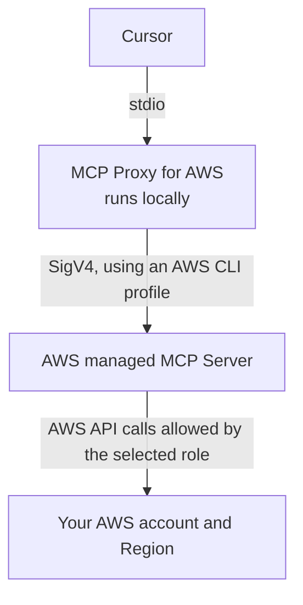
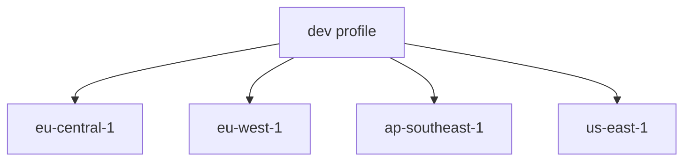

# How to Configure AWS MCP in Cursor with AWS SSO, AssumeRole, Multiple Accounts, and Multiple Regions

When I work with AWS infrastructure, I often need to answer questions such as:

- Which VPC contains a particular resource?
- Why is an ECS task failing?
- What is attached to an IAM role?
- Which account owns a load balancer?
- Is a resource present in one Region but missing from another?

Normally, answering these questions means switching between the AWS Console, CLI, Terraform code, and documentation. The AWS Model Context Protocol (MCP) Server makes this workflow easier by allowing Cursor to query AWS on my behalf using the same AWS identities I already use locally.

My environment is slightly more complicated than a single AWS account:

- authentication uses AWS IAM Identity Center (AWS SSO);
- some profiles assume roles;
- I work across multiple AWS accounts;
- one account can contain resources in several AWS Regions;
- I do not want to create IAM users or long-lived access keys for an AI tool.

This guide documents the complete setup so I can reproduce it later.

{: .warning }
> This article uses example profile names and account IDs. Replace them with values from your own environment. Never publish real credentials, access keys, secret values, or SSO cache contents.

## What we are building

The connection has four parts:



Cursor does not store a permanent AWS access key. The local proxy reads the selected AWS CLI profile, obtains or refreshes temporary credentials, signs requests with AWS Signature Version 4, and sends them to the managed AWS MCP endpoint.

The effective permissions are still controlled by IAM, permission boundaries, session policies, and service control policies (SCPs). MCP does not bypass AWS authorization.

## Why use SigV4 instead of OAuth?

The managed AWS MCP Server supports both OAuth and SigV4.

OAuth is convenient for a person using one account, but it does not support switching among several local AWS profiles in one MCP session.

SigV4 through `mcp-proxy-for-aws` is the better choice when:

- you already authenticate with AWS CLI profiles;
- you use AWS SSO or AssumeRole;
- you need several AWS accounts in the same Cursor session;
- you want an explicit allowlist of profiles;
- you want read-only mode at the MCP proxy level.

For this setup, use SigV4.

## Prerequisites

You need:

1. Cursor
2. AWS CLI v2
3. Working AWS SSO or AssumeRole profiles
4. `uv` / `uvx`
5. Permission to call the AWS APIs you want MCP to inspect

Check the tools:

```bash
aws --version
uv --version
uvx --version
```

AWS currently recommends AWS CLI `2.32.0` or later for the managed MCP workflow. Upgrade if yours is older.

On macOS with Homebrew:

```bash
brew update
brew upgrade awscli
```

Install `uv` if it is missing:

```bash
curl -LsSf https://astral.sh/uv/install.sh | sh
```

Restart the terminal and check `uvx --version`.

## Step 1: Configure AWS CLI profiles

### AWS SSO profile

The simplest setup uses `aws configure sso`:

```bash
aws configure sso
```

AWS CLI asks for the SSO start URL, SSO Region, account, role, default resource Region, output format, and profile name.

A traditional SSO profile can look like this:

```ini
[profile dev]
sso_start_url = https://example.awsapps.com/start
sso_region = us-east-1
sso_account_id = 111122223333
sso_role_name = ReadOnlyAccess
region = eu-west-1
output = json
```

Newer AWS CLI configurations can use reusable `sso-session` blocks:

```ini
[sso-session company]
sso_start_url = https://example.awsapps.com/start
sso_region = us-east-1
sso_registration_scopes = sso:account:access

[profile dev]
sso_session = company
sso_account_id = 111122223333
sso_role_name = ReadOnlyAccess
region = eu-west-1
output = json
```

The profile's `region` is only a default. It does not limit the profile to that Region.

### AssumeRole profile

The proxy also works with role chaining through the standard AWS credential provider chain:

```ini
[profile platform-source]
sso_session = company
sso_account_id = 111122223333
sso_role_name = PlatformAccess
region = eu-west-1

[profile production-readonly]
role_arn = arn:aws:iam::444455556666:role/ProductionReadOnly
source_profile = platform-source
region = eu-central-1
```

When `production-readonly` is selected, the AWS SDK authenticates through `platform-source` and assumes the target role automatically.

{: .tip }
> Use read-only roles wherever possible. Do not make an administrator profile the default merely because it is convenient.

## Step 2: Log in and verify every profile

For an SSO profile:

```bash
aws sso login --profile dev
```

Then verify the exact identity:

```bash
aws sts get-caller-identity --profile dev
```

For an AssumeRole profile:

```bash
aws sts get-caller-identity --profile production-readonly
```

The second command exercises the complete source-profile and AssumeRole chain.

{: .note }
> Before adding a profile to MCP, make sure `get-caller-identity` succeeds. If AWS CLI cannot use a profile, MCP cannot use it either.

## Step 3: Create Cursor's MCP configuration

Cursor's global MCP configuration is:

```text
~/.cursor/mcp.json
```

Create it if it does not exist:

```bash
mkdir -p ~/.cursor
touch ~/.cursor/mcp.json
chmod 600 ~/.cursor/mcp.json
```

Use this configuration:

```json
{
  "mcpServers": {
    "aws-mcp": {
      "command": "uvx",
      "args": [
        "mcp-proxy-for-aws-cli@latest",
        "https://aws-mcp.us-east-1.api.aws/mcp",
        "--read-only"
      ],
      "env": {
        "AWS_MCP_PROXY_PROFILES": "dev staging production-readonly"
      }
    }
  }
}
```

The first profile in `AWS_MCP_PROXY_PROFILES` is the default. Additional profiles can be selected per tool call.

{: .important }
> `AWS_MCP_PROXY_PROFILES` takes precedence over `AWS_PROFILE`. Defining both is unnecessary and can make the configuration misleading. For a multi-profile configuration, list the profiles once in `AWS_MCP_PROXY_PROFILES`.

### What each field means

`command: "uvx"`

: Runs the proxy package in an isolated Python environment.

`mcp-proxy-for-aws-cli@latest`

: Starts the AWS SigV4 MCP proxy. Pin a tested version instead of `latest` if deterministic upgrades are required.

`https://aws-mcp.us-east-1.api.aws/mcp`

: The Region hosting the **managed MCP endpoint**. This is not the Region in which your EC2, ECS, RDS, or other resources must live.

`--read-only`

: Hides write-capable MCP operations. This is strongly recommended for investigation, inventory, and troubleshooting.

`AWS_MCP_PROXY_PROFILES`

: An explicit allowlist. Cursor cannot select AWS profiles that were not listed when the proxy started.

## Accounts and Regions are separate decisions

This is the most important detail in a multi-account environment.

- The **profile** selects the AWS identity/account/role.
- The **resource Region** selects where an operation runs.
- The **MCP endpoint Region** selects which AWS-managed MCP endpoint Cursor contacts.

They are not interchangeable.

One account may hold workloads in several Regions:



### Avoid a global `AWS_REGION`

Do not put this in a multi-region MCP configuration:

```json
"env": {
  "AWS_REGION": "ap-southeast-1"
}
```

Also avoid:

```json
"--metadata",
"AWS_REGION=ap-southeast-1"
```

Those values become global defaults for the MCP session. A question about resources in `eu-west-1` can silently query `ap-southeast-1` and return an empty or misleading answer.

Omit the global default and specify the Region in each request:

```text
Using profile dev in eu-central-1, list failed ECS services.
```

```text
Using profile production-readonly in eu-west-1, show this load balancer's listeners.
```

```text
Using profile dev, compare running EC2 instances across eu-west-1 and ap-southeast-1.
```

If the Region is omitted, some tools may fall back to the profile default or `us-east-1`. For reliable answers, always include it.

## Step 4: Reload Cursor

After saving `~/.cursor/mcp.json`:

1. Open Cursor Settings.
2. Open the MCP section.
3. Refresh or enable `aws-mcp`.
4. If it does not initialize, restart Cursor.

The first `uvx` launch can take a little longer because it downloads the proxy package.

## Step 5: Test from Cursor

Start with a low-risk identity check:

```text
Using AWS profile dev, call STS GetCallerIdentity and tell me the account and role.
```

Then test a regional read:

```text
Using profile dev in eu-west-1, list the VPCs and their CIDR ranges.
```

Then test profile switching:

```text
Using profile production-readonly in eu-central-1, list ECS clusters.
```

Verify the returned account ID before trusting a larger investigation.

## Recommended security model

Connecting an AI assistant to AWS should be treated like connecting any other operational tool.

### Keep read-only mode enabled

Use:

```json
"--read-only"
```

Remove it only when you have intentionally designed a write workflow with approvals and restricted IAM permissions.

### Use a read-only default profile

The first profile in `AWS_MCP_PROXY_PROFILES` is used when no profile is explicitly selected. Make it a development or audit read-only role—not production administrator.

### Apply least privilege in AWS

The proxy does not create additional security isolation. If the selected profile is an administrator, MCP has administrator-level AWS authorization whenever write tools are enabled.

Prefer:

- AWS managed `ReadOnlyAccess` where suitable;
- custom diagnostic policies for CloudWatch, ECS, EC2, RDS, and IAM metadata;
- explicit denies for sensitive data services when not required;
- separate profiles for read and write access;
- SCPs and permission boundaries as additional guardrails.

### Be careful with sensitive output

Read-only access can still expose sensitive information:

- Secrets Manager values;
- SSM secure parameters;
- Lambda environment variables;
- ECS task-definition environment values;
- database connection strings;
- CloudWatch logs containing customer data.

Do not grant `secretsmanager:GetSecretValue`, `ssm:GetParameter` with decryption, or `kms:Decrypt` unless the use case genuinely requires it.

### Never configure static credentials in `mcp.json`

Do not write:

```json
"AWS_ACCESS_KEY_ID": "...",
"AWS_SECRET_ACCESS_KEY": "..."
```

Use AWS SSO or AssumeRole temporary credentials.

### Protect local files

Recommended permissions:

```bash
chmod 600 ~/.cursor/mcp.json
chmod 600 ~/.aws/config
```

Do not commit `.aws` files, SSO caches, MCP config containing internal profile details, or terminal output with credentials to a repository.

## Daily workflow

At the beginning of a session:

```bash
aws sso login --profile dev
aws sts get-caller-identity --profile dev
```

If another profile has its own SSO session:

```bash
aws sso login --profile production-readonly
aws sts get-caller-identity --profile production-readonly
```

Then ask Cursor with both profile and Region:

```text
Use profile dev in ap-southeast-1. Find the ECS service named sdb-dev and summarize its networking.
```

For a cross-account comparison:

```text
Compare the sdb service in profile dev/eu-west-1 and profile production-readonly/eu-west-1. Read only; do not change anything.
```

## Adding another AWS account

1. Add or generate the profile in `~/.aws/config`.
2. Log in and verify it:

```bash
aws sso login --profile new-account
aws sts get-caller-identity --profile new-account
```

3. Add the profile name to `AWS_MCP_PROXY_PROFILES`:

```json
"AWS_MCP_PROXY_PROFILES": "dev staging production-readonly new-account"
```

4. Reload the MCP server in Cursor.
5. Test identity and one regional read.

If a profile is not in the allowlist, MCP should reject it. That is intentional.

## Optional: one MCP server per fixed Region

For most users, one server with explicit Region instructions is easiest.

If you repeatedly forget Regions, separate fixed-region servers are possible:

```json
{
  "mcpServers": {
    "aws-eu-west-1": {
      "command": "uvx",
      "args": [
        "mcp-proxy-for-aws-cli@latest",
        "https://aws-mcp.eu-central-1.api.aws/mcp",
        "--metadata",
        "AWS_REGION=eu-west-1",
        "--read-only"
      ],
      "env": {
        "AWS_MCP_PROXY_PROFILES": "dev production-readonly"
      }
    },
    "aws-ap-southeast-1": {
      "command": "uvx",
      "args": [
        "mcp-proxy-for-aws-cli@latest",
        "https://aws-mcp.us-east-1.api.aws/mcp",
        "--metadata",
        "AWS_REGION=ap-southeast-1",
        "--read-only"
      ],
      "env": {
        "AWS_MCP_PROXY_PROFILES": "dev production-readonly"
      }
    }
  }
}
```

This is more explicit but creates duplicate MCP tools and can make tool selection noisier. Prefer one server unless fixed-region separation provides a clear operational benefit.

## Troubleshooting

### `ExpiredTokenException`

Refresh the SSO source profile:

```bash
aws sso login --profile dev
```

For AssumeRole, refresh the source profile. The SDK will assume the target role again. Reload MCP if it does not recover.

### `No AWS credentials found`

Verify:

```bash
aws sts get-caller-identity --profile dev
```

If this fails, fix the AWS CLI profile first.

### Profile is not allowed

Add it to `AWS_MCP_PROXY_PROFILES`, then reload the MCP server. The proxy intentionally cannot discover arbitrary profiles.

### Query returns no resources

Usually one of these is wrong:

- profile/account;
- Region;
- resource name;
- IAM permission.

First verify:

```text
Use profile dev and call STS GetCallerIdentity.
```

Then repeat the query with an explicit Region.

### `uvx` is not found

Check:

```bash
which uvx
```

If it works in the terminal but not Cursor, restart Cursor so it inherits the updated `PATH`. An absolute executable path may also be used as the `command`.

### Proxy starts but tools do not appear

Validate `mcp.json`:

```bash
python3 -m json.tool ~/.cursor/mcp.json
```

Look for trailing commas, missing braces, or duplicate server names. Refresh MCP or restart Cursor after fixing it.

### Wrong endpoint or signature errors

Use a supported managed MCP endpoint:

```text
https://aws-mcp.us-east-1.api.aws/mcp
https://aws-mcp.eu-central-1.api.aws/mcp
```

Check that the system clock is accurate. SigV4 requests fail if the local clock is significantly skewed.

### Access denied

This confirms authentication may be working but authorization is not. Identify:

1. the profile and assumed role;
2. the denied API action;
3. IAM policies and permission boundaries;
4. relevant SCPs;
5. whether the resource policy also needs to allow access.

Do not solve every denial by switching to an administrator profile. Add the minimum required read permission.

## A clean production-ready example

This is the configuration I recommend as a reusable baseline:

```json
{
  "mcpServers": {
    "aws-mcp": {
      "command": "uvx",
      "args": [
        "mcp-proxy-for-aws-cli@latest",
        "https://aws-mcp.us-east-1.api.aws/mcp",
        "--read-only"
      ],
      "env": {
        "AWS_MCP_PROXY_PROFILES": "development-readonly audit-readonly production-readonly"
      }
    }
  }
}
```

Its operating rules are simple:

1. Authenticate profiles through AWS SSO.
2. Keep MCP read-only.
3. Put only approved profiles in the allowlist.
4. Use a low-risk profile as the default.
5. State both profile and Region in every request.
6. Verify caller identity before investigating sensitive environments.
7. Never add long-lived AWS credentials to Cursor configuration.

## Final thoughts

The important part of this setup is not installing an MCP package. It is preserving the AWS security model while making infrastructure questions easier to answer.

With SigV4, AWS SSO, AssumeRole, an explicit profile allowlist, and read-only mode, Cursor can inspect multiple AWS accounts without introducing IAM users or permanent credentials. Keeping account selection and Region selection explicit prevents the most common source of misleading results in a multi-account AWS organization.

The result is a practical workflow: authenticate with AWS SSO, ask Cursor a precise question containing the profile and Region, and let AWS IAM decide exactly what the assistant is allowed to see.

## References

- [Setting up the AWS MCP Server](https://docs.aws.amazon.com/agent-toolkit/latest/userguide/getting-started-aws-mcp-server.html)
- [AWS MCP multi-profile support](https://docs.aws.amazon.com/agent-toolkit/latest/userguide/multi-account-access.html)
- [MCP Proxy for AWS](https://github.com/aws/mcp-proxy-for-aws)
- [AWS CLI IAM Identity Center authentication](https://docs.aws.amazon.com/cli/latest/userguide/cli-configure-sso.html)
- [AWS CLI AssumeRole profiles](https://docs.aws.amazon.com/cli/latest/userguide/cli-configure-role.html)
