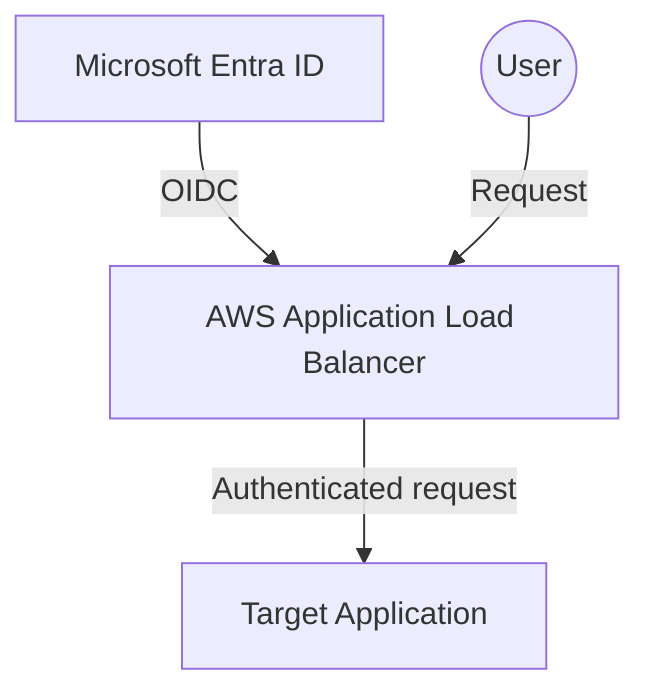
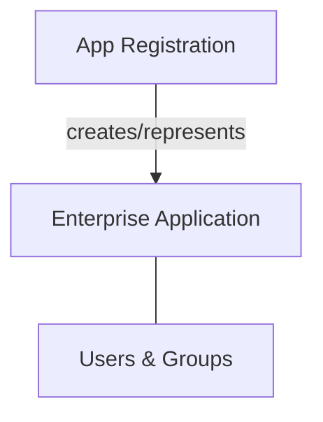
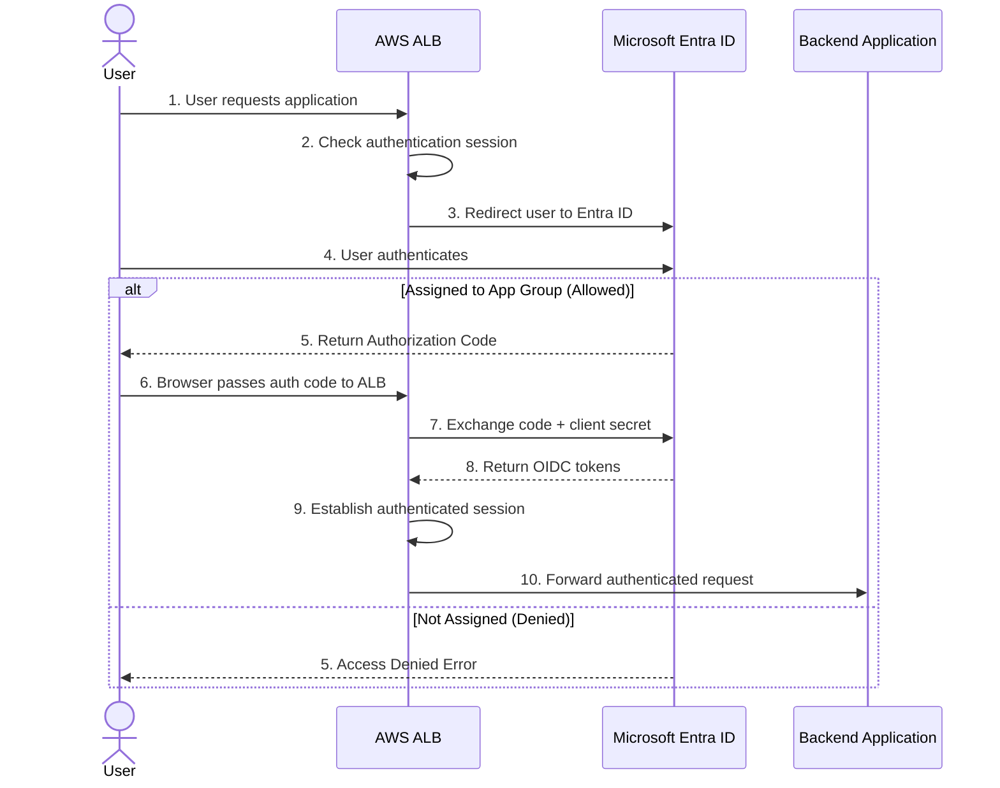
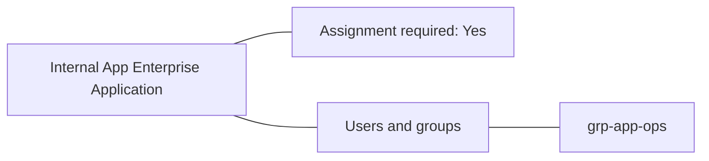
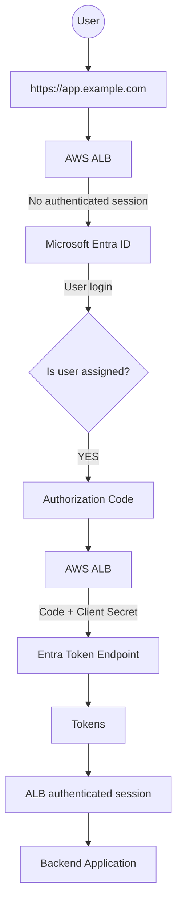
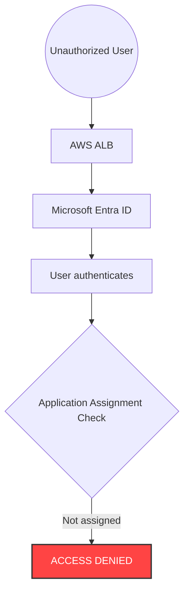
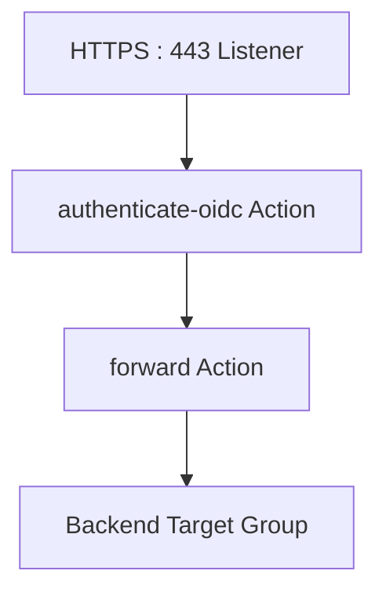
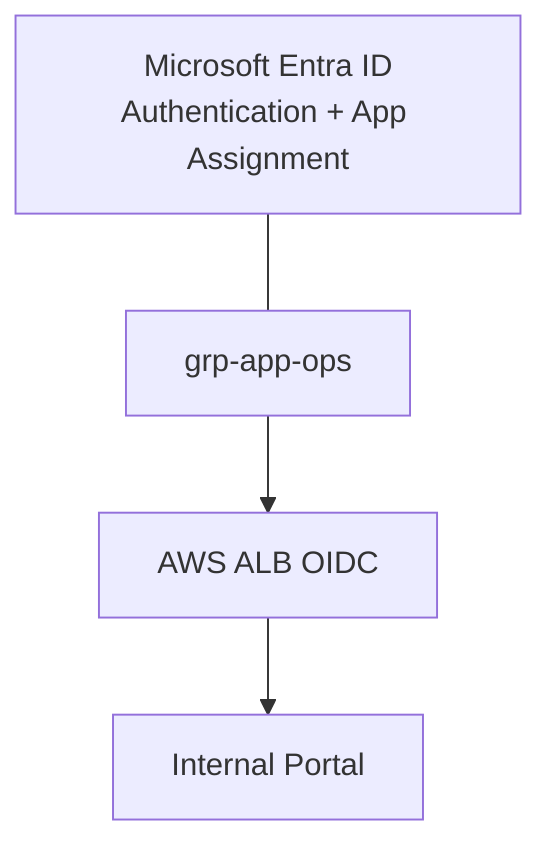

# Secure an AWS Application with Microsoft Entra ID OIDC and Group-Based Access Control

Modern internal applications often need more than just authentication. We also need to answer a second question: **Which authenticated users are actually allowed to access the application?**

A common pattern is to use **Microsoft Entra ID (Azure AD)** as the Identity Provider and an **AWS Application Load Balancer (ALB)** as the OAuth/OIDC client.

In this setup:
- **Microsoft Entra ID** handles user authentication.
- **AWS ALB** handles the OIDC authentication flow.
- A **client secret** allows the ALB to securely exchange the authorization code for tokens.
- Entra ID **application assignment** restricts access to a specific group.
- Users outside the assigned group receive an Entra access-denied response instead of reaching the application.

This article walks through the complete setup to ensure security and ease of management.

---

## 1. What We Are Building

The target architecture utilizes the AWS ALB as the **OIDC client** and Microsoft Entra ID as the **Identity Provider (IdP)**.



The authentication flow strictly uses the **OAuth 2.0 Authorization Code** combined with a **Client Secret**. 

{: .important }
> We explicitly do **not** use the implicit flow to ensure tokens are kept secure.

---

## 2. Requirements & Application Configuration

For this example, our application is called `Internal App (ops portal)`. Below is the required configuration matrix:

| Setting                       | Value                                        |
| ----------------------------- | -------------------------------------------- |
| **Application name**          | Internal App (ops portal)                    |
| **Platform**                  | Web                                          |
| **Tenant**                    | Single tenant                                |
| **Redirect URI**              | `https://app.example.com/oauth2/idpresponse` |
| **OAuth flow**                | Authorization Code                           |
| **Client authentication**     | Client Secret                                |
| **Identity provider**         | Microsoft Entra ID                           |
| **Scopes**                    | `openid email profile`                       |
| **Implicit flow**             | Disabled                                     |
| **ID token implicit/hybrid flow** | Disabled                                 |
| **Assignment required**       | Enabled                                      |
| **Application access**        | `App/Ops group`                              |

---

## 3. Understand the Two Entra Objects

One of the most critical concepts in this configuration is the distinction between the **App Registration** and the **Enterprise Application**.

### App Registration
The App Registration defines the application from an OAuth/OIDC perspective. It handles the **Authorization Code + Client Secret** configuration and contains:
- Client ID & Client secrets
- Redirect URI
- Authentication configuration
- API permissions

### Enterprise Application
The Enterprise Application represents the application's service principal in the tenant. It manages the **Assignment Required + group assignment** configuration and controls:
- Who can access the application
- User/group assignments
- Whether assignment is required



The **Authorization Code + Client Secret** configuration belongs primarily to the App Registration.

The **Assignment Required + group assignment** configuration belongs to the Enterprise Application.

---

## 4. Authentication Flow Lifecycle

Before configuring the services, it is useful to visualize the authentication sequence. The important security property is that **group authorization is enforced by Entra before the user ever reaches the backend application**.



{: .important}
> The important security property is that **group authorization is enforced by Entra before the user reaches the application**.

---

## 5. Step 1 — Create the App Registration

Open the **Microsoft Entra admin center** and navigate to **App registrations** → **New registration**.

- **Name:** `Internal App (ops portal)`
- **Supported account types:** `Accounts in this organizational directory only` (Single tenant)

### Configure the Web Redirect URI
During registration, select the **Web** platform and enter your ALB's redirect URI:
`https://app.example.com/oauth2/idpresponse`

{: .warning }
> The redirect URI is extremely strict. It must exactly match the URI configured by the ALB. Even a trailing slash (`/`) will cause authentication failures!

# 7. Disable Implicit Grant

After creating the application, open:

```text
App registrations
  → Internal App (ops portal)
  → Authentication
```

Under:

```text
Implicit grant and hybrid flows
```

you may see:

```text
☐ Access tokens
☐ ID tokens
```

Leave both unchecked.

The required configuration is:

```text
Access tokens: OFF
ID tokens:     OFF
```

We are using:

```text
Authorization Code Flow
```

instead of:

```text
Implicit Flow
```

The implicit flow is not required for an AWS ALB OIDC integration.

---

## 6. Step 2 — Create the Client Secret

Navigate to **Certificates & secrets** → **Client secrets** → **New client secret**. Provide a description (e.g., `AWS ALB OIDC`) and set the expiration according to your security policy.

Entra will display both a `Secret ID` and a `Value`.

{: .important }
> **Do not confuse the Secret ID with the Secret Value!** The ALB requires the **Secret Value**. This is the actual credential. Store it securely in AWS Secrets Manager or HashiCorp Vault. Never commit it to source control or logs.

---

## 7. Step 3 — Configure OpenID Connect Permissions

Under **API permissions**, add the following OpenID scopes:
- `openid`
- `email`
- `profile`

These scopes allow the application to obtain the basic identity information required. For a simple authentication setup, avoid adding unnecessary broad Microsoft Graph permissions (like `Directory.Read.All`).

---

## 8. Step 4 & 5 — Enforce Application Assignment

If the required group doesn't exist, navigate to **Groups** → **All groups** → **New group**, and create a Security group (e.g., `grp-app-ops`). Add the required users to this group.

Next, open your application under **Enterprise applications** (not App registrations). 

### Enable Assignment Required
Under **Properties**, find **Assignment required?** and set it to **Yes**. 

{: .note }
> This is a critical security setting! It ensures that simply having an account in the tenant isn't sufficient. The user must explicitly be assigned to the application.

### Assign the Group
Navigate to **Users and groups** → **Add user/group**, select the `grp-app-ops` group, and assign it to the application.



---

## 9. Understanding the Authorization Outcomes

### What Happens to an Authorized User?
If the user belongs to `grp-app-ops`, Entra ID verifies their group membership during login, successfully issues the Authorization Code, and allows the ALB to establish a session with the backend application.



### What Happens to an Unauthorized User?
If a user exists in the Entra tenant but is **not** a member of `grp-app-ops`, they can successfully authenticate their identity with Entra, but the **Application Assignment Check will fail**. They will receive an `ACCESS DENIED` message directly from Microsoft Entra, and the request will never reach the AWS ALB or the Backend Application.



---

## 10. Step 6 — Collect Values and Configure AWS ALB

After completing the Entra configuration, collect the required values to configure the AWS ALB:

- **Tenant ID**: `<tenant-id>`
- **Client ID**: `<application-client-id>`
- **Client Secret**: `<secret-value>`
- **Redirect URI**: `https://app.example.com/oauth2/idpresponse`
- **Issuer**: `https://login.microsoftonline.com/<TENANT_ID>/v2.0`
- **OIDC Discovery**: `https://login.microsoftonline.com/<TENANT_ID>/v2.0/.well-known/openid-configuration`

### AWS ALB Configuration
The ALB needs an HTTPS listener with an `authenticate-oidc` action rule configured with the values collected above.



---

## 11. Testing & Troubleshooting

Perform testing with at least two users to ensure the assignment requirement is actively filtering traffic.

| Test | Entra User | Group Membership | Expected Result |
| :--- | :--- | :--- | :--- |
| 1 | User A | `grp-app-ops` | ✅ **SUCCESS** (Access Granted) |
| 2 | User C | No group | ❌ **ACCESS DENIED** (Entra Denied) |
| 3 | Disabled user | Group assigned | ❌ **Authentication denied** |

### Common Issues

- **Error: AADSTS50011**: This typically indicates a redirect URI mismatch. Check that the Entra redirect URI exactly matches the ALB callback URL, paying close attention to trailing slashes and `https://`.
- **Unauthorized user gets access**: Check the Enterprise Application **Properties** and verify that `Assignment required?` is set to **Yes**. Also, ensure the user hasn't been directly assigned to the app or isn't a member of another assigned group.
- **Client secret authentication fails**: Ensure the AWS ALB is configured with the **Client Secret VALUE**, not the Secret ID.

---

## 12. Implementation Checklist & Final Outcome

Before concluding the setup, verify the following:

- [x] App Registration created (Single-tenant, Web platform)
- [x] Redirect URI configured and matching the ALB perfectly
- [x] Authorization Code flow enabled (Implicit flows disabled)
- [x] Client secret securely generated and stored
- [x] Enterprise Application `Assignment required` set to **YES**
- [x] Security group created and assigned to the Enterprise Application
- [x] Verified both authorized and unauthorized user access

**The resulting security model provides a clean separation between identity and application access.** 



**Being an employee in the Entra tenant is not enough.** By configuring the OIDC integration in this manner, your AWS infrastructure leans entirely on Entra ID to definitively answer both "Who are you?" and "Are you allowed to use this application?".
