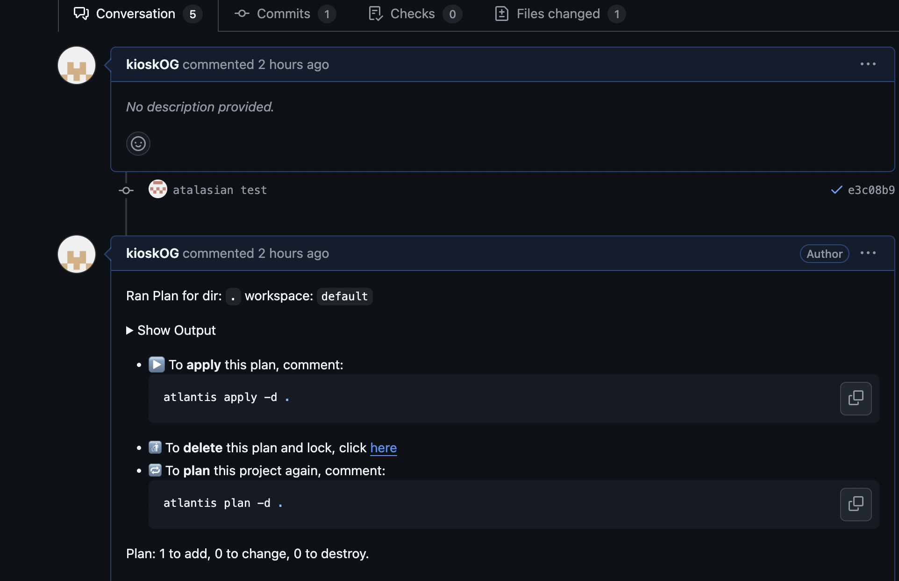
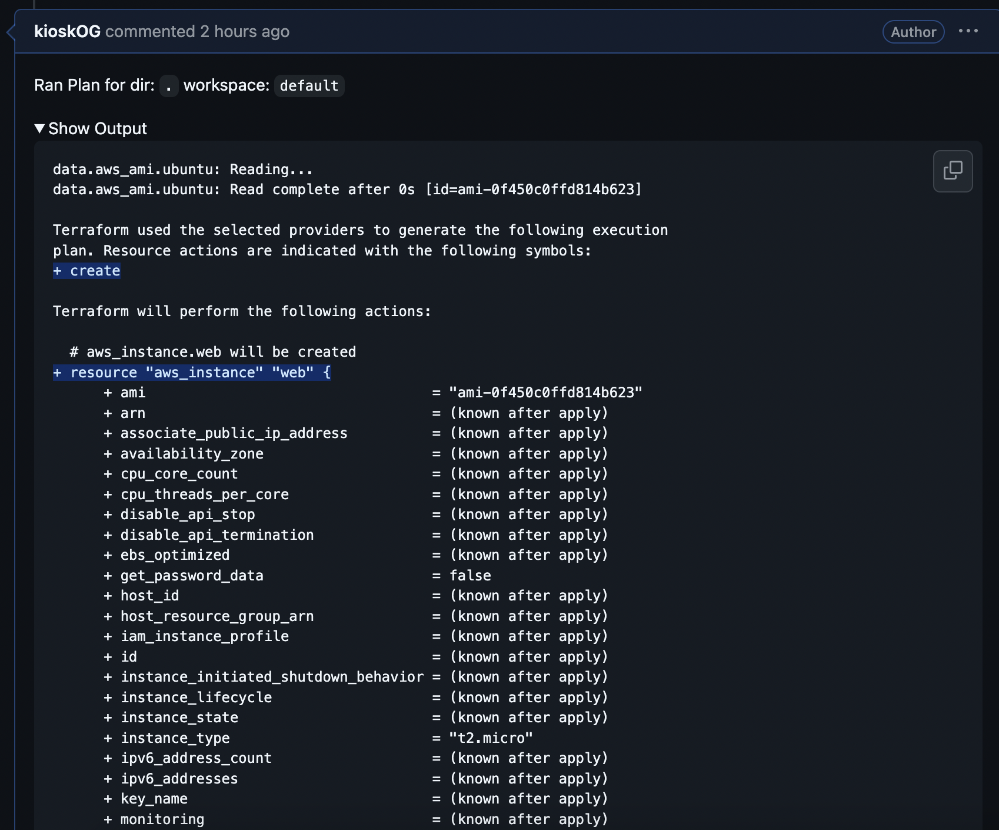
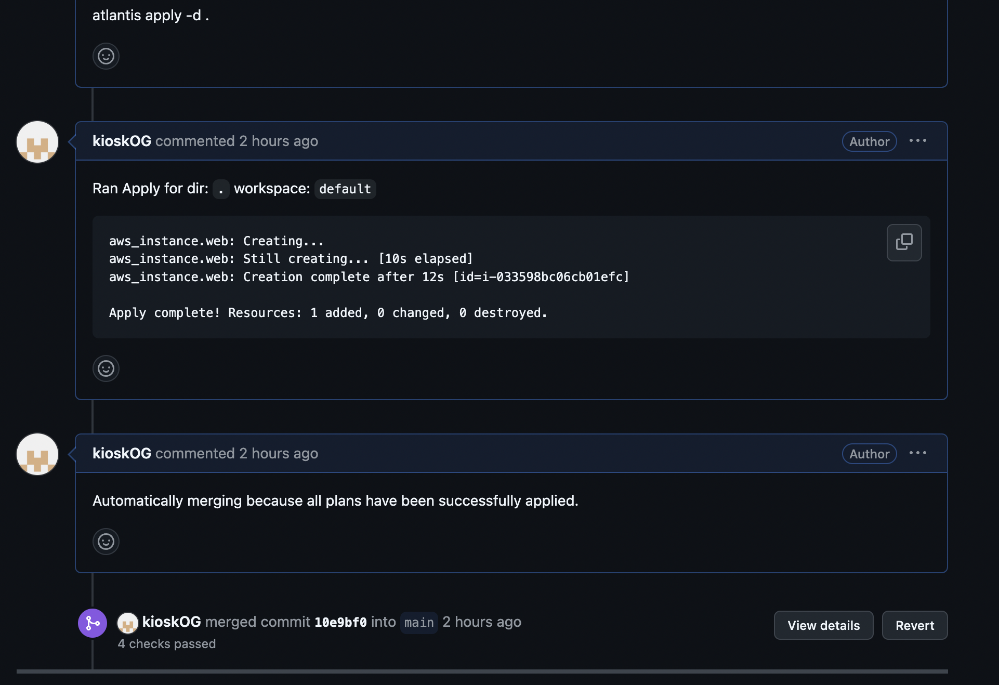

# 🚀 **Atlasian Deployment Guide**

---

## 🎯 **Objective**
Terraform Pull Request Automation tool.

---

## 📋 **Prerequisites**
- An EC2 Instance with **Docker** and **Docker Compose** installed (**Compose v2 recommended**). Upgrade instructions can be found [here](https://docs.docker.com/compose/migrate/).
- Github Account & a Private Repo
- A host with **at least 1 CPU cores** and **1 GB of RAM**.
- Basic understanding of Docker commands.
- An S3 bucket for terraform state management.
- Port 4000 & 22 should be allowed on instance security group.


## Atlantis integartion with GitHub
## ⚙️ **Setup Instructions**

### 1. Create a **Dockerfile** & **docker-compose.yaml**

```shell
mkdir Atlantis
cd Atlantis
vim Dockerfile
```

- [Dockerfile](./Dockerfile)

### 2. docker-compose.yaml

```shell
vim docker-compose.yaml
```

```shell
version: '3.8'

services:
  atlantis:
    build:
      context: .
      dockerfile: Dockerfile
    container_name: atlantis
    ports:
      - "4000:4141"
    command: >
      server
      --automerge
      --autoplan-modules
      --gh-user=${GITHUB_USERNAME}
      --gh-token=${GITHUB_TOKEN}
      --repo-allowlist=${REPO_ALLOWLIST}
    environment:
      - GITHUB_USERNAME=${GITHUB_USERNAME}
      - GITHUB_TOKEN=${GITHUB_TOKEN}
      - REPO_ALLOWLIST=${REPO_ALLOWLIST}
    volumes:
      - ./data:/home/atlantis/.aws
    restart: unless-stopped

```

### 3. Create .env file & use paste content. change as per require
```shell
vim .env
```

```shell
GITHUB_USERNAME=username
GITHUB_TOKEN=<PAT-Token>
REPO_ALLOWLIST=<comma-separated-list-of-allowed-repos>
```

## 4. Using IAM Role for AWS Communication
- Create an IAM Instance-profile role
- Add necessary permissions for S3 & EC2 As we are creating EC2 Instance in this post.
- Attach the Instance-profile role to the Instance your docker conatiner of atlasian will be running

```shell
# You can check if instance got access to aws
aws sts get-caller-identity
```

### 5. Create S3 bucket
> Go to aws console & follow the steps to create an s3 bucket. Keep the bucket private
> Bucket Name in this case **test-atlantis**

### 6. Create PAT Token
* Go to [Create PAT Token](https://github.com/settings/tokens)
* Click on **Generate New Token**
* Choose **Generate New Token (classic)**


{: .important }
> - Provide a Name
> - Expiration
> - Select scopes
> - Select repo (Full control of private repositories)
> - Select admin:repo_hookFull (control of repository hooks)
> - Click on Active & save


### 7. Start docker compose
```shell
docker compose up -d
docker compose logs
```

### 8. ***Access the Atlasian Page using the Public IP of your Instance on port 4000***
```shell
http://<Instance-Public-IP>:4000/
```

### 9. Create a Webshook for the repo you wanna use Atlasian for

{: .important }
> * Go to the repo Settings
> * Choose Webhooks
> * Add webhook
> * **Payload URL** http://<Instance-Public-IP>:4000/events
> * **Content type** application/json
> * **SSL verification** Disable if you aren't using any ssl on Atlasian domain. As we are using IP keep it Disabled.
> * **Which events would you like to trigger this webhook?**
> * **Choose** Issue comments, Pull request reviews, Pull requests, Pushes
> * Choose **Active** & save


### 10. How to test 
- Create a develop branch in repo
- create main.tf with below details

```tf
############ PROVIDER BLOCK ############
provider "aws" {
  region     = "ap-southeast-1"
}
############ SAVING TF STATE FILE #########
terraform {
  backend "s3" {
    bucket  = "test-atlantis" ## update bucket name & region as required
    key     = "atlantis/terraform.tfstate"
    region  = "ap-southeast-1"
  }
}
################# EC2 INSTANCE CREATION #########
data "aws_ami" "ubuntu" {
  most_recent = true

  filter {
    name   = "name"
    values = ["ubuntu/images/hvm-ssd/ubuntu-focal-20.04-amd64-server-*"]
  }

  filter {
    name   = "virtualization-type"
    values = ["hvm"]
  }

  owners = ["099720109477"]
}

resource "aws_instance" "web" {
  ami           = data.aws_ami.ubuntu.id
  instance_type = "t2.micro"

  tags = {
    Name = "terraform-atlantis"
  }
}
```

- commit changes & create PR
## To push the code to GitHub
```
git add *
git commit -m "Create EC2 Instance"
git checkout -b develop
git push origin develop
```
- Once done you will see plan in PR
- 
- 
- When you comment **atlantis apply -d .** terraform apply happens.
- 

{: .note }
If Wanna Run Atlantis as Docker contianer Without docker-compose

```shell 
docker run -itd -p 4000:4141 --name atlantis atlantis server --automerge --autoplan-modules --gh-user=<github-account-username> --gh-token=<github-usr-access-token> --repo-allowlist=<list of allowed repos>

### Example for above command with single repository
docker run -itd -p 4000:4141 --name atlantis atlantis server --automerge --autoplan-modules --gh-user=jerinrathnam --gh-token=ghp_lj8nNeckni0N#C*54urnDBUCc0h3f#BFU --repo-allowlist=github.com/easydeploy-cloud/terraform-atlantis

### Example for above command with all repositories in a GitHub account or organization
docker run -itd -p 4000:4141 --name atlantis atlantis server --automerge --autoplan-modules --gh-user=jerinrathnam --gh-token=nNeckni0N#C*54urnDBUCc0h3f#BFU --repo-allowlist=github.com/easydeploy-cloud/*
```

### 💡 Using IAM User for AWS Communication
```shell
## To ssh into the Atlantis Docker Container
docker exec -it atlantis /bin/sh
## To add AWS credentials directly
aws configure

## To edit the aws credentials file
vi /home/atlantis/.aws/credentials

### Add the following content into the credentials file
[default]
aws_access_key_id = <ACCESS-KEY>
aws_secret_access_key = <SECRET-KEY>

### Replace the following values in the above code
**ACCESS-KEY:** Access key ID of the AWS IAM user

**SECRET-KEY:** Secret Access key ID of the AWS IAM user
```

> Refrences:- 
* [youtube video](https://www.youtube.com/watch?v=sV9IBczE3IA&t=56s)
* [Official doc](https://www.runatlantis.io/docs.html)
* [Atlantis Commands](https://www.runatlantis.io/docs/using-atlantis.html)

## Atlantis commands reference
> ``` atlantis plan -d . ``` ⇨ to get a plan of the terraform code

> ``` atlantis apply -d . ``` ⇨ to apply the terraform code
