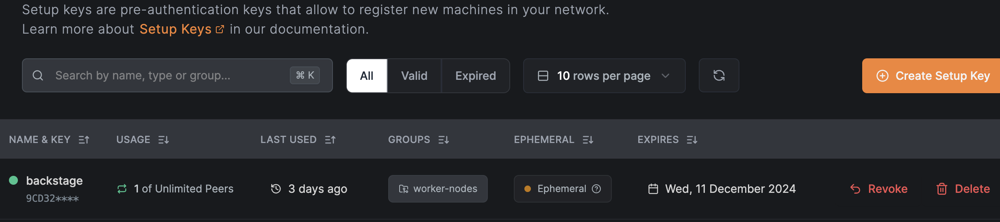
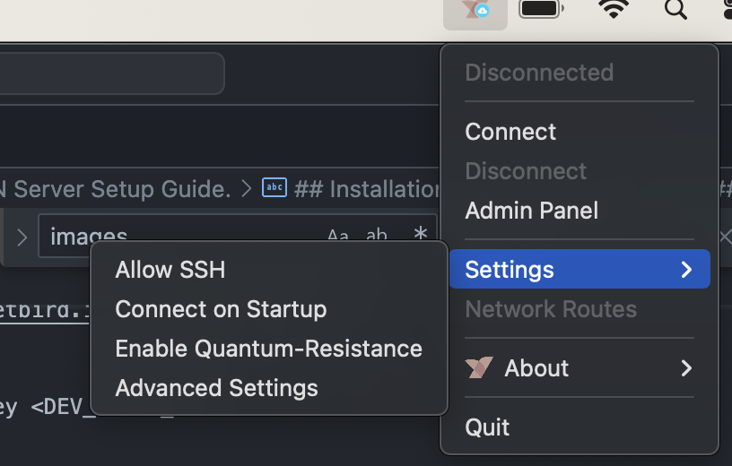
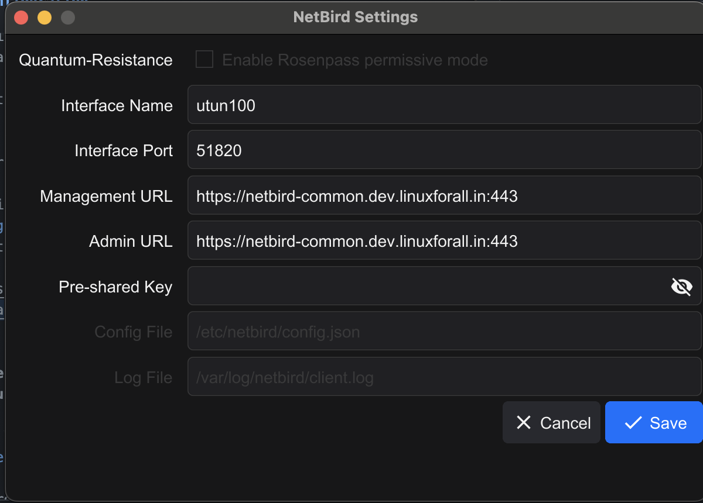
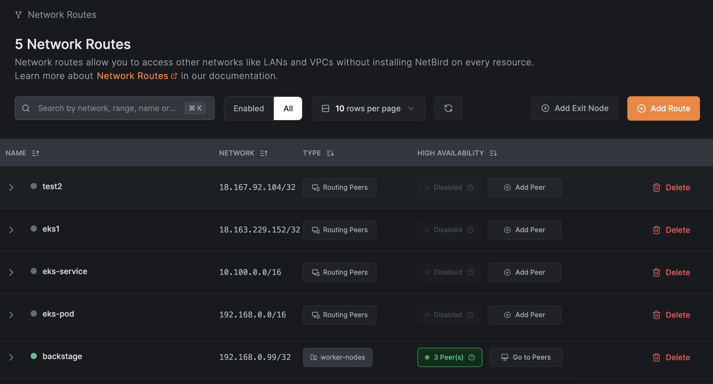
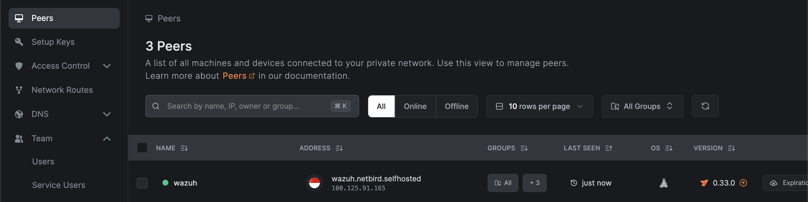

# Netbird VPN Server Setup Guide.

## Overview

This guide provides instructions to set up a Netbird VPN server, configure Netbird clients, and create secure connections between resources in cloud environments or local systems. It includes server setup, client configuration, routing traffic, and access control policies.

Netbird is a WireGuard-based VPN solution that enables secure communication between devices across distributed environments.

## Prerequisites

### External Database

- Create a RDS PostgreSQL Cluster.
- Note the Root username and password

### Google SSO

1. Go to the Google Cloud Platform and choose your project: [Google Credentials](https://console.cloud.google.com/apis/credentials)
2. Click on "+ CREATE CREDENTIALS" and choose "OAuth client ID"
3. Choose "Web application" as application type and give a name
4. Put `https://<netbird_URL>/ui/login/login/externalidp/callback` to the Authorised redirect URIs
5. Copy the Client ID and Client secret to configure the Google Identity Provider in ZITADEL.

### For Server

- **Cloud VM** with Ubuntu OS.
- **Security Group Rules**:
  - **Inbound**:  
    TCP: `33073`, `33080`, `10000`, `80`, `443`  
    UDP: `3478`, `49152-65535`
  - **Outbound**:  
    All to Internet

### For Clients

- **Cloud VM** with Ubuntu OS.
- **Security Group Rules**:
  - **Inbound**: None
  - **Outbound**: Routes to internal services as required

## Installation and Configuration

### Setting Up the Netbird Server

Run the provided script on the server VM. This script performs the following tasks:

- Fetches necessary credentials from a secret manager:
  - SMTP configuration, Google Client ID/Secret, PostgreSQL credentials, etc.
- Installs dependencies:
  - Docker and related tools, AWS CLI, Python, `curl`, `jq`, etc.
- Prompts for the value of `NETBIRD_DOMAIN` during installation.
- Renders configuration files (`docker-compose.yml`, `Caddyfile`, etc.).
- Configures Zitadel as the IDP for authentication and SMTP for email notifications.
- Sets up Google SSO.

After the script completes:

- Log in to `<netbird_domain>/ui/console` using the provided credentials.
- Enable the configured SMTP (API does not auto-enable SMTP).

#### Server Login URLs:

- **Console**: `<netbird_domain>/ui/console`
- **Peers Configuration**: `<netbird_domain>/peers`

---

### Configuring Setup Keys in Netbird

In the Netbird console, perform the following steps to create setup keys for clients:

**Create Setup Keys**:

- **DEV-CLIENT Key**:

  - Create a setup key named `dev-client`.
  - Assign it to the group `dev-client`.
  - Select Make Key Reusable and Ephemeral Peers options.

- **DEV-EKS Key**:
  - Create a setup key named `dev-eks`.
  - Assign it to the group `dev-eks`.
  - Select Make Key Reusable and Ephemeral Peers options.



These setup keys allow clients to register under specific groups, ensuring streamlined management and access control for various environments.

### Configuring Netbird Clients

#### Using Script

Run the following script on each client VM:

```bash
# Install dependencies
sudo apt update
sudo apt install -y curl
curl -fsSL https://repos.netbird.io/install.sh | bash

# Configure Netbird
netbird up --management-url <MANAGEMENT_URL> --admin-url <ADMIN_URL> --hostname dev-client --setup-key <DEV_CLIENT_SETUP_KEY>
sudo systemctl enable netbird
sudo systemctl start netbird
```

Parameters:

- `management-url`: The server management URL.
- `admin-url`: The server admin URL.
- `hostname`: The hostname for the client.
- `setup-key`: The setup key created in Netbird.

The client will register in the Netbird console under the group `dev-client`.

### For Local System

Install Netbird following the official documentation. [Netbird](https://docs.netbird.io/how-to/installation)
Run the following command:

```
netbird up --management-url <MANAGEMENT_URL> --admin-url <ADMIN_URL> --setup-key <DEV_SETUP_KEY>
```

Alternatively, configure the Netbird client UI:

1. Open the Netbird client UI.
2. Navigate to `Settings -> Advanced Settings`.
3. Enter the Management URL and Admin URL.




#### Routing Traffic

**To Access VPC Services**

1. **Create Network Routes**:

   - **Route Tab**:
     - Network Range: VPC CIDR
     - Peer Group: `dev-client`
   - **Group Tab**:
     - Distribution Group: `dev`
     - Access Control Groups: `dev`
   - **Next Tabs**:
     - Enable Route and Masquerade.
     - Set metric priority.
     - Click Add Route.

2. **Create Access Control Policies**:
   - **Protocol:** All
   - **Source**: `dev-client`
   - **Destination**: `dev`
   - Enable the policy.
   - Add any posture checks if required.
   - Provide a name and description.
   - Click Add Policy.

### Accessing Kubernetes Services

**Create a DaemonSet in Kubernetes**

Deploy the following DaemonSet in your Kubernetes cluster:

```yaml
apiVersion: v1
kind: Namespace
metadata:
  name: netbird
---
apiVersion: apps/v1
kind: DaemonSet
metadata:
  name: netbird
  namespace: netbird
spec:
  selector:
    matchLabels:
      app: netbird
  template:
    metadata:
      labels:
        app: netbird
    spec:
      containers:
        - name: netbird
          image: netbirdio/netbird:latest
          env:
            - name: NB_MANAGEMENT_URL
              value: "https://netbird.example.com" # replace with your management url
            - name: NB_ADMIN_URL
              value: "https://netbird.example.com" # replace with your admin url
            - name: NB_SETUP_KEY
              value: "XXXXXXXX-XXXX-XXXX-XXXX-XXXXXXXXXXXX" # replace with your setup key
            - name: NB_HOSTNAME
              value: "dev-k8s-worker" # name that will appear in the management UI
            - name: NB_LOG_LEVEL
              value: "info"
          securityContext:
            privileged: true
            runAsUser: 0
            runAsGroup: 0
            capabilities:
              add:
                - NET_ADMIN
                - SYS_RESOURCE
                - SYS_ADMIN
```

> [!NOTE]
> Cluster security group allows inbound access from the Netbird client security group on HTTPS (for services).
> Worker security group allows inbound access from the Netbird client security group on All TCP (for pods).

#### Routing Traffic to Kubernetes Services

1. **Create Network Routes**:

   - **Route Tab**:
     - Network Range: Kubernetes Service CIDR (`kubectl get svc` to retrieve)
     - Peer Group: `dev-eks`
   - **Group Tab**:
     - Distribution Group: `dev`
     - Access Control Groups: `dev`
   - **Next Tabs**:
     - Enable Route and Masquerade.
     - Set metric priority.
     - Click Add Route.

2. **Create Access Control Policies**:
   - **Protocol:** All
   - **Source**: `dev-eks`
   - **Destination**: `dev`
   - Enable the policy.
   - Add any posture checks if required.
   - Provide a name and description.
   - Click Add Policy.

**Network Routes**:


**Access Control Policies**


**Peers**


## Netbird Server Setup script

```bash
#!/bin/bash

#----- Constants and Variables -----#
DOCKER_GPG_KEY_URL="https://download.docker.com/linux/ubuntu/gpg"
AWS_CLI_ZIP_URL="https://awscli.amazonaws.com/awscli-exe-linux-x86_64.zip"
DOCKER_LIST_FILE="/etc/apt/sources.list.d/docker.list"
KEYRINGS_DIR="/etc/apt/keyrings"
DOCKER_KEYRING="$KEYRINGS_DIR/docker.asc"

SECRET_NAME="netbird/infra/netbird"
SECRET_VALUE=$(aws secretsmanager get-secret-value --secret-id "$SECRET_NAME" --query SecretString --output text)

SMTP_SENDER_NAME="ZITADEL"
SMTP_TLS=true
SMTP_SENDER_ADDRESS=$(echo "$SECRET_VALUE" | jq -r .SMTP_SENDER_ADDRESS)
SMTP_HOST=$(echo "$SECRET_VALUE" | jq -r .SMTP_HOST)
SMTP_USER=$(echo "$SECRET_VALUE" | jq -r .SMTP_USER)
SMTP_PASSWORD=$(echo "$SECRET_VALUE" | jq -r .SMTP_PASSWORD)

CLIENT_ID=$(echo "$SECRET_VALUE" | jq -r .GOOGLE_CLIENT_ID)
CLIENT_SECRET=$(echo "$SECRET_VALUE" | jq -r .GOOGLE_CLIENT_SECRET)
LETSENCRYPT_EMAIL=$(echo "$SECRET_VALUE" | jq -r .LETSENCRYPT_EMAIL)
NETBIRD_STORE_ENGINE_POSTGRES_DSN=$(echo "$SECRET_VALUE" | jq -r .NETBIRD_STORE_ENGINE_POSTGRES_DSN)
ZITADEL_ADMIN_USERNAME=$(echo "$SECRET_VALUE" | jq -r .ZITADEL_ADMIN_USERNAME)
ZITADEL_DATABASE_POSTGRES_HOST=$(echo "$SECRET_VALUE" | jq -r .ZITADEL_DATABASE_POSTGRES_HOST)
POSTGRES_ROOT_PASSWORD=$(echo "$SECRET_VALUE" | jq -r .POSTGRES_ROOT_PASSWORD)
POSTGRES_ZITADEL_PASSWORD=$(echo "$SECRET_VALUE" | jq -r .POSTGRES_ZITADEL_PASSWORD)

#----- Helper Functions -----#

# Check if a package is installed
is_installed() {
    dpkg -l | grep -q "^ii  $1"
}

# Install a package if it is not already installed
install_package() {
    local package=$1
    if ! is_installed "$package"; then
        echo "Installing $package..."
        sudo apt-get install -y "$package" || { echo "Failed to install $package"; exit 1; }
    else
        echo "$package is already installed."
    fi
}

# Download a file if it does not already exist
download_file() {
    local url=$1
    local dest=$2
    if [ ! -f "$dest" ]; then
        echo "Downloading $(basename "$dest")..."
        sudo curl -fsSL "$url" -o "$dest" || { echo "Failed to download $(basename "$dest")"; exit 1; }
    fi
}

#----- Docker Installation -----#

echo "Starting Docker installation..."

# Update package list
sudo apt-get update || { echo "Failed to update package list"; exit 1; }

# Install prerequisites
install_package "ca-certificates"
install_package "curl"
install_package "jq"

# Create keyrings directory if it doesn't exist
if [ ! -d "$KEYRINGS_DIR" ]; then
    echo "Creating $KEYRINGS_DIR directory..."
    sudo install -m 0755 -d "$KEYRINGS_DIR" || { echo "Failed to create $KEYRINGS_DIR"; exit 1; }
fi

# Download Docker GPG key
download_file "$DOCKER_GPG_KEY_URL" "$DOCKER_KEYRING"
sudo chmod a+r "$DOCKER_KEYRING"

# Add Docker repository if it doesn't already exist
if [ ! -f "$DOCKER_LIST_FILE" ]; then
    echo "Adding Docker repository..."
    echo "deb [arch=$(dpkg --print-architecture) signed-by=$DOCKER_KEYRING] https://download.docker.com/linux/ubuntu \
    $(. /etc/os-release && echo "$VERSION_CODENAME") stable" | \
    sudo tee "$DOCKER_LIST_FILE" > /dev/null || { echo "Failed to add Docker repository"; exit 1; }
fi

# Update package list again to include Docker repository
sudo apt-get update || { echo "Failed to update package list"; exit 1; }

# Install Docker packages
DOCKER_PACKAGES=(docker-ce docker-ce-cli containerd.io docker-buildx-plugin docker-compose-plugin docker-compose)
for pkg in "${DOCKER_PACKAGES[@]}"; do
    install_package "$pkg"
done

echo "Docker installation and setup complete!"

#----- AWS CLI Installation -----#

echo "Checking AWS CLI installation..."

# Install AWS CLI if not installed
if ! command -v aws &> /dev/null; then
    echo "AWS CLI not found. Installing AWS CLI dependencies..."
    install_package "python3-pip"
    install_package "unzip"
    install_package "curl"

    echo "Downloading AWS CLI..."
    curl -o "awscliv2.zip" "$AWS_CLI_ZIP_URL" || { echo "Failed to download AWS CLI"; exit 1; }
    unzip -q awscliv2.zip
    sudo ./aws/install || { echo "Failed to install AWS CLI"; exit 1; }

    # Clean up downloaded files
    rm -rf awscliv2.zip aws/
    echo "AWS CLI installed successfully!"
else
    echo "AWS CLI is already installed."
fi

#-----Installing Netbird-----#
set -e

handle_request_command_status() {
  PARSED_RESPONSE=$1
  FUNCTION_NAME=$2
  RESPONSE=$3
  if [[ $PARSED_RESPONSE -ne 0 ]]; then
    echo "ERROR calling $FUNCTION_NAME:" $(echo "$RESPONSE" | jq -r '.message') > /dev/stderr
    exit 1
  fi
}

handle_zitadel_request_response() {
  PARSED_RESPONSE=$1
  FUNCTION_NAME=$2
  RESPONSE=$3
  if [[ $PARSED_RESPONSE == "null" ]]; then
    echo "ERROR calling $FUNCTION_NAME:" $(echo "$RESPONSE" | jq -r '.message') > /dev/stderr
    echo "Full Response: $RESPONSE" > /dev/stderr  # Debugging output
    exit 1
  fi
  sleep 1
}

check_jq() {
  if ! command -v jq &> /dev/null
  then
    echo "jq is not installed or not in PATH, please install with your package manager. e.g. sudo apt install jq" > /dev/stderr
    exit 1
  fi
}

get_main_ip_address() {
  if [[ "$OSTYPE" == "darwin"* ]]; then
    interface=$(route -n get default | grep 'interface:' | awk '{print $2}')
    ip_address=$(ifconfig "$interface" | grep 'inet ' | awk '{print $2}')
  else
    interface=$(ip route | grep default | awk '{print $5}' | head -n 1)
    ip_address=$(ip addr show "$interface" | grep 'inet ' | awk '{print $2}' | cut -d'/' -f1)
  fi

  echo "$ip_address"
}

wait_pat() {
  PAT_PATH=$1
  set +e
  while true; do
    if [[ -f "$PAT_PATH" ]]; then
      break
    fi
    echo -n " ."
    sleep 1
  done
  echo " done"
  set -e
}

wait_api() {
    INSTANCE_URL=$1
    PAT=$2
    set +e
    counter=1
    while true; do
      FLAGS="-s"
      if [[ $counter -eq 45 ]]; then
        FLAGS="-v"
        echo ""
      fi

      curl $FLAGS --fail --connect-timeout 1 -o /dev/null "$INSTANCE_URL/auth/v1/users/me" -H "Authorization: Bearer $PAT"
      if [[ $? -eq 0 ]]; then
        break
      fi
      if [[ $counter -eq 45 ]]; then
        echo ""
        echo "Unable to connect to Zitadel for more than 45s, please check the output above, your firewall rules and the caddy container logs to confirm if there are any issues provisioning TLS certificates"
      fi
      echo -n " ."
      sleep 1
      counter=$((counter + 1))
    done
    echo " done"
    set -e
}

create_new_project() {
  INSTANCE_URL=$1
  PAT=$2
  PROJECT_NAME="NETBIRD"

  RESPONSE=$(
    curl -sS -X POST "$INSTANCE_URL/management/v1/projects" \
      -H "Authorization: Bearer $PAT" \
      -H "Content-Type: application/json" \
      -d '{"name": "'"$PROJECT_NAME"'"}'
  )
  PARSED_RESPONSE=$(echo "$RESPONSE" | jq -r '.id')
  handle_zitadel_request_response "$PARSED_RESPONSE" "create_new_project" "$RESPONSE"
  echo "$PARSED_RESPONSE"
}

create_new_application() {
  INSTANCE_URL=$1
  PAT=$2
  APPLICATION_NAME=$3
  BASE_REDIRECT_URL1=$4
  BASE_REDIRECT_URL2=$5
  LOGOUT_URL=$6
  ZITADEL_DEV_MODE=$7
  DEVICE_CODE=$8

  if [[ $DEVICE_CODE == "true" ]]; then
    GRANT_TYPES='["OIDC_GRANT_TYPE_AUTHORIZATION_CODE","OIDC_GRANT_TYPE_DEVICE_CODE","OIDC_GRANT_TYPE_REFRESH_TOKEN"]'
  else
    GRANT_TYPES='["OIDC_GRANT_TYPE_AUTHORIZATION_CODE","OIDC_GRANT_TYPE_REFRESH_TOKEN"]'
  fi

  RESPONSE=$(
    curl -sS -X POST "$INSTANCE_URL/management/v1/projects/$PROJECT_ID/apps/oidc" \
      -H "Authorization: Bearer $PAT" \
      -H "Content-Type: application/json" \
      -d '{
    "name": "'"$APPLICATION_NAME"'",
    "redirectUris": [
      "'"$BASE_REDIRECT_URL1"'",
      "'"$BASE_REDIRECT_URL2"'"
    ],
    "postLogoutRedirectUris": [
      "'"$LOGOUT_URL"'"
    ],
    "RESPONSETypes": [
      "OIDC_RESPONSE_TYPE_CODE"
    ],
    "grantTypes": '"$GRANT_TYPES"',
    "appType": "OIDC_APP_TYPE_USER_AGENT",
    "authMethodType": "OIDC_AUTH_METHOD_TYPE_NONE",
    "version": "OIDC_VERSION_1_0",
    "devMode": '"$ZITADEL_DEV_MODE"',
    "accessTokenType": "OIDC_TOKEN_TYPE_JWT",
    "accessTokenRoleAssertion": true,
    "skipNativeAppSuccessPage": true
  }'
  )

  PARSED_RESPONSE=$(echo "$RESPONSE" | jq -r '.clientId')
  handle_zitadel_request_response "$PARSED_RESPONSE" "create_new_application" "$RESPONSE"
  echo "$PARSED_RESPONSE"
}

create_service_user() {
  INSTANCE_URL=$1
  PAT=$2

  RESPONSE=$(
    curl -sS -X POST "$INSTANCE_URL/management/v1/users/machine" \
      -H "Authorization: Bearer $PAT" \
      -H "Content-Type: application/json" \
      -d '{
            "userName": "netbird-service-account",
            "name": "Netbird Service Account",
            "description": "Netbird Service Account for IDP management",
            "accessTokenType": "ACCESS_TOKEN_TYPE_JWT"
      }'
  )
  PARSED_RESPONSE=$(echo "$RESPONSE" | jq -r '.userId')
  handle_zitadel_request_response "$PARSED_RESPONSE" "create_service_user" "$RESPONSE"
  echo "$PARSED_RESPONSE"
}

create_service_user_secret() {
  INSTANCE_URL=$1
  PAT=$2
  USER_ID=$3

  RESPONSE=$(
    curl -sS -X PUT "$INSTANCE_URL/management/v1/users/$USER_ID/secret" \
      -H "Authorization: Bearer $PAT" \
      -H "Content-Type: application/json" \
      -d '{}'
  )
  SERVICE_USER_CLIENT_ID=$(echo "$RESPONSE" | jq -r '.clientId')
  handle_zitadel_request_response "$SERVICE_USER_CLIENT_ID" "create_service_user_secret_id" "$RESPONSE"
  SERVICE_USER_CLIENT_SECRET=$(echo "$RESPONSE" | jq -r '.clientSecret')
  handle_zitadel_request_response "$SERVICE_USER_CLIENT_SECRET" "create_service_user_secret" "$RESPONSE"
}

add_organization_user_manager() {
  INSTANCE_URL=$1
  PAT=$2
  USER_ID=$3

  RESPONSE=$(
    curl -sS -X POST "$INSTANCE_URL/management/v1/orgs/me/members" \
      -H "Authorization: Bearer $PAT" \
      -H "Content-Type: application/json" \
      -d '{
            "userId": "'"$USER_ID"'",
            "roles": [
              "ORG_USER_MANAGER"
            ]
      }'
  )
  PARSED_RESPONSE=$(echo "$RESPONSE" | jq -r '.details.creationDate')
  handle_zitadel_request_response "$PARSED_RESPONSE" "add_organization_user_manager" "$RESPONSE"
  echo "$PARSED_RESPONSE"
}

create_admin_user() {
    INSTANCE_URL=$1
    PAT=$2
    USERNAME=$3
    PASSWORD=$4
    RESPONSE=$(
        curl -sS -X POST "$INSTANCE_URL/management/v1/users/human/_import" \
          -H "Authorization: Bearer $PAT" \
          -H "Content-Type: application/json" \
          -d '{
                "userName": "'"$USERNAME"'",
                "profile": {
                  "firstName": "Zitadel",
                  "lastName": "Admin"
                },
                "email": {
                  "email": "'"$USERNAME"'",
                  "isEmailVerified": true
                },
                "password": "'"$PASSWORD"'",
                "passwordChangeRequired": true
          }'
      )
      PARSED_RESPONSE=$(echo "$RESPONSE" | jq -r '.userId')
      handle_zitadel_request_response "$PARSED_RESPONSE" "create_admin_user" "$RESPONSE"
      echo "$PARSED_RESPONSE"
}

add_instance_admin() {
  INSTANCE_URL=$1
  PAT=$2
  USER_ID=$3

  RESPONSE=$(
    curl -sS -X POST "$INSTANCE_URL/admin/v1/members" \
      -H "Authorization: Bearer $PAT" \
      -H "Content-Type: application/json" \
      -d '{
            "userId": "'"$USER_ID"'",
            "roles": [
              "IAM_OWNER"
            ]
      }'
  )
  PARSED_RESPONSE=$(echo "$RESPONSE" | jq -r '.details.creationDate')
  handle_zitadel_request_response "$PARSED_RESPONSE" "add_instance_admin" "$RESPONSE"
  echo "$PARSED_RESPONSE"
}

delete_auto_service_user() {
  INSTANCE_URL=$1
  PAT=$2

  RESPONSE=$(
    curl -sS -X GET "$INSTANCE_URL/auth/v1/users/me" \
      -H "Authorization: Bearer $PAT" \
      -H "Content-Type: application/json" \
  )
  USER_ID=$(echo "$RESPONSE" | jq -r '.user.id')
  handle_zitadel_request_response "$USER_ID" "delete_auto_service_user_get_user" "$RESPONSE"

  RESPONSE=$(
      curl -sS -X DELETE "$INSTANCE_URL/admin/v1/members/$USER_ID" \
        -H "Authorization: Bearer $PAT" \
        -H "Content-Type: application/json" \
  )
  PARSED_RESPONSE=$(echo "$RESPONSE" | jq -r '.details.changeDate')
  handle_zitadel_request_response "$PARSED_RESPONSE" "delete_auto_service_user_remove_instance_permissions" "$RESPONSE"

  RESPONSE=$(
      curl -sS -X DELETE "$INSTANCE_URL/management/v1/orgs/me/members/$USER_ID" \
        -H "Authorization: Bearer $PAT" \
        -H "Content-Type: application/json" \
  )
  PARSED_RESPONSE=$(echo "$RESPONSE" | jq -r '.details.changeDate')
  handle_zitadel_request_response "$PARSED_RESPONSE" "delete_auto_service_user_remove_org_permissions" "$RESPONSE"
  echo "$PARSED_RESPONSE"
}


# Google SSO Setup
# Function to configure Google SSO in ZITADEL
configure_google_sso() {
  # Parameters for Google SSO Configuration
  local INSTANCE_URL=$1
  local PAT=$2
  local CLIENT_ID=$3
  local CLIENT_SECRET=$4

  # Step 1: Create Google IDP and get the idpId
  idpIdCreation=$(
    curl -sS -X POST "$INSTANCE_URL/admin/v1/idps/google" \
      -H 'Content-Type: application/json' \
      -H 'Accept: application/json' \
      -H "Authorization: Bearer $PAT" \
      --data-raw "{
        \"name\": \"Google\",
        \"clientId\": \"$CLIENT_ID\",
        \"clientSecret\": \"$CLIENT_SECRET\",
        \"scopes\": [
          \"openid\",
          \"profile\",
          \"email\"
        ],
        \"providerOptions\": {
          \"isLinkingAllowed\": true,
          \"isCreationAllowed\": true,
          \"isAutoCreation\": true,
          \"isAutoUpdate\": true,
          \"autoLinking\": \"AUTO_LINKING_OPTION_UNSPECIFIED\"
        }
      }" | jq -r '.id'
  )

  # Check if idpId was successfully retrieved
  if [[ -z "$idpIdCreation" || "$idpIdCreation" == "null" ]]; then
    echo "Failed to create Google IDP. Check response and token permissions."
    return 1
  else
    echo "Google IDP created successfully with ID: $idpIdCreation"
  fi

  # Step 2: Link the IDP to login policies
  response=$(
    curl -sS -w "\n%{http_code}" -X POST "$INSTANCE_URL/admin/v1/policies/login/idps" \
      -H 'Content-Type: application/json' \
      -H 'Accept: application/json' \
      -H "Authorization: Bearer $PAT" \
      --data-raw "{
        \"idpId\": \"$idpIdCreation\"
      }"
  )

  # Split response and HTTP code
  http_body=$(echo "$response" | sed '$d')
  http_code=$(echo "$response" | tail -n1)

  # Check if linking the IDP to login policies was successful
  if [[ "$http_code" -eq 200 ]]; then
    echo "Google IDP successfully linked to login policies. Response:"
    echo "$http_body" | jq .
  else
    echo "Failed to link Google IDP with HTTP code $http_code. Response:"
    echo "$http_body" | jq .
  fi
}
# Google SSO Setup done


# SMTP Configure
SMTP_SENDER_ADDRESS="$SMTP_SENDER_ADDRESS"
SMTP_SENDER_NAME="$SMTP_SENDER_NAME"
SMTP_TLS=true
SMTP_HOST="$SMTP_HOST"
SMTP_USER="$SMTP_USER"
SMTP_PASSWORD="$SMTP_PASSWORD"

# Function to configure SMTP settings in ZITADEL
configure_smtp() {
  # SMTP Configure
  local INSTANCE_URL=$1
  local PAT=$2
  local SMTP_SENDER_ADDRESS=$3
  local SMTP_SENDER_NAME=$4
  local SMTP_TLS=$5
  local SMTP_HOST=$6
  local SMTP_USER=$7
  local SMTP_PASSWORD=$8

  # Send curl request
  response=$(
    curl -sS -w "\n%{http_code}" -X POST "$INSTANCE_URL/admin/v1/smtp" \
      -H 'Content-Type: application/json' \
      -H 'Accept: application/json' \
      -H "Authorization: Bearer $PAT" \
      --data-raw "{
        \"senderAddress\": \"$SMTP_SENDER_ADDRESS\",
        \"senderName\": \"$SMTP_SENDER_NAME\",
        \"tls\": $SMTP_TLS,
        \"host\": \"$SMTP_HOST\",
        \"user\": \"$SMTP_USER\",
        \"password\": \"$SMTP_PASSWORD\"
      }"
  )

  # Split response and HTTP code
  http_body=$(echo "$response" | sed '$d')
  http_code=$(echo "$response" | tail -n1)

  # Check if the response is successful
  if [[ "$http_code" -eq 200 ]]; then
    echo "SMTP configuration succeeded. Response:"
    echo "$http_body" | jq .
  else
    echo "SMTP configuration failed with HTTP code $http_code. Response:"
    echo "$http_body" | jq .
  fi
}

# SMTP Configure done

init_zitadel() {
  echo -e "\nInitializing Zitadel with NetBird's applications\n"
  INSTANCE_URL="$NETBIRD_HTTP_PROTOCOL://$NETBIRD_DOMAIN"

  TOKEN_PATH=./machinekey/zitadel-admin-sa.token

  echo -n "Waiting for Zitadel's PAT to be created "
  wait_pat "$TOKEN_PATH"
  echo "Reading Zitadel PAT"
  PAT=$(cat $TOKEN_PATH)
  if [ "$PAT" = "null" ]; then
    echo "Failed requesting getting Zitadel PAT"
    exit 1
  fi

  echo -n "Waiting for Zitadel to become ready "
  wait_api "$INSTANCE_URL" "$PAT"

  #  create the zitadel project
  echo "Creating new zitadel project"
  PROJECT_ID=$(create_new_project "$INSTANCE_URL" "$PAT")

  ZITADEL_DEV_MODE=false
  BASE_REDIRECT_URL=$NETBIRD_HTTP_PROTOCOL://$NETBIRD_DOMAIN
  if [[ $NETBIRD_HTTP_PROTOCOL == "http" ]]; then
    ZITADEL_DEV_MODE=true
  fi

  # create zitadel spa applications
  echo "Creating new Zitadel SPA Dashboard application"
  DASHBOARD_APPLICATION_CLIENT_ID=$(create_new_application "$INSTANCE_URL" "$PAT" "Dashboard" "$BASE_REDIRECT_URL/nb-auth" "$BASE_REDIRECT_URL/nb-silent-auth" "$BASE_REDIRECT_URL/" "$ZITADEL_DEV_MODE" "false")

  echo "Creating new Zitadel SPA Cli application"
  CLI_APPLICATION_CLIENT_ID=$(create_new_application "$INSTANCE_URL" "$PAT" "Cli" "http://localhost:53000/" "http://localhost:54000/" "http://localhost:53000/" "true" "true")

  MACHINE_USER_ID=$(create_service_user "$INSTANCE_URL" "$PAT")

  SERVICE_USER_CLIENT_ID="null"
  SERVICE_USER_CLIENT_SECRET="null"

  create_service_user_secret "$INSTANCE_URL" "$PAT" "$MACHINE_USER_ID"

  DATE=$(add_organization_user_manager "$INSTANCE_URL" "$PAT" "$MACHINE_USER_ID")

  # ZITADEL_ADMIN_USERNAME="admin@$NETBIRD_DOMAIN"
  ZITADEL_ADMIN_USERNAME="$ZITADEL_ADMIN_USERNAME"
  #ZITADEL_ADMIN_PASSWORD="Qwerty2254@@1"
  ZITADEL_ADMIN_PASSWORD="$(openssl rand -base64 32 | sed 's/=//g')@"

  HUMAN_USER_ID=$(create_admin_user "$INSTANCE_URL" "$PAT" "$ZITADEL_ADMIN_USERNAME" "$ZITADEL_ADMIN_PASSWORD")

  # Call the function
  configure_smtp "$INSTANCE_URL" "$PAT" "$SMTP_SENDER_ADDRESS" "$SMTP_SENDER_NAME" "$SMTP_TLS" "$SMTP_HOST" "$SMTP_USER" "$SMTP_PASSWORD"

  configure_google_sso "$INSTANCE_URL" "$PAT" "$CLIENT_ID" "$CLIENT_SECRET"

  DATE="null"

  DATE=$(add_instance_admin "$INSTANCE_URL" "$PAT" "$HUMAN_USER_ID")

  DATE="null"
  DATE=$(delete_auto_service_user "$INSTANCE_URL" "$PAT")
  if [ "$DATE" = "null" ]; then
      echo "Failed deleting auto service user"
      echo "Please remove it manually"
  fi

  export NETBIRD_AUTH_CLIENT_ID=$DASHBOARD_APPLICATION_CLIENT_ID
  export NETBIRD_AUTH_CLIENT_ID_CLI=$CLI_APPLICATION_CLIENT_ID
  export NETBIRD_IDP_MGMT_CLIENT_ID=$SERVICE_USER_CLIENT_ID
  export NETBIRD_IDP_MGMT_CLIENT_SECRET=$SERVICE_USER_CLIENT_SECRET
  export ZITADEL_ADMIN_USERNAME
  export ZITADEL_ADMIN_PASSWORD
}


check_nb_domain() {
  DOMAIN=$1
  if [ "$DOMAIN-x" == "-x" ]; then
    echo "The NETBIRD_DOMAIN variable cannot be empty." > /dev/stderr
    return 1
  fi

  if [ "$DOMAIN" == "netbird.example.com" ]; then
    echo "The NETBIRD_DOMAIN cannot be netbird.example.com" > /dev/stderr
    return 1
  fi
  return 0
}

read_nb_domain() {
  READ_NETBIRD_DOMAIN=""
  echo -n "Enter the domain you want to use for NetBird (e.g. netbird.my-domain.com): " > /dev/stderr
  read -r READ_NETBIRD_DOMAIN < /dev/tty
  if ! check_nb_domain "$READ_NETBIRD_DOMAIN"; then
    read_nb_domain
  fi
  echo "$READ_NETBIRD_DOMAIN"
}

get_turn_external_ip() {
  TURN_EXTERNAL_IP_CONFIG="#external-ip="
  IP=$(curl -s -4 https://jsonip.com | jq -r '.ip')
  if [[ "x-$IP" != "x-" ]]; then
    TURN_EXTERNAL_IP_CONFIG="external-ip=$IP"
  fi
  echo "$TURN_EXTERNAL_IP_CONFIG"
}

initEnvironment() {
  CADDY_SECURE_DOMAIN=""
  ZITADEL_EXTERNALSECURE="false"
  ZITADEL_TLS_MODE="disabled"
  ZITADEL_MASTERKEY="$(openssl rand -base64 32 | head -c 32)"
  NETBIRD_PORT=80
  NETBIRD_HTTP_PROTOCOL="http"
  NETBIRD_RELAY_PROTO="rel"
  TURN_USER="self"
  TURN_PASSWORD=$(openssl rand -base64 32 | sed 's/=//g')
  NETBIRD_RELAY_AUTH_SECRET=$(openssl rand -base64 32 | sed 's/=//g')
  TURN_MIN_PORT=49152
  TURN_MAX_PORT=65535
  TURN_EXTERNAL_IP_CONFIG=$(get_turn_external_ip)

  if ! check_nb_domain "$NETBIRD_DOMAIN"; then
    NETBIRD_DOMAIN=$(read_nb_domain)
  fi

  if [ "$NETBIRD_DOMAIN" == "use-ip" ]; then
    NETBIRD_DOMAIN=$(get_main_ip_address)
  else
    ZITADEL_EXTERNALSECURE="true"
    ZITADEL_TLS_MODE="external"
    NETBIRD_PORT=443
    CADDY_SECURE_DOMAIN=", $NETBIRD_DOMAIN:$NETBIRD_PORT"
    NETBIRD_HTTP_PROTOCOL="https"
    NETBIRD_RELAY_PROTO="rels"
  fi

  if [[ "$OSTYPE" == "darwin"* ]]; then
      ZIDATE_TOKEN_EXPIRATION_DATE=$(date -u -v+30M "+%Y-%m-%dT%H:%M:%SZ")
  else
      ZIDATE_TOKEN_EXPIRATION_DATE=$(date -u -d "+30 minutes" "+%Y-%m-%dT%H:%M:%SZ")
  fi

  DOCKER_COMPOSE_COMMAND="docker-compose"

  if [ -f zitadel.env ]; then
    echo "Generated files already exist, if you want to reinitialize the environment, please remove them first."
    echo "You can use the following commands:"
    echo "  $DOCKER_COMPOSE_COMMAND down --volumes # to remove all containers and volumes"
    echo "  rm -f docker-compose.yml Caddyfile zitadel.env dashboard.env machinekey/zitadel-admin-sa.token turnserver.conf management.json relay.env"
    echo "Be aware that this will remove all data from the database, and you will have to reconfigure the dashboard."
    exit 1
  fi

  echo Rendering initial files...
  renderDockerCompose > docker-compose.yml
  renderCaddyfile > Caddyfile
  renderZitadelEnv > zitadel.env
  echo "" > dashboard.env
  echo "" > turnserver.conf
  echo "" > management.json
  echo "" > relay.env

  mkdir -p machinekey
  chmod 777 machinekey

  echo -e "\nStarting Zitadel IDP for user management\n\n"
  $DOCKER_COMPOSE_COMMAND up -d caddy zitadel
  init_zitadel

  echo -e "\nRendering NetBird files...\n"
  renderTurnServerConf > turnserver.conf
  renderManagementJson > management.json
  renderDashboardEnv > dashboard.env
  renderRelayEnv > relay.env

  echo -e "\nStarting NetBird services\n"
  $DOCKER_COMPOSE_COMMAND up -d
  echo -e "\nDone!\n"
  echo "You can access the NetBird dashboard at $NETBIRD_HTTP_PROTOCOL://$NETBIRD_DOMAIN"
  echo "Login with the following credentials:"
  echo "Username: $ZITADEL_ADMIN_USERNAME" | tee .env
  echo "Password: $ZITADEL_ADMIN_PASSWORD" | tee -a .env
}

renderCaddyfile() {
  cat <<EOF
{
  debug
	servers :80,:443 {
    protocols h1 h2c
  }
}

(security_headers) {
    header * {
        # enable HSTS
        # https://cheatsheetseries.owasp.org/cheatsheets/HTTP_Headers_Cheat_Sheet.html#strict-transport-security-hsts
        # NOTE: Read carefully how this header works before using it.
        # If the HSTS header is misconfigured or if there is a problem with
        # the SSL/TLS certificate being used, legitimate users might be unable
        # to access the website. For example, if the HSTS header is set to a
        # very long duration and the SSL/TLS certificate expires or is revoked,
        # legitimate users might be unable to access the website until
        # the HSTS header duration has expired.
        # The recommended value for the max-age is 2 year (63072000 seconds).
        # But we are using 1 hour (3600 seconds) for testing purposes
        # and ensure that the website is working properly before setting
        # to two years.

        Strict-Transport-Security "max-age=3600; includeSubDomains; preload"

        # disable clients from sniffing the media type
        # https://cheatsheetseries.owasp.org/cheatsheets/HTTP_Headers_Cheat_Sheet.html#x-content-type-options
        X-Content-Type-Options "nosniff"

        # clickjacking protection
        # https://cheatsheetseries.owasp.org/cheatsheets/HTTP_Headers_Cheat_Sheet.html#x-frame-options
        X-Frame-Options "SAMEORIGIN"

        # xss protection
        # https://cheatsheetseries.owasp.org/cheatsheets/HTTP_Headers_Cheat_Sheet.html#x-xss-protection
        X-XSS-Protection "1; mode=block"

        # Remove -Server header, which is an information leak
        # Remove Caddy from Headers
        -Server

        # keep referrer data off of HTTP connections
        # https://cheatsheetseries.owasp.org/cheatsheets/HTTP_Headers_Cheat_Sheet.html#referrer-policy
        Referrer-Policy strict-origin-when-cross-origin
    }
}

:80${CADDY_SECURE_DOMAIN} {
    import security_headers
    # relay
    reverse_proxy /relay* relay:80
    # Signal
    reverse_proxy /signalexchange.SignalExchange/* h2c://signal:10000
    # Management
    reverse_proxy /api/* management:80
    reverse_proxy /management.ManagementService/* h2c://management:80
    # Zitadel
    reverse_proxy /zitadel.admin.v1.AdminService/* h2c://zitadel:8080
    reverse_proxy /admin/v1/* h2c://zitadel:8080
    reverse_proxy /zitadel.auth.v1.AuthService/* h2c://zitadel:8080
    reverse_proxy /auth/v1/* h2c://zitadel:8080
    reverse_proxy /zitadel.management.v1.ManagementService/* h2c://zitadel:8080
    reverse_proxy /management/v1/* h2c://zitadel:8080
    reverse_proxy /zitadel.system.v1.SystemService/* h2c://zitadel:8080
    reverse_proxy /system/v1/* h2c://zitadel:8080
    reverse_proxy /assets/v1/* h2c://zitadel:8080
    reverse_proxy /ui/* h2c://zitadel:8080
    reverse_proxy /oidc/v1/* h2c://zitadel:8080
    reverse_proxy /saml/v2/* h2c://zitadel:8080
    reverse_proxy /oauth/v2/* h2c://zitadel:8080
    reverse_proxy /.well-known/openid-configuration h2c://zitadel:8080
    reverse_proxy /openapi/* h2c://zitadel:8080
    reverse_proxy /debug/* h2c://zitadel:8080
    reverse_proxy /device/* h2c://zitadel:8080
    reverse_proxy /device h2c://zitadel:8080
    # Dashboard
    reverse_proxy /* dashboard:80
}
EOF
}

renderTurnServerConf() {
  cat <<EOF
listening-port=3478
$TURN_EXTERNAL_IP_CONFIG
tls-listening-port=5349
min-port=$TURN_MIN_PORT
max-port=$TURN_MAX_PORT
fingerprint
lt-cred-mech
user=$TURN_USER:$TURN_PASSWORD
realm=wiretrustee.com
cert=/etc/coturn/certs/cert.pem
pkey=/etc/coturn/private/privkey.pem
log-file=stdout
no-software-attribute
pidfile="/var/tmp/turnserver.pid"
no-cli
EOF
}

renderManagementJson() {
  cat <<EOF
{
    "Stuns": [
        {
            "Proto": "udp",
            "URI": "stun:$NETBIRD_DOMAIN:3478"
        }
    ],
    "TURNConfig": {
        "Turns": [
            {
                "Proto": "udp",
                "URI": "turn:$NETBIRD_DOMAIN:3478",
                "Username": "$TURN_USER",
                "Password": "$TURN_PASSWORD"
            }
        ],
        "TimeBasedCredentials": false
    },
    "Relay": {
        "Addresses": ["$NETBIRD_RELAY_PROTO://$NETBIRD_DOMAIN:$NETBIRD_PORT"],
        "CredentialsTTL": "24h",
        "Secret": "$NETBIRD_RELAY_AUTH_SECRET"
    },
    "Signal": {
        "Proto": "$NETBIRD_HTTP_PROTOCOL",
        "URI": "$NETBIRD_DOMAIN:$NETBIRD_PORT"
    },
    "HttpConfig": {
        "AuthIssuer": "$NETBIRD_HTTP_PROTOCOL://$NETBIRD_DOMAIN",
        "AuthAudience": "$NETBIRD_AUTH_CLIENT_ID",
        "OIDCConfigEndpoint":"$NETBIRD_HTTP_PROTOCOL://$NETBIRD_DOMAIN/.well-known/openid-configuration"
    },
    "IdpManagerConfig": {
        "ManagerType": "zitadel",
        "ClientConfig": {
            "Issuer": "$NETBIRD_HTTP_PROTOCOL://$NETBIRD_DOMAIN",
            "TokenEndpoint": "$NETBIRD_HTTP_PROTOCOL://$NETBIRD_DOMAIN/oauth/v2/token",
            "ClientID": "$NETBIRD_IDP_MGMT_CLIENT_ID",
            "ClientSecret": "$NETBIRD_IDP_MGMT_CLIENT_SECRET",
            "GrantType": "client_credentials"
        },
        "ExtraConfig": {
            "ManagementEndpoint": "$NETBIRD_HTTP_PROTOCOL://$NETBIRD_DOMAIN/management/v1"
        }
    },
  "DeviceAuthorizationFlow": {
      "Provider": "hosted",
      "ProviderConfig": {
          "Audience": "$NETBIRD_AUTH_CLIENT_ID_CLI",
          "ClientID": "$NETBIRD_AUTH_CLIENT_ID_CLI",
          "Scope": "openid"
      }
    },
    "PKCEAuthorizationFlow": {
        "ProviderConfig": {
            "Audience": "$NETBIRD_AUTH_CLIENT_ID_CLI",
            "ClientID": "$NETBIRD_AUTH_CLIENT_ID_CLI",
            "Scope": "openid profile email offline_access",
            "RedirectURLs": ["http://localhost:53000/","http://localhost:54000/"]
        }
    }
}
EOF
}

renderPostgresEnv() {
  cat <<EOF
POSTGRES_USER=root
POSTGRES_PASSWORD=$POSTGRES_ROOT_PASSWORD
EOF
}


renderDashboardEnv() {
  cat <<EOF
# Endpoints
NETBIRD_MGMT_API_ENDPOINT=$NETBIRD_HTTP_PROTOCOL://$NETBIRD_DOMAIN
NETBIRD_MGMT_GRPC_API_ENDPOINT=$NETBIRD_HTTP_PROTOCOL://$NETBIRD_DOMAIN
# OIDC
AUTH_AUDIENCE=$NETBIRD_AUTH_CLIENT_ID
AUTH_CLIENT_ID=$NETBIRD_AUTH_CLIENT_ID
AUTH_AUTHORITY=$NETBIRD_HTTP_PROTOCOL://$NETBIRD_DOMAIN
USE_AUTH0=false
AUTH_SUPPORTED_SCOPES="openid profile email offline_access"
AUTH_REDIRECT_URI=/nb-auth
AUTH_SILENT_REDIRECT_URI=/nb-silent-auth
# SSL
NGINX_SSL_PORT=443
# Letsencrypt
LETSENCRYPT_DOMAIN=none
LETSENCRYPT_EMAIL=$LETSENCRYPT_EMAIL
EOF
}

renderZitadelEnv() {
  cat <<EOF
ZITADEL_LOG_LEVEL=debug
ZITADEL_MASTERKEY=$ZITADEL_MASTERKEY
ZITADEL_EXTERNALSECURE=$ZITADEL_EXTERNALSECURE
ZITADEL_TLS_ENABLED="false"
ZITADEL_EXTERNALPORT=$NETBIRD_PORT
ZITADEL_EXTERNALDOMAIN=$NETBIRD_DOMAIN
ZITADEL_FIRSTINSTANCE_PATPATH=/machinekey/zitadel-admin-sa.token
ZITADEL_FIRSTINSTANCE_ORG_MACHINE_MACHINE_USERNAME=zitadel-admin-sa
ZITADEL_FIRSTINSTANCE_ORG_MACHINE_MACHINE_NAME=Admin
ZITADEL_FIRSTINSTANCE_ORG_MACHINE_PAT_SCOPES=openid
ZITADEL_FIRSTINSTANCE_ORG_MACHINE_PAT_EXPIRATIONDATE=$ZIDATE_TOKEN_EXPIRATION_DATE
ZITADEL_DATABASE_POSTGRES_HOST=$ZITADEL_DATABASE_POSTGRES_HOST
ZITADEL_DATABASE_POSTGRES_PORT=5432
ZITADEL_DATABASE_POSTGRES_DATABASE=zitadel
ZITADEL_DATABASE_POSTGRES_USER_USERNAME=zitadel
ZITADEL_DATABASE_POSTGRES_USER_PASSWORD=$POSTGRES_ZITADEL_PASSWORD
ZITADEL_DATABASE_POSTGRES_USER_SSL_MODE=require
ZITADEL_DATABASE_POSTGRES_ADMIN_USERNAME=root
ZITADEL_DATABASE_POSTGRES_ADMIN_PASSWORD=$POSTGRES_ROOT_PASSWORD
ZITADEL_DATABASE_POSTGRES_ADMIN_SSL_MODE=require
NETBIRD_STORE_CONFIG_ENGINE=postgres
EOF
}

renderRelayEnv() {
  cat <<EOF
NB_LOG_LEVEL=info
NB_LISTEN_ADDRESS=:80
NB_EXPOSED_ADDRESS=$NETBIRD_RELAY_PROTO://$NETBIRD_DOMAIN:$NETBIRD_PORT
NB_AUTH_SECRET=$NETBIRD_RELAY_AUTH_SECRET
EOF
}

renderDockerCompose() {
  cat <<EOF
version: "3.4"
services:
  # Caddy reverse proxy
  caddy:
    image: caddy
    restart: unless-stopped
    networks: [ netbird ]
    ports:
      - '443:443'
      - '80:80'
      - '8080:8080'
    volumes:
      - netbird_caddy_data:/data
      - ./Caddyfile:/etc/caddy/Caddyfile
    logging:
      driver: "json-file"
      options:
        max-size: "500m"
        max-file: "2"
  # UI dashboard
  dashboard:
    image: netbirdio/dashboard:v2.7.0
    restart: unless-stopped
    networks: [netbird]
    env_file:
      - ./dashboard.env
    logging:
      driver: "json-file"
      options:
        max-size: "500m"
        max-file: "2"
  # Signal
  signal:
    image: netbirdio/signal:0.31.1
    restart: unless-stopped
    networks: [netbird]
    logging:
      driver: "json-file"
      options:
        max-size: "500m"
        max-file: "2"
  # Relay
  relay:
    image: netbirdio/relay:0.31.1
    restart: unless-stopped
    networks: [netbird]
    env_file:
      - ./relay.env
    logging:
      driver: "json-file"
      options:
        max-size: "500m"
        max-file: "2"
  # Management
  management:
    image: netbirdio/management:0.31.1
    restart: unless-stopped
    networks: [netbird]
    environment:
      - NETBIRD_STORE_ENGINE_POSTGRES_DSN=$NETBIRD_STORE_ENGINE_POSTGRES_DSN
      - ZITADEL_EXTERNALDOMAIN=$NETBIRD_DOMAIN
    volumes:
      - netbird_management:/var/lib/netbird
      - ./management.json:/etc/netbird/management.json
    command: [
      "--port", "80",
      "--log-file", "console",
      "--log-level", "info",
      "--disable-anonymous-metrics=false",
      "--single-account-mode-domain=netbird.selfhosted",
      "--dns-domain=netbird.selfhosted",
      "--idp-sign-key-refresh-enabled",
    ]
    logging:
      driver: "json-file"
      options:
        max-size: "500m"
        max-file: "2"
  # Coturn, AKA relay server
  coturn:
    image: coturn/coturn
    restart: unless-stopped
    #domainname: netbird.relay.selfhosted
    volumes:
      - ./turnserver.conf:/etc/turnserver.conf:ro
    network_mode: host
    command:
      - -c /etc/turnserver.conf
    logging:
      driver: "json-file"
      options:
        max-size: "500m"
        max-file: "2"
  # Zitadel - identity provider
  zitadel:
    restart: 'always'
    networks: [netbird]
    image: 'ghcr.io/zitadel/zitadel:v2.64.1'
    command: 'start-from-init --masterkeyFromEnv --tlsMode $ZITADEL_TLS_MODE'
    env_file:
      - ./zitadel.env
    volumes:
      - ./machinekey:/machinekey
      - netbird_zitadel_certs:/zdb-certs:ro
    logging:
      driver: "json-file"
      options:
        max-size: "500m"
        max-file: "2"
volumes:
  netbird_zdb_data:
  netbird_management:
  netbird_caddy_data:
  netbird_zitadel_certs:

networks:
  netbird:
EOF
}

initEnvironment
```

## Reference:

- [Netbird self-hosted](https://docs.netbird.io/selfhosted/selfhosted-guide)

- [Using Postgresql](https://docs.netbird.io/selfhosted/postgres-store)

- [Zitadel IDP](https://docs.netbird.io/selfhosted/identity-providers#zitadel)

- [Troubleshooting client issues](https://docs.netbird.io/how-to/troubleshooting-client)

- [Configure Google as an Identity Provider in ZITADEL](https://zitadel.com/docs/guides/integrate/identity-providers/google)

- [Zitadel APIs](https://zitadel.com/docs/apis/introduction)
