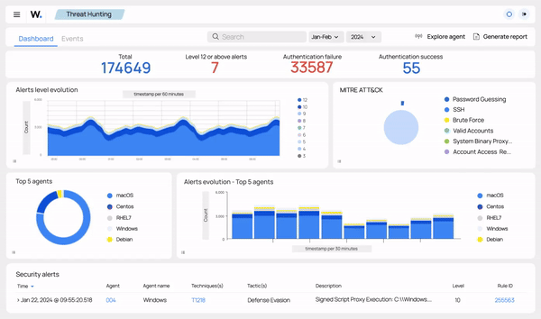
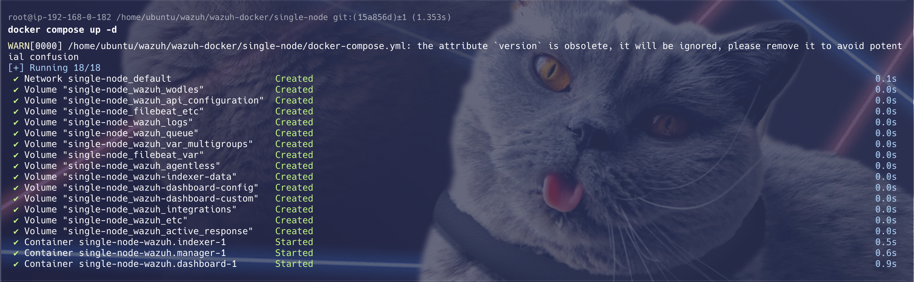
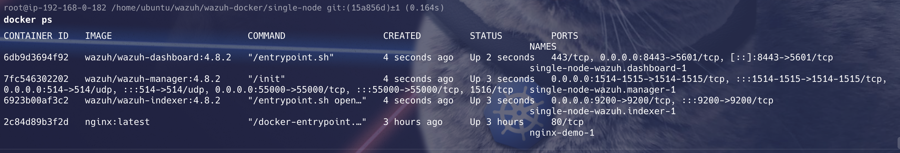
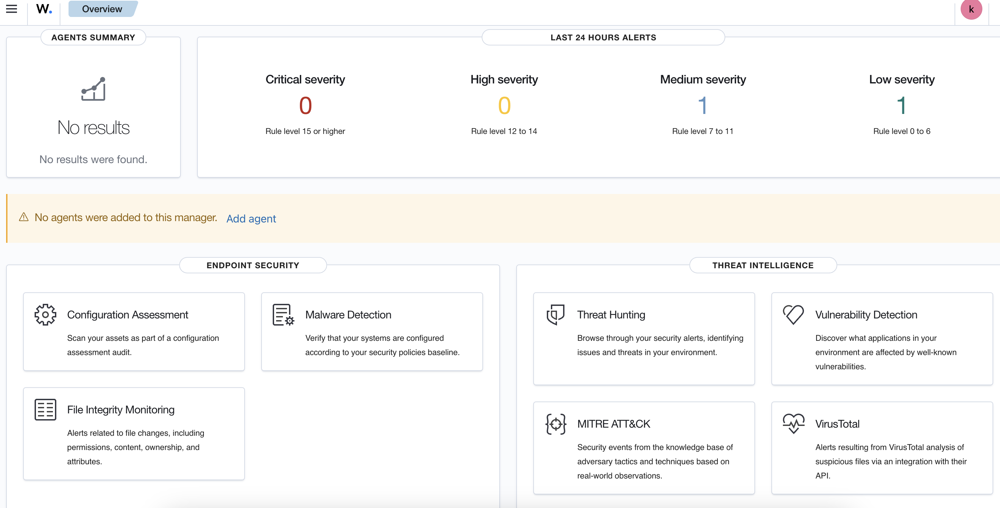

# ✨Deploy Wazuh Docker in single node configuration✨

This deployment is defined in the `docker-compose.yaml` file with one Wazuh manager containers, one Wazuh indexer containers, and one Wazuh dashboard container. It can be deployed by following these steps: 

✨ 

## Clone the Repository
Download the Wazuh Docker repository for version 4.8.2:
```shell
git clone https://github.com/wazuh/wazuh-docker.git -b v4.8.2
```

## Increase max_map_count on your host (Linux). This command must be run with root permissions:
```shell
sysctl -w vm.max_map_count=262144
```

## Run the certificate creation script:
> [generator-indexer-certs-file](./generator-indexer-certs.yaml)

```shell
cd wazuh-docker/single-node
docker pull wazuh/wazuh-certs-generator:0.0.2
cat generate-indexer-certs.yml #update image mentioned in below NOTE.
docker compose -f generate-indexer-certs.yml run --rm generator
```

{: .note}
> * **Update Image in `generate-indexer-certs.yml`**
> * **image: `wazuh/wazuh-certs-generator:0.0.2`**

## Start the environment with docker-compose:
- [docker-compose-with-environment-variables-file](./docker-compose-with-environment-variables.yaml)
- [docker-compose-with-env-file](./docker-compose-with-env-file.yaml)

- In the foregroud:
```shell
docker compose up
```

- In the background:
```shell
docker compose up -d
docker ps
```
✨ 

✨ 

## ⏱️ Deployment Time
The environment takes about 1 minute to get up (depending on your Docker host) for the first time since Wazuh Indexer must be started for the first time and the indexes and index patterns must be generated.

✨ Preview of Wazuh Dashboard:✨



## Destroy compose environment
```shell
docker compose down --volumes
```
