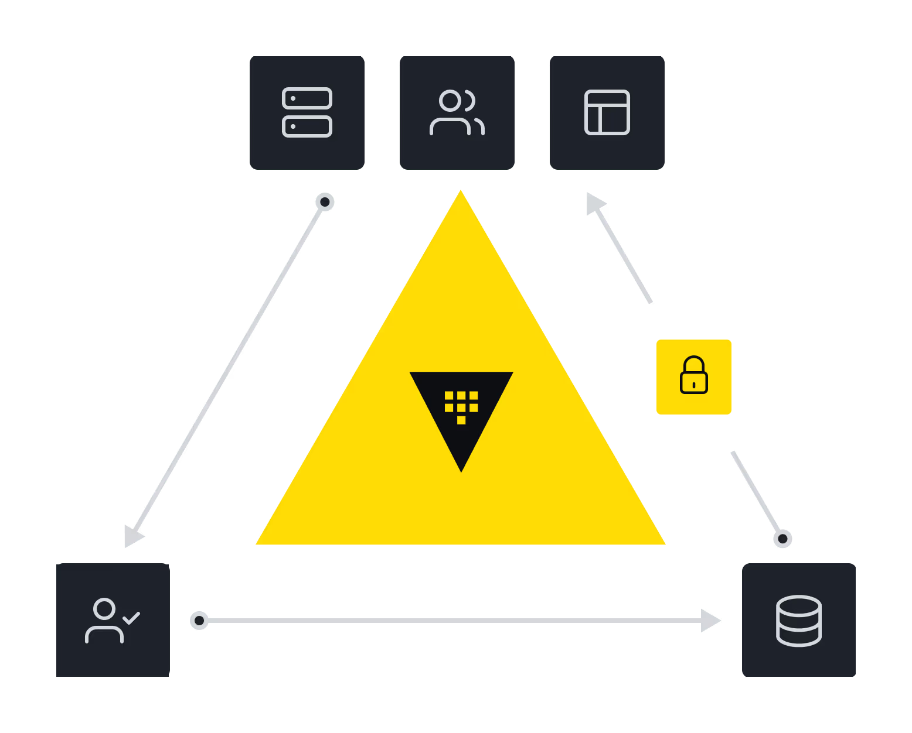
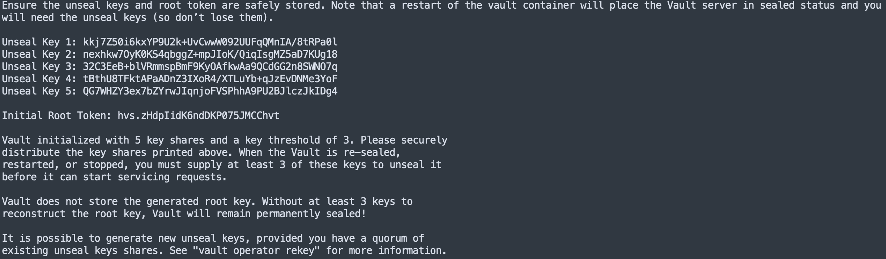
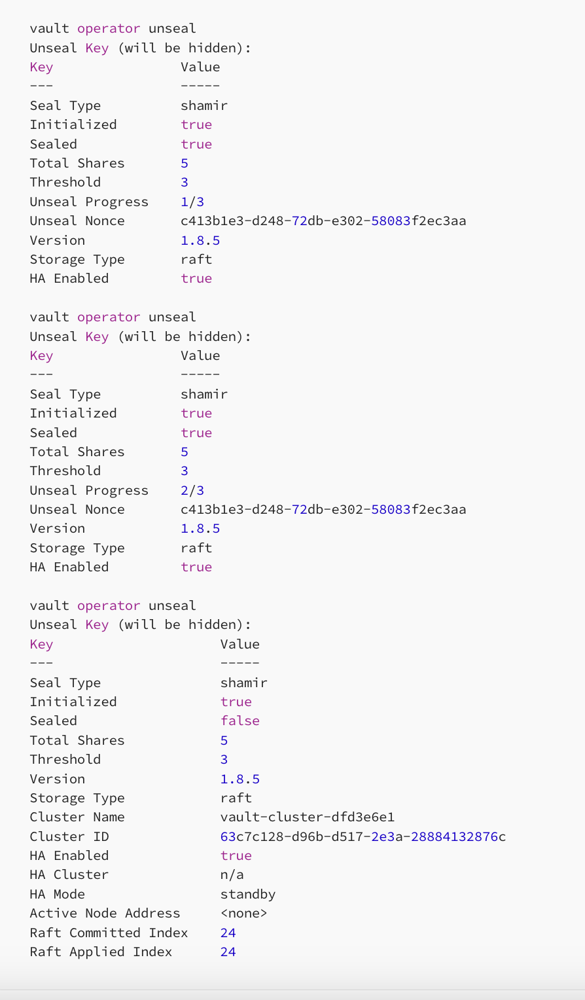

# 🔐 Vault Docker Setup along with Basics of vault & Dynamic creds generate for mysql(RDS) 🔐

## What is Vault?
Secure, store, and tightly control access to tokens, passwords, certificates, encryption keys for protecting secrets, and other sensitive data using a UI, CLI, or HTTP API.



---

## 🚀 Vault setup with http using docker

### 📋 Prerequisites
- **Docker** and **Docker Compose** installed.
- Basic understanding of Docker commands.

### 1️⃣ docker-compose file.

```yaml
  version: '3.3'
  services:
    vault:
      image: hashicorp/vault
      container_name: vault-new
      environment:
        VAULT_ADDR: "http://vault-poc.dev.linuxforall.in:8200"
        VAULT_API_ADDR: "http://vault-poc.dev.linuxforall.in:8200"
        VAULT_ADDRESS: "http://vault-poc.dev.linuxforall.in:8200"
        # VAULT_UI: true
        # VAULT_TOKEN:
      ports:
        - "8200:8200"
        - "8201:8201"
      restart: always
      volumes:
        - ./logs:/vault/logs/:rw
        - ./data:/vault/data/:rw
        - ./config:/vault/config/:rw
        - ./file:/vault/file/:rw
      cap_add:
        - IPC_LOCK
      entrypoint: vault server -config /vault/config/config.hcl
```
### 2️⃣ /config/config.hcl
```hcl
    ui = true
    disable_mlock = "true"

    storage "raft" {
      path    = "/vault/data"
      node_id = "node1"
    }

    listener "tcp" {
      address = "[::]:8200"
      tls_disable = "true"
    }

    api_addr = "http://vault-poc.dev.linuxforall.in:8200"
    cluster_addr = "http://vault-poc.dev.linuxforall.in:8201"
```

### 3️⃣ Start docker compose & exec into container
```bash
docker-compose up -d
docker exec -it vault-new /bin/sh
```

### 4️⃣ Once logged into the vault container, Initialize vault
```bash
vault operator init
```
**📝Note: Save the unseal keys and root token securely. They will be required for unsealing and logging in.**



### 5️⃣ While still in the vault container, execute the command below thrice with any of the 3 unseal keys. Please observe the below logs
```bash
vault operator unseal
```


### 6️⃣ Exit the docker-container and install vault CLI if not done already in local system
```bash

sudo apt update && sudo apt install gpg wget
wget -O- https://apt.releases.hashicorp.com/gpg | sudo gpg --dearmor -o /usr/share/keyrings/hashicorp-archive-keyring.gpg
gpg --no-default-keyring --keyring /usr/share/keyrings/hashicorp-archive-keyring.gpg --fingerprint
echo "deb [arch=$(dpkg --print-architecture) signed-by=/usr/share/keyrings/hashicorp-archive-keyring.gpg] https://apt.releases.hashicorp.com $(lsb_release -cs) main" | sudo tee /etc/apt/sources.list.d/hashicorp.list
sudo apt update && sudo apt install vault
```

### 7️⃣ For the login you will need to export the Vault adress and use the root token from the above steps
```bash
export VAULT_ADDR="http://vault-poc.dev.linuxforall.in:8200"
```

### 8️⃣ vault login
```bash
vault login
```


# 🔐 Vault setup with https using docker

### 1️⃣ docker-compose file.

```yaml
version: '3.3'
services:
  vault:
    image: hashicorp/vault
    container_name: vault-https
    environment:
      VAULT_ADDR: "https://vault2-poc.dev.linuxforall.in:8300"
      VAULT_API_ADDR: "https://vault2-poc.dev.linuxforall.in:8300"
      VAULT_ADDRESS: "https://vault2-poc.dev.linuxforall.in:8300"
      # VAULT_UI: true
      # VAULT_TOKEN:
    ports:
      - "8300:8200"
      - "8301:8201"
    restart: always
    volumes:
      - ./logs:/vault/logs/:rw
      - ./data:/vault/data/:rw
      - ./config:/vault/config/:rw
      - ./certs:/certs/:rw
      - ./file:/vault/file/:rw
    cap_add:
      - IPC_LOCK
    entrypoint: vault server -config /vault/config/config.hcl
```

### 2️⃣ config/config.hcl

```yaml
ui = true
disable_mlock = "true"

storage "raft" {
  path    = "/vault/data"
  node_id = "node1"
}

listener "tcp" {
  address = "[::]:8200"
  tls_disable = "false"
  tls_cert_file = "/certs/cert.crt"
  tls_key_file  = "/certs/cert.key"
}

api_addr = "https://vault2-poc.dev.linuxforall.in:8300"
cluster_addr = "https://vault2-poc.dev.linuxforall.in:8301"
```
### 3️⃣ Start docker compose & exec into container
```bash
docker-compose up -d
docker exec -it vault-new /bin/sh
```

### 4️⃣ Notes for HTTPS Setup

**Note: Follow the same steps as the HTTP setup for the remaining configuration.**

>If you're using **self-signed certificates**, use a browser instead of running the `vault operator init` command inside the container. The browser will guide you through the necessary prompts to proceed with initialization.

---

### Common Error with Self-Signed Certificates

When using self-signed certificates, you may encounter the following error:

```plaintext
Get "https://vault2-poc.dev.linuxforall.in:8300/v1/sys/seal-status": tls: failed to verify certificate: x509: certificate signed by unknown authority
```


# 📚 Some Basics of Hashicorp Vault

# Vault: Read, List, Write, and Delete Secrets

This guide covers the fundamental operations for managing secrets in Vault, including enabling secret engines, writing, reading, listing, and deleting secrets.

---

## 📌 Enable a Secret Engine

To use a new path in Vault, you must enable it under a secret engine:

```bash
vault secrets enable -path=my kv
```

### ✏️ Write Secrets
> Store a key-value pair in Vault:
```shell
vault kv put my/path key-1=value-1
```


* 📖 Read Secrets
> Retrieve the stored secret:
```shell
vault kv get my/path
```

> Retrieve the secret in JSON format:
```shell
vault kv get my/path
```

* 📂 List Secrets
> List all secret engines:
```shell
vault secrets list
```

* 🗑️ Delete Secrets
> Remove a specific secret:
```shell
vault kv delete my/path
```


# 📋 Examples
* 1️⃣ Create or Update a Secret
> Add or update the key `foo` in the secret mount with the value bar=baz:
```shell
vault kv put -mount=secret foo bar=baz
```

* 2️⃣ Read a Secret
> Retrieve the value of the key `foo`:
```shell
vault kv put -mount=secret foo bar=baz
```

* 3️⃣ Get Metadata
> Retrieve metadata for the key `foo`:
```shell
vault kv metadata get -mount=secret foo
```

* 4️⃣ Read a Specific Version
> Retrieve a specific version of the key `foo`:
```shell
vault kv metadata get -mount=secret foo
```


## 🔐 Vault Secret Engine Operations
* 1️⃣ List Secret Engines
```shell
vault secrets list
```

* 2️⃣ Enable a Secret Engine
> Enable a secret engine at a custom path:
```shell
vault secrets enable -path=aws aws
```

* 3️⃣ Disable a Secret Engine
> Disable a secret engine:
```shell
vault secrets disable aws
```

#### 🎉 You're All Set!
> You now know how to enable secret engines, write, read, list, and delete secrets in Vault. Use these commands to manage secrets securely and effectively. 🏆


# Setup Dynamic creds for mysql(RDS)

> This plugin has a few different instances built into vault, each instance is for a slightly different MySQL driver. The only difference between these plugins is the length of usernames generated by the plugin as different versions of mysql accept different lengths.

###  The available plugins are:

* mysql-database-plugin
* mysql-aurora-database-plugin
* mysql-rds-database-plugin
* mysql-legacy-database-plugin


### Enable Secrets Engines for Database
```shell
Vault secrets enable database
```

### mysql RDS connection configure
```shell
vault write database/config/mysql \
  plugin_name=mysql-database-plugin \
  connection_url="{{username}}:{{password}}@tcp(iam-rds.cnca5n9dcmn4.ap-southeast-1.rds.amazonaws.com:3306)/" \
  allowed_roles="readonly" \
  username="admin" \
  password="strong_password" \
  tls_ca_file="ap-southeast-1-bundle.pem"
```

### mysql readonly role configure
``` shell
vault write database/roles/readonly \
    db_name=mysql \
    creation_statements="CREATE USER '{{name}}'@'%' IDENTIFIED BY '{{password}}';GRANT SELECT ON *.* TO '{{name}}'@'%';" \
    default_ttl="1h" \
    max_ttl="24h"
```
### Read database config & roles details about 
```shell
vault read database/config/iamrds
vault read database/roles/readonly
```

### Generate new temporary credentials
```shell
vault read database/creds/readonly
```
