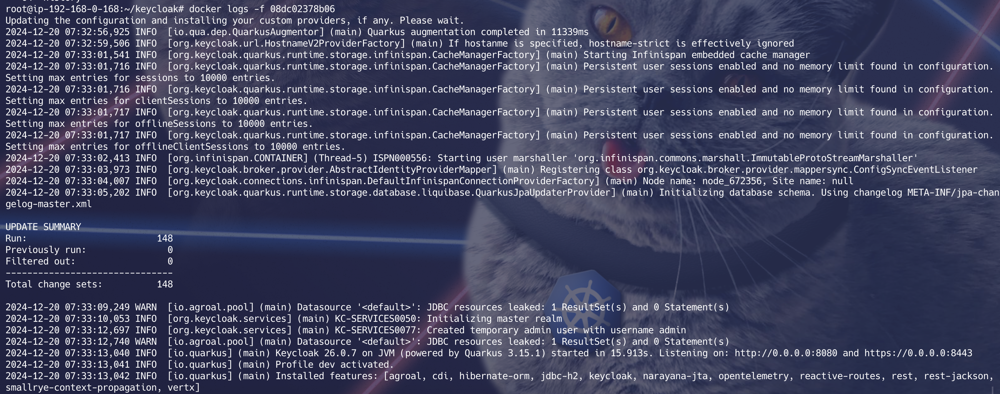

# 🚀 SOP: Keycloak Deployment using docker

## 🎯 Objective
Deploy Keycloak in a docker environment for Authentication & Authorization.

---

## ✅ Prerequisites
- A ubuntu system with docker & docker compose installed.
- A domain Name.

---

## 📋 Steps

# Docker Compose

```shell
mkdir keycloak
cd keycloak
vim docker-compose.yaml
```

```yaml
version: '3'

services:

  keycloak:
    image: quay.io/keycloak/keycloak:latest
    container_name: keycloak
    restart: always
    ports:
      - "80:8080"  # Listen to HTTP on host port 80 and forward to keycloak on 8080
      - "443:8443" # Listen to HTTPS on host port 443 and forward to keycloak on 8443

    volumes:
      - "./certs/fullchain.pem:/etc/x509/https/tls.crt"  # Map certificate to container
      - "./certs/privkey.pem:/etc/x509/https/tls.key"    # Map private key to container

    environment:
      # - JAVA_OPTS_APPEND="-D keycloak.profile.feature.upload_script=enabled"
      - KC_BOOTSTRAP_ADMIN_USERNAME=admin
      - KC_BOOTSTRAP_ADMIN_PASSWORD=admin
      - KC_HOSTNAME=keycloak.dev.linuxforall.in  # Set the hostname here
      - KC_HTTPS_CERTIFICATE_FILE=/etc/x509/https/tls.crt
      - KC_HTTPS_CERTIFICATE_KEY_FILE=/etc/x509/https/tls.key

    command:
      - start-dev  # Start Keycloak in developer mode
```

> **Note:** Use certificates from let's encrypt or self sign certificates for your domain.


```shell
apt update && apt install certbot
sudo certbot certonly --standalone -d keycloak.dev.linuxforall.in
# cp -R /etc/letsencrypt/live/* .
cp /etc/letsencrypt/live/keycloak.dev.linuxforall.in/fullchain.pem certs/
cp /etc/letsencrypt/live/keycloak.dev.linuxforall.in/privkey.pem certs/
chmod 644 ./certs/fullchain.pem ./certs/privkey.pem
docker compose up -d
docker exec -it keycloak ls /etc/x509/https/
docker ps
docker logs -f <container_id>
```



✅ Conclusion

> Keycloak is successfully deployed in the Kubernetes environment. Ensure proper functionality by testing the service at:

#### Access with your keycloak endpoint: [keycloak url](https://keycloak.dev.linuxforall.in)

