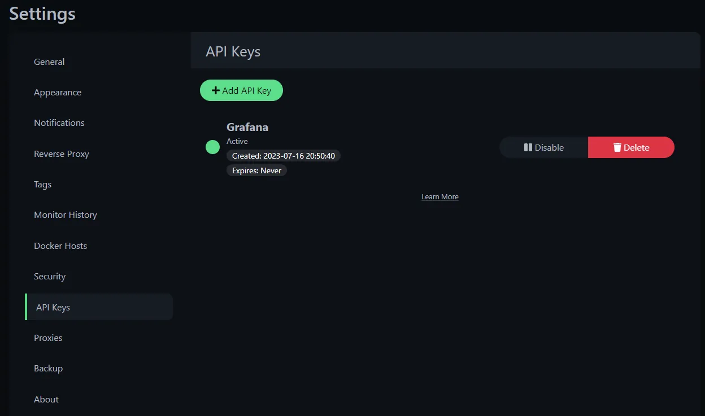
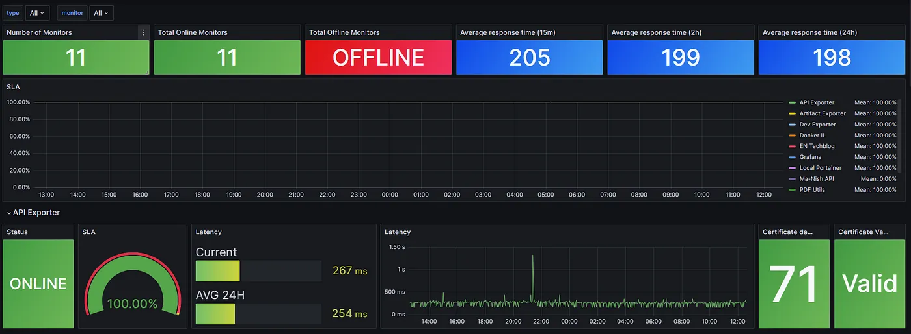

# 🚀 **Uptime-Kuma Deployment Guide**

---

## 🎯 **Objective**

Uptime Kuma is an easy-to-use self-hosted monitoring tool.

---

## 📋 **Prerequisites**

- **Docker** and **Docker Compose** installed (**Compose v2 recommended**). Upgrade instructions can be found [here](https://docs.docker.com/compose/migrate/).
- A host with **at least 1 CPU cores** and **1 GB of RAM**.
- Basic understanding of Docker commands.

---

⭐ Features

- Monitoring uptime for HTTP(s) / TCP / HTTP(s) Keyword / HTTP(s) Json Query / Ping / DNS Record / Push / Steam Game Server / Docker Containers
- Fancy, Reactive, Fast UI/UX
- Notifications via Telegram, Discord, Gotify, Slack, Pushover, Email (SMTP), and [90+ notification services, click here for the full list](https://github.com/louislam/uptime-kuma/tree/master/src/components/notifications)
- 20-second intervals
- [Multi Languages](https://github.com/louislam/uptime-kuma/tree/master/src/lang)
- Multiple status pages
- Map status pages to specific domains
- Ping chart
- Certificate info
- Proxy support
- 2FA support

## ⚙️ **Setup Instructions**

```shell
mkdir uptime-kuma
vim docker-compose.yaml
```

```shell
name: uptime-kuma

services:
  uptime-kuma:
    container_name: uptime-kuma
    hostname: uptime-kuma
    image: louislam/uptime-kuma:latest
    network_mode: "host"
    volumes:
      - uptime-kuma:/app/data
    restart: always
    # ports:
    #  - '3001:3001'

volumes:
  uptime-kuma:
```

> **WARNING**  
> File Systems like **NFS** (Network File System) are **NOT** supported. Please map to a local directory or volume.

> **NOTE**
> If you want to limit exposure to localhost (without exposing port for other users or to use a [reverse proxy](https://github.com/louislam/uptime-kuma/wiki/Reverse-Proxy)), you can expose the port like this:
>
> ```bash
> docker run -d --restart=always -p 127.0.0.1:3001:3001 -v uptime-kuma:/app/data --name uptime-kuma louislam/uptime-kuma:1
> ```

Uptime Kuma is now running on <http://0.0.0.0:3001>

```shell
http://<host-ip>:3001
http://<host-ip>:3001/metrics
```

## Track Docker container using uptime kuma

> Create a file at below location & paste the content

```shell
/etc/docker/daemon.json

{"hosts": ["tcp://0.0.0.0:2375", "unix:///var/run/docker.sock"]}
```

> Create another file if not present at below loaction

```shell
/etc/systemd/system/docker.service.d/override.conf

[Service]
ExecStart=
ExecStart=/usr/bin/dockerd --config-file /etc/docker/daemon.json
```

> Restart the daemon & docker service
> systemctl daemon-reload
> systemctl restart docker

> **NOTE**
> Restarting **docker** will restart all the containers all well.

# Real-time Uptime Monitoring with Uptime Kuma and Grafana

## Introduction

```plaintext
Integrating Uptime Kuma monitoring into your Grafana dashboard offers a powerful synergy, allowing you to consolidate real-time uptime data alongside other critical metrics. By seamlessly embedding Uptime Kuma’s monitoring capabilities into Grafana, you unlock a comprehensive view of your system’s health and performance in a single unified interface. This integration empowers you to make informed decisions swiftly, enhancing your ability to proactively manage and optimize service uptime effortlessly. Let’s delve into the process of adding Uptime Kuma monitoring to your Grafana dashboard for a holistic monitoring experience.
```

## prerequisites

```plaintext
Integrating Uptime Kuma monitoring into your Grafana dashboard offers a powerful synergy, allowing you to consolidate real-time uptime data alongside other critical metrics.
```

> 1. Uptime Kuma Installed and Running: Have Uptime Kuma set up and operational, either via Docker or the non-Docker method.
> 2. Grafana Installed and Configured: Ensure Grafana is installed and properly configured to create and manage dashboards.
> 3. Access Credentials: Have the necessary access credentials or APIs ready for both Uptime Kuma and Grafana for seamless integration. This can be done under API key in Uptime Kuma Settings:



## Prometheus and Grafa configuration

### Step 1. Verify we can access the Uptime Kuma metrics

```plaintext
Before we can start scrapping the metrics we need to verify that we can access the Uptime Kuma “/metrics”. to do that, open the browser and enter your Uptime Kuma server, ending with “/metrics”:
```

```shell
https://<hostip>:3001/metrics
```

> You should get a Basic Auth screen:
> 

```plaintext
Leave the Username empty or pass the same username which you created when first time created a user and the password is the Uptime Kuma API Key you generated and click on “Sign in”. if the password is correct you should see a screen that looks like the following:
```


### Step 2. Configure Prometheus scrapper

```plaintext
After we confirm that we can access the Uptime Kuma metrics, It’s time to configure our Prometheus scrapper. For that, open your Prometheus configuration file and add the following text:
```

```shell
- job_name: "uptime Kuma"
    scrape_interval: 30s
    scheme: http
    static_configs:
      - targets: ["192.168.0.185:3001"]
        labels:
          host: 'UptimeKuma'
    metrics_path: "/metrics"
    basic_auth:
      password: uk1_rV7hmbnlWSZ8UcV78bZR2m9eCU0N0OFSBi4Qi4wF
```

> [!NOTE]
> Don’t forget to replace the targets and passwords with your own. Save the file and restart your Prometheus instance.

### Step 3: Setting up the Grafana dashboard

```plaintext
Grafana allows you to import dashboards using JSON files. This can be helpful for sharing dashboards or moving them between instances. Here are the steps to import a Grafana dashboard from a JSON file.
```

- Open your web browser and navigate to your Grafana instance.
- If you’re not already logged in, enter your Grafana username and password to log in.
- In the Grafana sidebar, click on the “Dashboards” icon (it looks like a bar chart).

- Import the Dashboard JSON File:

  > In the top menu of the dashboard, click on the “Import” button. It may be represented as an arrow pointing upwards.
  > You can select between three existing dashboards or create one of your own

- [uptime kuma](https://grafana.com/grafana/dashboards/14847-uptime-kuma/)
  

- [Uptime Kuma — SLA/Latency/Certs](https://grafana.com/grafana/dashboards/18667-uptime-kuma-metrics/)
  

- [Uptime Kuma — Metrics](https://grafana.com/grafana/dashboards/18278-uptime-kuma/)
  

[Reference](https://medium.com/@tomer.klein/real-time-uptime-monitoring-with-uptime-kuma-and-grafana-16638d6a579f)
