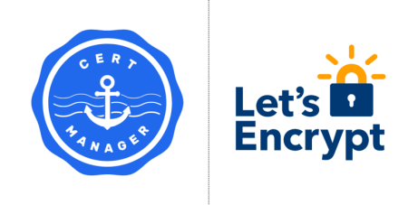
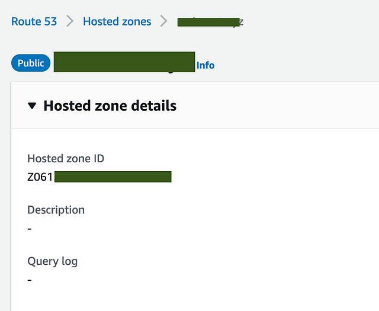
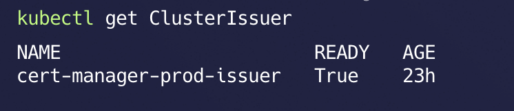
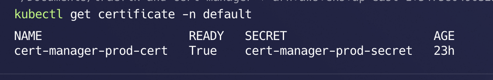
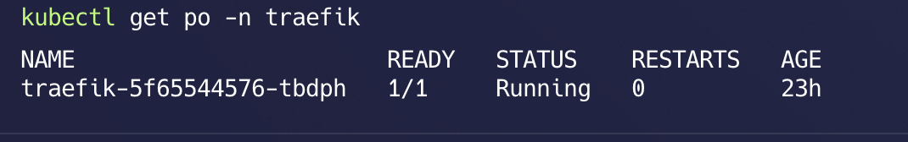
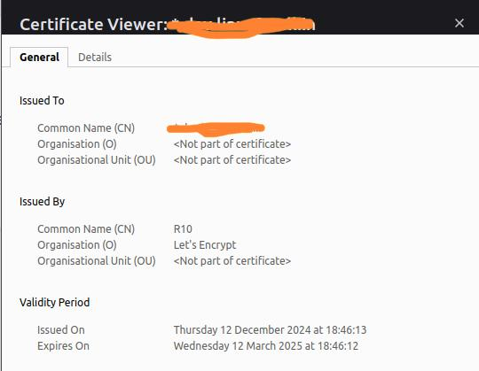

# EKS Ingress with Traefik, Cert-Manager, and Cross-Account Route 53 using IAM Role and Service Account



## 🎯 Objective
When managing workloads in Kubernetes (EKS), securing communication with HTTPS is crucial. This blog demonstrates how to set up **Traefik** as an ingress controller and integrate it with **Cert-Manager** for TLS certificate management. We also cover cross-account Route 53 integration for DNS-01 validation using AWS IAM roles and service accounts.

---

## 📋 **Prerequisites**

1) A Kubernetes 1.22+
2) Helm version 3.9+ is [installed](https://helm.sh/docs/intro/install/)
3) Two Aws Accounts
  a) Account A having EKS Cluster running
  b) Account B having Route53 hosted
4) Public Hosted zone in Route53

### 🌟 Cert-Manager

#### **Cert-Manager** is an open-source tool for managing TLS certificates in Kubernetes. It automates tasks such as:

- Certificate creation
- Renewal
- Domain validation

By handling certificates automatically, Cert-Manager ensures secure communication between Kubernetes services and external systems.

---

### 🌟 Traefik

**Traefik** is a Kubernetes-native ingress controller that simplifies managing traffic into your cluster. It supports features like:
- Automatic certificate management (via Cert-Manager)
- Load balancing
- HTTPS termination

Traefik makes ingress configuration more efficient and user-friendly while ensuring secure traffic flow.

---

### Cross-Account Setup Overview

We set up EKS in **Account A** and Route 53 DNS zones in **Account B**. Cert-Manager in **Account A** needs permissions to validate domains in **Account B** via DNS-01 challenges.

#### Account-B Setup: Trusted Role for Account-A
Create an AWS IAM role of type Trusted entity in Account B that allows Account A to assume it and manage DNS records.

**Role Policy for Account B:**
```json
{
  "Version": "2012-10-17",
  "Statement": [
    {
      "Effect": "Allow",
      "Action": "route53:GetChange",
      "Resource": "arn:aws:route53:::change/*"
    },
    {
      "Effect": "Allow",
      "Action": [
        "route53:ChangeResourceRecordSets",
        "route53:ListResourceRecordSets"
      ],
      "Resource": "arn:aws:route53:::hostedzone/<YOUR_SPECIFIC_HOSTED_ZONE_ID>"
    },
    {
      "Effect": "Allow",
      "Action": "route53:ListHostedZonesByName",
      "Resource": "*"
    }
  ]
}
```

#### Grab Hosted Zone ID from Route53 in Account B

---

#### Account-A Setup: Role and Service Account

In Account A, create an IAM role that Cert-Manager will assume.

**IAM Trusted Entities Policy for Account A:**
```json
{
  "Version": "2012-10-17",
  "Statement": [
    {
      "Effect": "Allow",
      "Principal": {
        "Federated": "arn:aws:iam::$account_id:oidc-provider/$oidc_provider"
      },
      "Action": "sts:AssumeRoleWithWebIdentity",
      "Condition": {
        "StringEquals": {
          "$oidc_provider:aud": "sts.amazonaws.com",
          "$oidc_provider:sub": "system:serviceaccount:cert-manager:cert-manager"
        }
      }
    }
  ]
}
```

**IAM Inline Policy for Account A:**
```json
{
  "Version": "2012-10-17",
  "Statement": [
    {
      "Effect": "Allow",
      "Action": "sts:AssumeRole",
      "Resource": "<Account-B-Role-arn>"
    }
  ]
}
```

---

### Cert-Manager Setup

Install Cert-Manager using Helm:
```bash
helm repo add jetstack https://charts.jetstack.io --force-update
helm install cert-manager jetstack/cert-manager --namespace cert-manager --create-namespace --set crds.enabled=true
```

Update the `cert-manager` service account to use the IAM role, to do that add the annotation:

```shell
kubectl edit sa cert-manager -n cert-manager
```

```yaml
annotations:
  eks.amazonaws.com/role-arn: <Account-A role arn>
```

---

### ClusterIssuer and Certificate Configuration

**ClusterIssuer Manifest:**

```yaml
apiVersion: cert-manager.io/v1
kind: ClusterIssuer
metadata:
  name: cert-manager-prod-issuer
spec:
  acme:
    email: <Email_ID>
    server: https://acme-v02.api.letsencrypt.org/directory # For Prod use
    privateKeySecretRef:
      name: letsencrypt-prod
    solvers:
    - selector:
        dnsZones:
          - "dev.example.in"
      dns01:
        route53:
          region: us-east-1
          hostedZoneID: <hostedZoneID>
          role: <Account-B role arn>
```



📝 This is for production grade environment certificates. which are real https certificates.
> If you want to use certificate for testing environment you can change `server: https://acme-staging-v02.api.letsencrypt.org/directory`

**Certificate Manifest:**
```yaml
apiVersion: cert-manager.io/v1
kind: Certificate
metadata:
  name: cert-manager-prod-cert
  namespace: default
spec:
  secretName: cert-manager-prod-secret
  issuerRef:
    name: cert-manager-prod-issuer
    kind: ClusterIssuer
  dnsNames:
    - "*.dev.example.in"
    - "dev.example.in"
```


---

### Traefik Setup

Install Traefik with Helm:
```shell
helm repo add traefik https://traefik.github.io/charts --force-update
kubectl create ns traefik
helm install traefik traefik/traefik -n traefik
```



---

### Deploy and Test an Application

**Nginx Deployment Manifest:**
```yaml
apiVersion: apps/v1
kind: Deployment
metadata:
  name: nginx
  namespace: default
spec:
  replicas: 1
  selector:
    matchLabels:
      app: nginx
  template:
    metadata:
      labels:
        app: nginx
    spec:
      containers:
      - name: nginx
        image: nginx:latest
        ports:
        - containerPort: 80
---
apiVersion: v1
kind: Service
metadata:
  name: nginx-service
  namespace: default
spec:
  type: ClusterIP
  selector:
    app: nginx
  ports:
    - protocol: TCP
      port: 80
      targetPort: 80
```

**IngressRoute Manifest:**
```yaml
apiVersion: traefik.io/v1alpha1
kind: IngressRoute
metadata:
  name: nginx-ingress-route
  namespace: kong
  annotations:
    kubernetes.io/ingress.class: traefik
    kubernetes.io/tls-acme: "true"
    certmanager.k8s.io/cluster-issuer: letsencrypt-prod
spec:
  entryPoints:
    - websecure
  routes:
  - match: Host('nginx.dev.example.in')
    kind: Rule
    services:
    - name: nginx-service
      port: 80
  tls:
    secretName: cert-manager-prod-secret
```

---

### Final Note

{: .note}
> Ensure that a CNAME record for `nginx.dev.example.com` points to your Traefik load balancer's DNS in Route 53.
>
> With this setup, Traefik and Cert-Manager efficiently manage ingress traffic and certificates, ensuring secure communication for your Kubernetes workloads.



