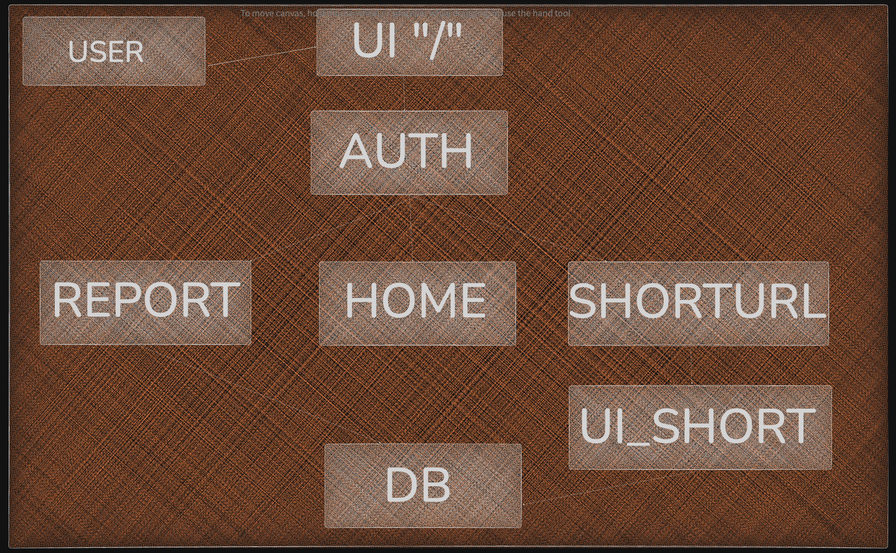

# Application High-Level Design (HLD) Diagram

The system consists of distinct microservices/applications (UI, Auth, Report, ShortURL) and a shared database (DB). The diagram visually reflects data and control flows, service boundaries, and integration points.

## Application HLD Diagram

## Components

| **Component**  | **Description**                                                       |
|------------|-------------------------------------------------------------------|
| `USER`       | End user interacting with the front end.                          |
| `UI ("/")`   | The primary user interface, serving as the entry point for all user actions. |
| `AUTH`       | Handles authentication, database validation, and authorization checks. |
| `REPORT`     | Manages report generation and data retrieval.                     |
| `HOME`       | Landing/dashboard logic after login.                              |
| `SHORTURL`   | Provides URL shortening functionality.                            |
| `UI_SHORT`   | User interface for the short URL service.                         |
| `DB`         | Central MySQL database for persistent storage.                    |

## High-Level Flow

1. The **USER** interacts with the **UI ("/")**.
2. **UI** sends user credentials/data to **AUTH**.
3. **AUTH** communicates with **DB** for authentication and retrieves required information.
4. After authentication:
   * Users are redirected to **HOME**.
   * Users can access **REPORT** or **SHORTURL** services.
5. **REPORT** fetches data from **DB** and returns reports to the user via **AUTH**.
6. **SHORTURL** service (after passing through `AUTH`) connects users to **UI_SHORT**.
7. **UI_SHORT** interacts with the DB for URL mapping data.

