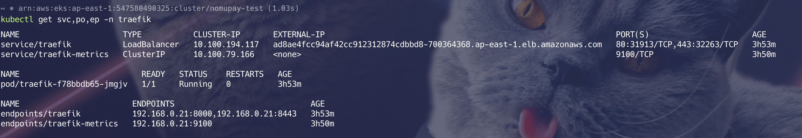
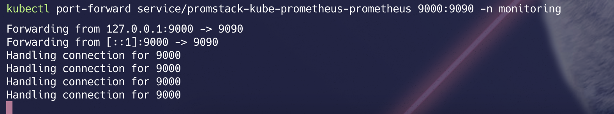
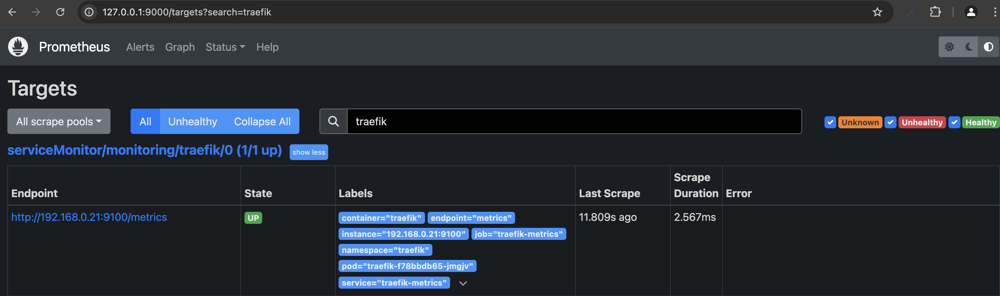
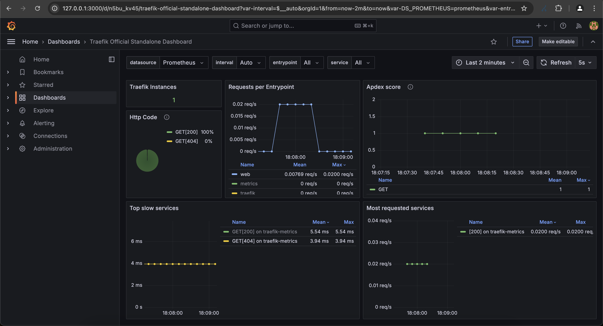

# 🚀 How to Deploy Traefik Ingress Controller on Kubernetes using Helm with Prometheus & Grafana Integration.

## Table of Contents
- [🚀 How to Deploy Traefik Ingress Controller on Kubernetes using Helm with Prometheus & Grafana Integration.](#-how-to-deploy-traefik-ingress-controller-on-kubernetes-using-helm-with-prometheus--grafana-integration)
  - [Overview](#overview)
  - [Key Features](#key-features)
  - [Prerequisites](#prerequisites)
  - [Step 1: Deploy Traefik Ingress Controller](#step-1)
    - [1.1: 🌟 Create a New Namespace](#11--create-a-new-namespace-called-traefik)
    - [1.2: 🌟 Add Traefik Labs Chart Repository](#12--add-traefik-labs-chart-repository-to-helm)
    - [1.3: 🌟 Update and List the Chart Repository](#13--you-can-update--list-the-chart-repository-by-running)
    - [1.4: 🌟 Install Traefik with Helm](#14--and-install-it-with-the-helm-command-line)
    - [🌟 Installing with Custom Values](#-installing-with-custom-values)
  - [Step 2: 🌟 Access Traefik Dashboard](#step-2-access-traefik-dashboard-without-exposing-it)
    - [2.1: Local Dashboard Access (Port-Forwarding)](#21-local-dashboard-access-port-forwarding)
  - [Step 3: Integrate with Prometheus](#step-3-integrate-with-prometheus)
    - [3.1: Verify Prometheus Metrics Scraping](#31-verify-your-prometheus-able-to-scrape-traefik-metrics)
  - [Step 4: Visualize Metrics with Grafana Dashboard](#step-4-visualize-metrics-with-grafana-dashboard)
    - [4.1: Import the Official Traefik Grafana Dashboard](#41-import-the-official-traefik-grafana-dashboard)
    - [4.2: Import the Dashboard Template in Grafana](#42-open-grafana-in-your-browser)
  - [References](#references)


## Overview


### Traefik is a cloud-native application proxy designed to simplify the deployment and management of microservices. It’s a reverse proxy and load balancer that automates service discovery, SSL/TLS termination, and routing, making it an ideal choice for modern containerized environments like Kubernetes.

## Key Features:
1) **Automated Service Discovery**: Traefik integrates with popular orchestration tools like Docker, Kubernetes, Rancher, and Consul, automatically discovering services and injecting routes without manual configuration.

2) **Cloud-Native**: Designed from the ground up for cloud-native applications, Traefik provides a scalable and flexible solution for managing ingress traffic.

3) **SSL/TLS Termination**: Supports automatic issuance of Let’s Encrypt certificates and termination of SSL/TLS traffic.

4) **Load Balancing**: Offers various load balancing algorithms, including round-robin, least connection, and IP Hash.

5) **Routing**: Routes traffic to backend services based on URL patterns, headers, and other criteria.

6) **Middlewares**: Allows attaching custom middlewares to manipulate requests and responses.

7) **Web UI**: Provides a user-friendly web interface for monitoring and configuring Traefik.

### Prerequisites

1) A Kubernetes 1.22+
2) Helm version 3.9+ is [installed](https://helm.sh/docs/intro/install/)


## step 1

### 1.1: 🌟 Create a new namespace called traefik

```shell
kubectl create ns traefik
```

### 1.2: 🌟 Add Traefik Labs chart repository to Helm:

```shell
helm repo add traefik https://traefik.github.io/charts
```

### 1.3: 🌟 You can update & list the chart repository by running:

```shell
helm repo update
helm repo list
```

### 1.4: 🌟 And install it with the Helm command line:

```shell
helm install traefik traefik/traefik -n traefik
```

{: .important}
> All [Helm features](https://helm.sh/docs/intro/using_helm/) are supported.
>
> Examples are provided [here](https://github.com/traefik/traefik-helm-chart/blob/master/EXAMPLES.md)


### 🌟 Installing with Custom Values
* You can set Traefik command line flags using `additionalArguments`. Example of installation with logging set to `DEBUG`:
```shell
helm install --namespace=traefik-v2 \
    --set="additionalArguments={--log.level=DEBUG}" \
    traefik traefik/traefik
```

* You can also customize the installation by specifying custom values For that we need a file named `values.yaml`.
- [values file](./values.yaml)

```shell
helm install traefik traefik/traefik -f values.yaml -n traefik
```



### Step 2:🌟 Access Traefik dashboard without exposing it
```plaintext
This Chart does not expose the Traefik local dashboard by default.
Enabling the API in production is not recommended, because it will expose all configuration elements, including sensitive data.
```
### 2.1: Local Dashboard Access (Port-Forwarding)
> The traefik admin port can be forwarded locally:

```shell
kubectl port-forward -n traefik $(kubectl get pods -n traefik --selector "app.kubernetes.io/name=traefik" --output=name) 8080:8080
```

This makes the dashboard accessible on the url: [http://127.0.0.1:8080/dashboard/](http://127.0.0.1:8080/dashboard/)


### Step 3: Integrate with Prometheus

{: .important}
> If you want to access the `Traefik` metrics, on prometheus (prometheus satck), add `release: promstack` selector into serviceMonitor created in monitoring namespace. like below. If you have prometheus running in different namespace change the serviceMonitor namespace as required.

```shell
      selector:
        matchLabels:
          release: promstack
```

### 3.1 Verify your Prometheus able to scrape Traefik metrics
---
- Port Forward for prometheus service


- Check for Prometheus Targets & search for traefik


---

### Step 4: Visualize Metrics with Grafana Dashboard
### 4.1 Import the Official Traefik Grafana Dashboard
> [traefik-official-standalone-dashboard](https://grafana.com/grafana/dashboards/17346-traefik-official-standalone-dashboard/)
> Import the dashboard template by `Copy ID to clipboard`

### 4.2 Open Grafana in your browser
> Click on Dashboards --> New --> Import. And paste the ID & click on `Load`
> Chosse your prometheus data source, then click import.




## References
> [Traefik](https://doc.traefik.io/traefik/getting-started/install-traefik/#use-the-helm-chart)

> [Examples](https://github.com/traefik/traefik-helm-chart/blob/master/EXAMPLES.md?plain=1)