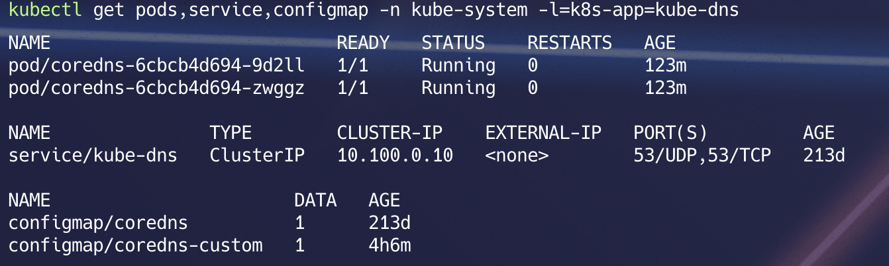
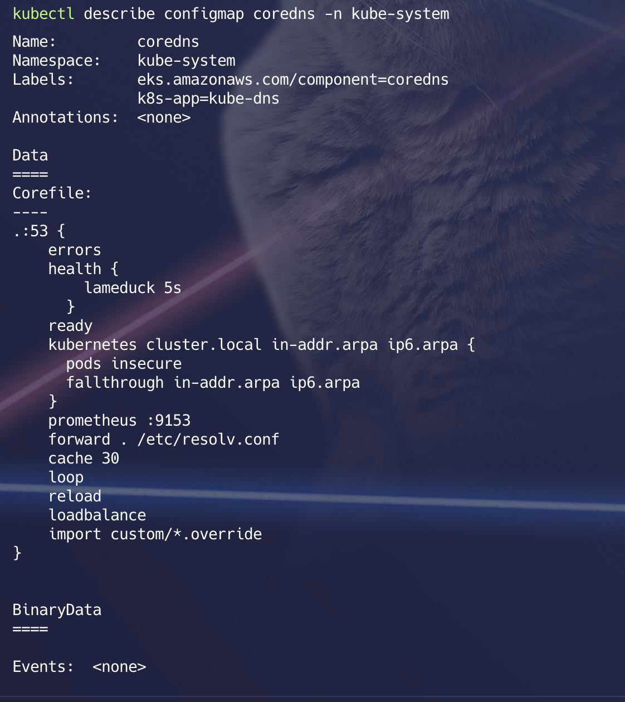
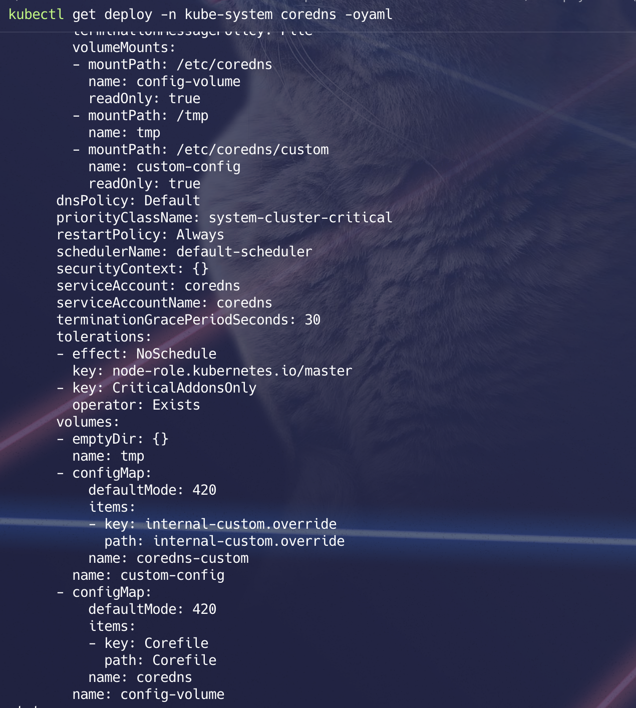
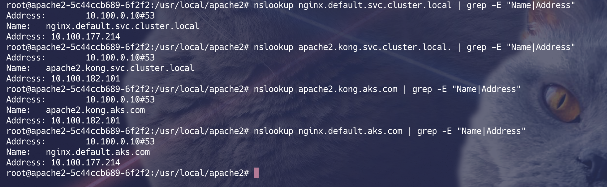

# 🌐 Custom domain names using Kubernetes CoreDNS


## **✨ Introduction**

🎯 **CoreDNS** is the DNS service discovery plugin for Kubernetes. It replaces the older `kube-dns` and is pre-installed in the `kube-system` namespace.

💡 The objective of this guide is to use CoreDNS to provide **custom domain names** inside the cluster. For example, replacing the service name `nginx.default.svc.cluster.local` with something like `nginx.default.devops.com`.

---

### **🔍 Getting Started**

📜 Check the current CoreDNS setup:
```shell
kubectl get pods,service,configmap -n kube-system -l=k8s-app=kube-dns
```



CoreDNS configuration is saved into a configmap.

```shell
kubectl describe configmap coredns -n kube-system  
```

### To provide a custom confiuration, we can use the coredns custom confgmap.

#### 🛠️ Customizing CoreDNS
> 1) Save the following as `create custome-configmap.yaml`
```yaml
apiVersion: v1
kind: ConfigMap
metadata:
  name: coredns-custom
  namespace: kube-system
  labels:
    k8s-app: kube-dns
data:
  internal-custom.override: |
    rewrite stop {
      name regex (.*)\.aks\.com\.$ {1}.svc.cluster.local.
      answer name (.*)\.svc\.cluster\.local\.$ {1}.devops.com.
    }
```

> Apply the custom ConfigMap:
```shell
kubectl apply -f custom-configmap.yaml
```

> 2) Import the Custom ConfigMap

> Edit the default CoreDNS ConfigMap to include the custom configuration:
📸 Reference screenshot:


```shell
kubectl edit configmap coredns -n kube-system
```
```shell
import custom/*.override
```

> 3) ⚙️ Update CoreDNS Deployment
> To enable the custom configuration, add a volume and volume mount to the CoreDNS deployment: Modify the deployment YAML:
<!-- Now to tell coreDNS about this `custom/*.override`, Add a volume & volume mount in coredns deployment -->

```yaml
volumes:
  - configMap:
      defaultMode: 420
      items:
        - key: internal-custom.override
          path: internal-custom.override
      name: coredns-custom

volumeMounts:
  - mountPath: /etc/coredns/custom
    name: custom-config
    readOnly: true

```

📸 Reference screenshot:



> 4) 📦 Now let's start deploying some services & expose them. Create Services in Different Namespaces

> 🚢 Create deployments and expose services in the `default` and `kong` namespaces:

```shell
kubectl create deployment nginx --image=nginx --replicas=1 -n default
kubectl expose deployment nginx --name nginx --port=80 -n default
kubectl get deploy,svc

kubectl create deployment apache2 --image=httpd --replicas=1 -n kong
kubectl expose deployment apache2 --name apache2 --port=80 -n kong
kubectl get deploy,svc -n kong
```


### 🧩 Explanation:

> 🔄 Incoming domain `apache2.kong.devops.com` will be rewritten as `apache2.kong.svc.cluster.local.`

> 🔄 Incoming domain `nginx.default.devops.com` will be rewritten as `nginx.default.svc.cluster.local.`

### 🧪 Testing:
> Let us try resolving with `.devops.com` . Andunderstand how that works.

> ✅ `nginx.default.devops.com` → should resolve to `nginx.default.svc.cluster.local.`

> ✅ `apache2.kong.devops.com` → should resolve to `apache2.kong.svc.cluster.local.`

```shell
kubectl exec -it deploy/apache2 -n kong -- bash
apt update && apt install dnsutils curl -y

nslookup nginx.default.devops.com
nslookup apache2.kong.devops.com

curl nginx.default.devops.com
curl apach2.kong.devops.com
```
> 📸 Reference screenshot of final output:

