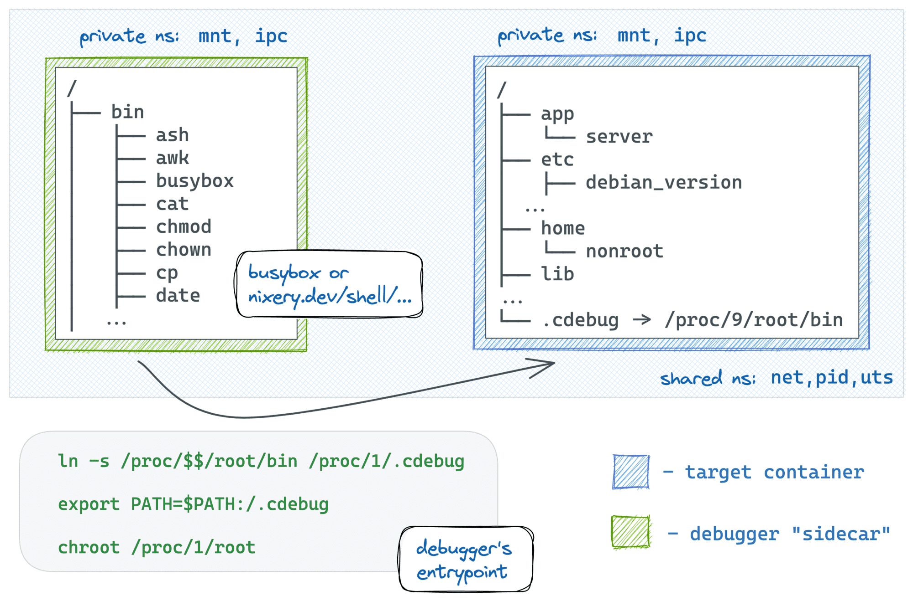
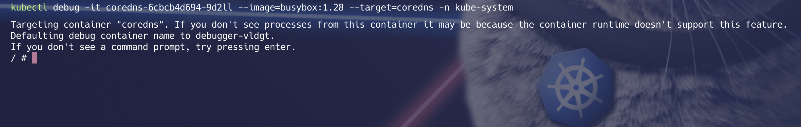
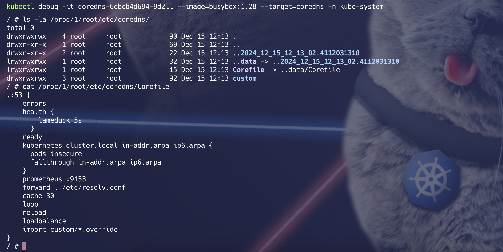

# 🐛 Debugging Containers in Kubernetes

---

## **🔍 Introduction**

Kubernetes provides a powerful command called `kubectl debug` that allows you to troubleshoot issues within running pods. It enables you to attach a temporary debugging container to an existing pod, giving you access to the pod's environment without affecting the running application.

Slim containers are faster (less stuff to move around) and more secure. However, these benefits of slim containers come at a price - such containers lack (the much-needed at times) exploration and debugging tools. It might be quite challenging to tap into a container that was built from a distroless or slim base image

In this guide, we will learn how to debug a **CoreDNS pod** in the `kube-system` namespace using a **BusyBox** container.


---

## **⚙️ Debugging CoreDNS**

### **1️⃣ Attaching a Debugging Container**

🛠️ Use the `kubectl debug` command to attach a debugging container:
```bash
kubectl debug -it <coredns-pod-name> --image=busybox:1.28 --target=coredns -n kube-system
```


* `coredns-5bd47f77ff-npvsp`: The name of the CoreDNS pod you want to debug.
* `--image=busybox:1.28`: The temporary debugging container image.
* `--target=coredns`: Targets the coredns container in the pod.
* `-n kube-system`: Specifies the namespace where the CoreDNS pod is running.

#### 🔄 After running this command, you’ll be attached to the debugging container with an interactive shell.


### 2️⃣ Inspecting the CoreDNS Pod
Once inside the debugging container, you can perform various commands to inspect the CoreDNS pod's environment and files.

> 🔸 Check Running Processes
```shell
# command to install ps in debian
apt-get update; apt-get install -y procps
ps
```
This command lists the running processes in the debugging container, helping you identify the services running in the pod.

> 🔸 Inspect CoreDNS Configuration
Navigate to the CoreDNS configuration directory in the pod’s filesystem:
```shell
ls -la /proc/1/root/etc/coredns/
```

> `/proc/1/root/`: Refers to the root filesystem of the target container (CoreDNS in this case).

> `/etc/coredns/`: The directory where CoreDNS configuration files, such as the Corefile, are stored.

> 🔸 View the Corefile
To examine the CoreDNS configuration file, use:
```shell
cat /proc/1/root/etc/coredns/Corefile
```
This will display the contents of the Corefile, which contains the DNS configuration for the cluster.


## 🛡️ Key Notes
1) Debugging Containers:
    * The debugging container runs alongside the targeted container in the pod.
    * It shares the same namespaces and volumes as the target container.

2) Read-Only Access:
    * Debugging containers often have read-only access to the target container's filesystem to avoid unintended changes.

3) Cleaning Up:
    * Once you're done debugging, exit the container, and Kubernetes will automatically clean up the temporary debugging container.


### 📸 Visual Reference



🤔 When to Use Debugging Containers?
* Slim containers
* Investigating Application Errors
* Troubleshooting Network Connectivity Issues
* Analyzing Resource Usage
* Debugging Deployment Issues
* Security Investigations


##### With the kubectl debug command, Kubernetes simplifies troubleshooting, allowing you to analyze and resolve issues efficiently! 🚀

<!-- https://iximiuz.com/en/posts/docker-debug-slim-containers/ -->
