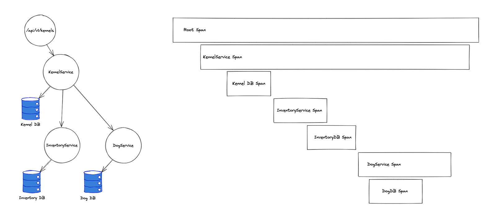

# 📌 Introduction to Distributed Tracing & Grafana Tempo
Grafana Tempo is an open-source, easy-to-use, and high-scale distributed tracing backend. Tempo lets you search for traces, generate metrics from spans, and link your tracing data with logs and metrics.

## 1️⃣ What is Distributed Tracing?

### 🔹 Problem Statement
* In modern `microservices` and `distributed systems`, requests flow across multiple services.
* Traditional `logging & metrics` can show individual system health but fail to `track a request across multiple services`.
* Without visibility, debugging `slow performance` or `failures` is difficult.

### 🔹 Solution: Distributed Tracing
* Distributed tracing allows you to `track a request` as it travels through multiple microservices.
* Each `unit of work` (API call, database query, etc.) is captured as a `span`.
* These spans form a `trace`, giving a complete picture of request flow.

### 🔹 Example:
#### Imagine a shopping website:

1. `User clicks "Buy"` → Request goes to API Gateway
2. API Gateway → Calls `Order Service`
3. Order Service → Calls `Payment Service`
4. Payment Service → Calls `Inventory Service`

Without tracing, debugging why `checkout is slow` would be a nightmare!
With tracing, you can see which service is slow and fix it.


## 2️⃣ Why Use Grafana Tempo?

### 🔹 Existing Tracing Tools

* `Jaeger`: Open-source but requires `indexing` (which slows performance).

* `Zipkin`: Older tool, similar to Jaeger, but requires `storage management`.

* `AWS X-Ray`: Paid service, good but locked into AWS.

* `OpenTelemetry`: Open source, as well as vendor and tool-agnostic.


### 🔹 Why Tempo?

✅ `Scalable & Lightweight` – Handles high-volume traces efficiently.

✅ `No Indexing Needed` – Unlike Jaeger, `Tempo doesn't need Elasticsearch`.

✅ `Easy to Integrate` – Works with `Prometheus, Loki, OpenTelemetry`.

✅ `Supports Object Storage` – Uses `S3, GCS, MinIO` for storage.

✅ `Built for Grafana` – Seamless visualization in Grafana UI.


### 3️⃣ Tempo Core Concepts

#### 🔹 `Tracing Components`
1. `Trace` – A full journey of a request across services.
2. `Span` – A single unit of work inside a trace (e.g., an HTTP request, DB query).
3. `Context Propagation` – Passes tracing data across services.

### 🔹 Example Trace Structure

```bash
Trace ID: 12345  
 ├── Span 1: API Gateway (Start: 0ms)  
 ├── Span 2: Order Service (Start: 10ms)  
 ├── Span 3: Payment Service (Start: 30ms)  
 ├── Span 4: Inventory Service (Start: 50ms)  
```

This shows that `Payment Service took 20ms` and `Inventory Service took 20ms`, which helps identify bottlenecks.

---

## 4️⃣ Tempo Architecture Overview

### 🔹 How Tempo Works

1. `Application emits traces` → Using OpenTelemetry SDKs.
2. `Traces are sent to Tempo` → Collected using OpenTelemetry Collector.
3. `Tempo stores traces` → In object storage like S3 or MinIO.
4. `Grafana queries Tempo` → Visualizes traces in dashboards.

## 🔹 Architecture Diagram
```bash
(Application) → (OpenTelemetry SDK) → (OTEL Collector) → (Tempo) → (Storage) → (Grafana)
```

* `Application`: Sends tracing data (Node.js, Python, Java, Go, etc.).
* `OpenTelemetry Collector`: Aggregates traces before sending to Tempo.
* `Tempo`: Stores traces.
* `Storage`: Object storage like MinIO or S3.
* `Grafana`: Queries Tempo to display traces.

---

## 5️⃣ Where Tempo Fits in the Observability Stack

### Observability has 3 pillars:

1️⃣ `Metrics` – Collected using `Prometheus`.

2️⃣ `Logs` – Collected using `Loki`.

3️⃣ `Traces` – Collected using `Tempo`.

By combining `logs, metrics, and traces`, you get full visibility into your system.


## Traces

A trace represents the whole journey of a request or an action as it moves through all the nodes of a distributed system, especially containerized applications or microservices architectures.

Traces are composed of one or more spans. A span is a unit of work within a trace that has a start time relative to the beginning of the trace, a duration, and an operation name for the unit of work. It usually has a reference to a parent span, unless it’s the first, or root, span in a trace. It frequently includes key/value attributes that are relevant to the span itself, for example the HTTP method used in the request, as well as other metadata such as the service name, sub-span events, or links to other spans.

Setting up tracing adds an identifier, or trace ID, to all of these events. The trace ID generates when the request initiates. That same trace ID applies to every span as the request and response generate activity across the system.

The trace ID lets you trace, or follow, a request as it flows from node to node, service to microservice to lambda function to wherever it goes in your chaotic, cloud computing system and back again. This is recorded and displayed as spans.


## Trace structure

Traces are telemetry data structured as trees. Traces are made of spans (for example, a span tree); there is a root span that can have zero to multiple branches that are called child spans. Each child span can itself be a parent span of one or multiple child spans, and so on so forth.



## Referance:

[Grafana Doc](https://grafana.com/docs/tempo/latest)