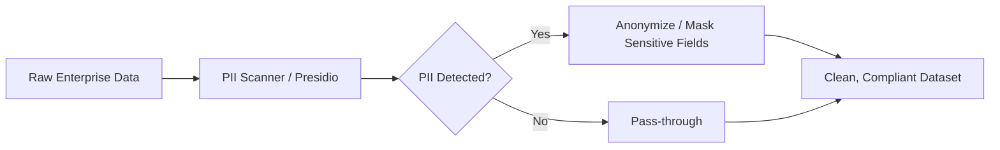
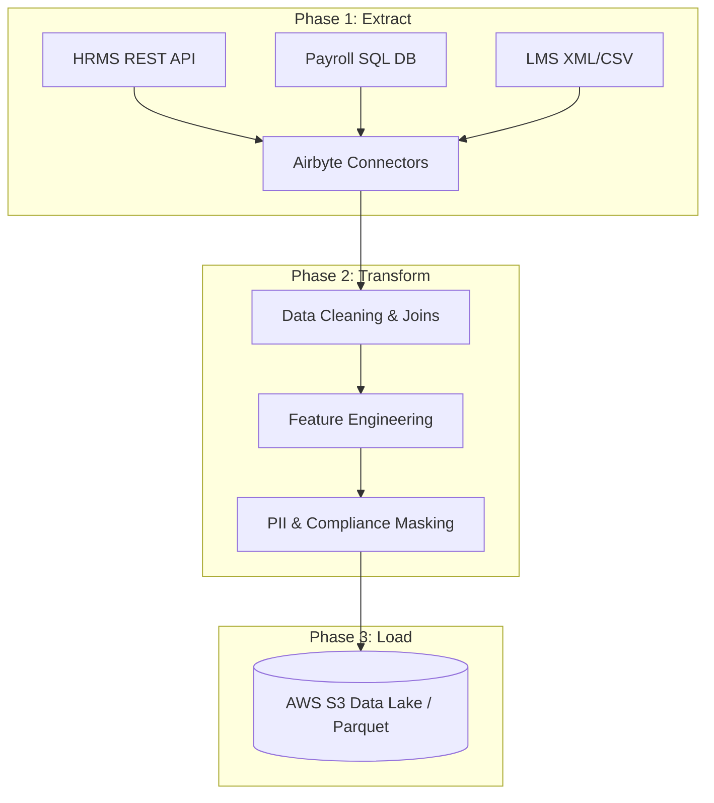

# MLOps Step 1: Building a Production-Grade Dataset Pipeline

## Introduction

In modern machine learning systems, model training and deployment are only a small fraction of the overall architecture. The success of any AI project hinges on the quality, security, and timeliness of the incoming data. 

Before training a model, you must establish a reliable dataset pipeline. This guide explores the engineering behind data ingestion, details how to build a secure Extract-Transform-Load (ETL) pipeline, and highlights the DevOps responsibilities involved in maintaining data infrastructure at scale.

---

## Background

You might wonder: if MLOps is focused on operations and infrastructure, why do we need to learn how to build dataset pipelines? 

{: .note }
> **The DevOps Analogy:**  
> A DevOps engineer does not write application code (e.g., Java or Go). However, understanding how the application is built, compiled, configured, and packaged is essential to creating effective CI/CD pipelines.
>
> Similarly, an MLOps or Platform engineer must understand how data flows, how models are trained, and what artifacts are produced. This foundational knowledge is crucial for designing orchestration pipelines, debugging container failures, and deploying models to production.

---

## Main Sections

### About the Model & Use Case

#### Concept
To demonstrate the pipeline architecture, we will follow the lifecycle of a real-world enterprise application: **Employee Attrition Prediction**. For a large organization with 500,000 employees, predicting who is likely to leave allows HR teams to proactively intervene (e.g., adjusting workloads, reviewing compensation, or offering growth opportunities).

Because historical records show whether past employees stayed or left, this is a **supervised learning** problem. The model learns patterns from historical data to predict the attrition risk of active employees.

#### Architecture
The challenge lies in the data itself. In a large enterprise, employee data is not consolidated in one place. It is scattered across multiple systems, including:
* **HRMS** (Human Resource Management Systems) containing profile details via REST APIs.
* **Payroll Databases** containing financial records in SQL servers.
* **LMS** (Learning Management Systems) containing training history in XML exports.
* **Performance Reviews** stored as text or JSON files.

Unifying this data into a single, clean, and compliant dataset is the primary goal of the dataset pipeline.

---

### PII Handling & Compliance

#### Concept
Because HR datasets contain Personally Identifiable Information (PII)—such as names, emails, and phone numbers—we cannot use the raw data for model training. Compliance with data protection regulations like GDPR and the DPDP Act is mandatory.

#### Architecture
PII detection and masking are integrated directly into the ingestion flow, sanitizing data before it reaches the model training environment.



#### Implementation
We can use tools like **Microsoft Presidio** to automatically detect and mask PII. Below is an example of a Python implementation:

```python
from presidio_analyzer import AnalyzerEngine
from presidio_anonymizer import AnonymizerEngine

# Initialize the analyzer and anonymizer
analyzer = AnalyzerEngine()
anonymizer = AnonymizerEngine()

# Raw text containing sensitive PII
raw_text = "Contact Jatin Sharma at jatin@example.com or +1-555-0199 for HR details."

# Analyze the text to identify PII entities
results = analyzer.analyze(text=raw_text, language="en")

# Anonymize the identified PII
anonymized_result = anonymizer.anonymize(text=raw_text, analyzer_results=results)

print("Anonymized Output:")
print(anonymized_result.text)
# Output: "Contact <PERSON> at <EMAIL_ADDRESS> or <PHONE_NUMBER> for HR details."
```

#### Best Practices
{: .important }
> **PII Governance:**
> * **Anonymize Early:** Strip or mask PII as close to the data source as possible.
> * **Replace Identifiers:** Use cryptographically hashed or random IDs in place of actual employee names.
> * **Shared Responsibility:** InfoSec teams define compliance rules, while Data and MLOps teams implement the programmatic masking and verification checks.

---

### The Dataset Pipeline (ETL)

#### Concept
Handling large datasets manually is impossible. The Data Engineering team builds an automated **ETL (Extract, Transform, Load)** pipeline to coordinate the process.

#### Architecture
The pipeline is split into three distinct phases:



1. **Extract**: Pull raw data from APIs, databases, and file dumps using pre-built connectors.
2. **Transform**: Clean null values, join tables, perform feature engineering, and mask PII.
3. **Load**: Save the sanitized, consolidated dataset to a secure storage system (e.g., AWS S3) for training.

---

### Tools Used in the ETL Pipeline

To build a scalable and reproducible pipeline, we use a specialized tool stack:

| Tool | Role in Pipeline | Description |
| :--- | :--- | :--- |
| **Apache Airflow** | Orchestration | Schedules, coordinates, and monitors tasks as a Directed Acyclic Graph (DAG). |
| **Airbyte** | Extraction | Provides pre-built connectors to ingest data without writing custom API code. |
| **Apache Spark** | Transformation / Validation | Handles distributed data transformations and executes schema validation checks. |
| **Microsoft Presidio** | Security / Compliance | Scans and anonymizes PII to meet GDPR and DPDP Act requirements. |

---

### Implementing Airflow DAG Tasks

#### Concept
In Apache Airflow, every step in the ETL pipeline runs as an independent, observable task in a DAG. 

#### Architecture
If a task (such as data validation) fails, subsequent tasks (such as loading data to S3) are blocked. This prevents corrupted or unmasked data from reaching your production environment.


#### Implementation
Below is an example of an Airflow DAG definition in Python:

```python
from airflow import DAG
from airflow.operators.python import PythonOperator
from datetime import datetime, timedelta

default_args = {
    "owner": "airflow",
    "depends_on_past": False,
    "email_on_failure": True,
    "retries": 1,
    "retry_delay": timedelta(minutes=5),
}

with DAG(
    "employee_attrition_etl",
    default_args=default_args,
    description="ETL pipeline for Employee Attrition prediction data",
    schedule_interval="@weekly",
    start_date=datetime(2026, 1, 1),
    catchup=False,
) as dag:

    def extract():
        print("Extracting raw data from HRMS, Payroll, and LMS...")

    def transform():
        print("Cleaning, joining, and performing feature engineering...")

    def validate():
        print("Running data quality and schema validation checks...")

    def mask_pii():
        print("Scanning and masking sensitive PII fields...")

    def load():
        print("Uploading final processed CSV to AWS S3...")

    # Task definitions
    t1 = PythonOperator(task_id="extract_data", python_callable=extract)
    t2 = PythonOperator(task_id="transform_data", python_callable=transform)
    t3 = PythonOperator(task_id="validate_data", python_callable=validate)
    t4 = PythonOperator(task_id="mask_pii", python_callable=mask_pii)
    t5 = PythonOperator(task_id="load_to_s3", python_callable=load)

    # Execution order
    t1 >> t2 >> t3 >> t4 >> t5
```

#### Best Practices
{: .tip }
> **DevOps DAG Management:**
> * **DAGs as Code:** Treat Airflow DAGs as Infrastructure as Code. Store them in Git, run unit tests, and deploy them using CI/CD pipelines.
> * **Kubernetes Execution:** Run Airflow on Kubernetes (using `KubernetesExecutor`) to dynamically scale worker pods on demand.

---

### Data Size Progression

During the ETL process, data goes through a massive reduction in size. This happens because the pipeline filters out noise, drops unused columns, and deduplicates records.

| Stage | Format | Size | Description |
| :--- | :--- | :--- | :--- |
| **Raw Extraction** | JSON, SQL, XML | ~1 TB | Unstructured, repetitive data containing full history and PII. |
| **Spark Cleaned** | Spark DataFrames | ~10 GB | Consolidated database tables with basic cleaning applied. |
| **Anonymized** | Parquet | ~5 GB | Text scanned, sensitive data masked, and identifiers stripped. |
| **Final Export** | Compressed CSV | ~300 MB | Feature-engineered dataset containing only predictive attributes. |

---

### Roles & DevOps Infrastructure Responsibilities

Building and running a production data pipeline is a collaborative effort:
1. **Data Engineers:** Build and maintain the ETL jobs, API connectors, and database joins.
2. **Data Scientists:** Define the features needed for the model and the transformation rules.
3. **InfoSec / Compliance:** Specify PII detection rules and data governance policies.
4. **DevOps / Platform Engineers:** Manage the infrastructure that runs the entire system.

#### Platform / DevOps Infrastructure Checklist
If you are managing the infrastructure for an ML pipeline, you are responsible for:
* **Orchestration Infrastructure:** Deploying and scaling Airflow on Kubernetes (e.g., using Helm).
* **Compute Clusters:** Provisioning and scaling Spark clusters (such as EMR, Dataproc, or Spark on K8s).
* **Storage Governance:** Configuring cloud storage (e.g., S3 buckets) with KMS encryption, IAM policies, and lifecycle rules.
* **Secrets Management:** Securing database credentials and API tokens using HashiCorp Vault or AWS Secrets Manager.
* **Monitoring & Observability:** Setting up Prometheus/Grafana alerts for Airflow task durations, Spark job metrics, and cluster health.
* **Log Aggregation:** Centralizing logs (using EFK or CloudWatch) for fast debugging.

---

## Key Takeaways

* **Data is the Foundation:** A robust, automated dataset pipeline is required before starting any machine learning work.
* **Early Anonymization:** Handle PII masking and regulatory compliance (GDPR/DPDP) at the entry point of the pipeline.
* **Task Isolation:** Use DAG orchestrators like Airflow to isolate steps. If validation fails, halt downstream processes to prevent corrupt data loads.
* **Massive Data Reduction:** Raw enterprise data shrinks significantly (from ~1 TB to ~300 MB) once filtered down to relevant features.
* **DevOps Ownership:** DevOps engineers manage the infrastructure (Kubernetes, Spark, S3, IAM, Secrets) that keeps the pipeline secure and scalable.

---

## Conclusion

Building a production-ready dataset pipeline involves more than loading a CSV file into a Jupyter notebook. In an enterprise environment, it requires orchestrating multiple data sources, enforcing strict PII compliance, and building resilient distributed systems. 

As a Platform or MLOps engineer, mastering the infrastructure that supports these workflows is the first step toward building reliable, automated, and secure machine learning systems.
